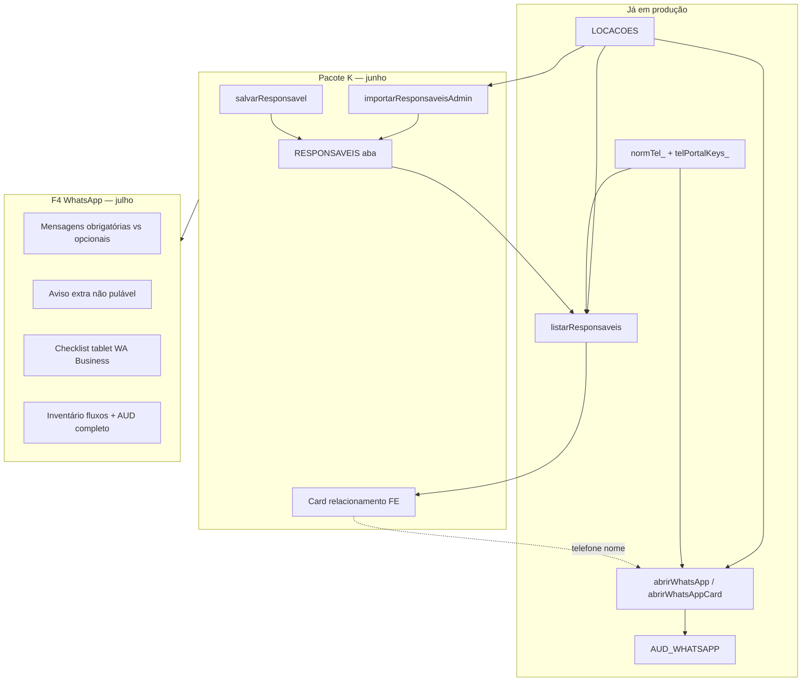

# Mapa de dependências — Pacote K (CRM) vs F4 (WhatsApp)

**Data:** 06/06/2026  
**Princípio (atualizado 06/06/2026):** **F4 PAUSADO** — conta WA bloqueada 4 dias; SMS sem entrega. **Canal oficial: QR Code.** Ver `DECISAO_COMUNICACAO_QR_CODE_2026-06.md`.

---

## 1. Visão geral

---

## 2. O que cada pacote toca

| Camada | Pacote K | F4 WhatsApp |
|--------|----------|-------------|
| **GAS — LOCACOES** | Leitura only | Leitura (rowIndex nos eventos) |
| **GAS — RESPONSAVEIS** | Escrita (import + salvar) | Não mexe |
| **GAS — AUD_WHATSAPP** | Não mexe | Escrita (`registrarWhatsAppEvento`) |
| **GAS — AUD_RESPONSAVEIS** | Escrita (import/salvar) | Não mexe |
| **GAS — Auth/sessão** | Não mexe | Não mexe |
| **FE — index.html** | Card Relacionamento, Resp. | `abrirWhatsApp*`, botões SMS/WA |
| **FE — mk-auth** | Não mexe | Não mexe |
| **Tablet/PWA** | Consulta CRM | Abertura link WA (zona crítica) |

---

## 3. Dependências compartilhadas (telefone)

| Função | K usa | F4 usa | Risco se divergir |
|--------|-------|--------|-------------------|
| `normTel_` | Chave RESPONSAVEIS, busca | `registrarWhatsAppEvento`, links | Telefone errado no AUD_WHATSAPP |
| `telPortalKeys_` | Portal + busca equivalente | Normalização BR no FE (`v1.6.61+`) | Cliente não acha locação no portal |
| Coluna telefone LOCACOES (N) | Fonte import K.1 | Origem WA nos cards | — |

**Regra:** qualquer mudança em normalização de telefone exige **teste conjunto** K + F4 + portal (`TESTE_PORTAL_READONLY`).

---

## 4. O que K entrega que F4 aproveita (depois)

| Entrega K | Benefício para F4 |
|-----------|-------------------|
| RESPONSAVEIS com nome/observação | Mensagens WA mais personalizadas (futuro) |
| Card com histórico | Operador confirma telefone antes de WA |
| `cadastroCanonico: true` | Menos typo em `wa.me` |
| AUD_RESPONSAVEIS | Rastreio separado de AUD_WHATSAPP |

**F4 não depende de K para funcionar hoje** — WA já usa telefone da locação ativa. K **reduz erro humano**, não desbloqueia WA.

---

## 5. O que F4 tem que K não resolve

| Item F4 | Status | Independente de K? |
|---------|--------|-------------------|
| Clique real em link + fallback `api.whatsapp.com` | ✅ v1.6.60+ | Sim |
| 9º dígito BR | ✅ v1.6.61+ | Sim |
| `registrarWhatsAppEvento` + AUD_WHATSAPP | ✅ v1.5.25+ | Sim |
| Copiar mensagem clipboard | ✅ parcial | Sim |
| **Aviso minuto extra não pulável** | ❌ pendente | Sim |
| **Inventário mensagens obrigatórias** | ❌ pendente | Sim |
| **Checklist tablet WA Business** | ❌ pendente | Sim |
| SMS primário + WA fallback | ✅ v1.5.30+ | Sim |

---

## 6. Por que K antes de F4

| Motivo | Detalhe |
|--------|---------|
| **Uma zona crítica por vez** | F4 = tablet + link externo (Regra 3). K = planilha + readonly no balcão. |
| **Incidente I19 recente** | Auth/PWA sensível; evitar deploy FE+GAS simultâneo sem necessidade. |
| **Valor imediato** | 137 clientes reconhecíveis no balcão sem novo risco WA. |
| **Dados para mensagens** | Quando F4 personalizar texto, RESPONSAVEIS já existe. |

---

## 7. Matriz de conflito de deploy

| Cenário | Seguro? | Nota |
|---------|---------|------|
| Só K.1 GAS (import dry-run) | ✅ | Read-only; não afeta tablet |
| Só K.1 GAS (import real) | 🟡 | Lock planilha; fazer sem ativas ou fora pico |
| Só F4 FE (abrirWhatsApp) | 🟡 | Teste físico tablet obrigatório |
| K.1 + F4 mesmo dia | ❌ | Evitar |
| K.1 + v1.7.48 auth fix | ✅ | Já feito (I19) |
| Liberar sessão ADM durante teste K | ❌ | Desloga Milena no tablet (I19) |

---

## 8. Ordem recomendada (jun–jul 2026)

1. **Fechar Sprint 1** — checklist I.5, tablet 1.7.48 (sem liberar sessão sem aviso).
2. **K.1** — dry-run → import fora pico → validar card Relacionamento.
3. **K.2–K.4** — FE leve se necessário; GAS `listarResponsaveis` já merge canônico.
4. **F4 W.1** — inventário mensagens (doc only).
5. **F4 W.2–W.6** — FE + checklist tablet WA.
6. **Pacote L** — polish UX (DNA portal).

---

## 9. Checklist “posso mexer em WhatsApp?”

Antes de qualquer PR F4:

- [ ] Pacote K.1 import concluído ou explicitamente adiado
- [ ] `TESTE_RELACIONAMENTO_READONLY` verde
- [ ] Nenhum incidente P1 auth aberto (I19 fechado)
- [ ] Tablet disponível para teste WA Business (não o único balcão em horário de pico)
- [ ] Regra 3 `REGRAS_DE_PUBLICACAO_SEGURA.md` assinada no PR

---

*Referências: `PROXIMAS_FASES_OPERACIONAIS.md` §4 e §5, `DEPLOY_v1.5.25_AUDITORIA_WHATSAPP.md`, `REGRAS_DE_PUBLICACAO_SEGURA.md` Regra 3.*
