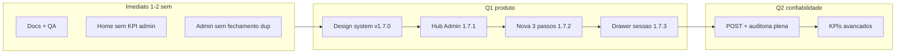

# MOVI KIDS — Plano mestre reorganizado

**Data:** 04/06/2026  
**Substitui como referência única de roadmap:** `PLANO_MESTRE_MOVIKIDS_CONFIABILIDADE.md` + trechos desatualizados de `PROXIMAS_FASES_OPERACIONAIS.md`  
**Produção de referência:** GAS **v1.5.43** · Frontend **v1.7.23** · Portal `acompanhar.html`  
**Atualizado:** 03/06/2026 — Pacotes A/B/C + incidente + UX auth (v1.7.18–23) publicados; **próximo: Pacote D** (drawer sessão). Ver `ESTADO_ATUAL.md`.

---

## 1. Momento atual (leitura honesta)

O MOVI KIDS já é um **sistema operacional completo** para locação infantil em shopping: timers multi-dispositivo, caixa, custos, SMS, portal do responsável, login de operadores com trava de sessão única e área admin. A base técnica é sólida.

O gargalo deixou de ser “fazer funcionar” e passou a ser **clareza, hierarquia visual e desenho de produto**:

- muitas telas repetem os mesmos números (faturamento hoje, mês, resultado);
- fluxos longos em uma única página (Nova locação, modais de encerrar/editar);
- **três famílias visuais de card/KPI** convivendo (`stat-card`, `kpi-card`, `new-kpi`, `fecha-card`, `session-card`, `cx-card`);
- área financeira/admin mistura **operação do dia**, **gestão do mês** e **diagnóstico técnico** na mesma “Visão geral”;
- operador vê resquícios de KPI admin na Home quando admin está logado — ruído no balcão.

Comparando com sistemas do mesmo tipo (POS de serviço por tempo, rental kiosk, SaaS de agendamento + caixa — ex.: Square, Toast, Mindbody simplificado, apps de “play center”), o MOVI KIDS precisa evoluir para:

| Referência do segmento | O que eles fazem bem | Gap no MOVI KIDS hoje |
|------------------------|----------------------|------------------------|
| Uma ação = uma tela clara | Fluxo curto, CTA único | Nova locação: 4 passos + review duplicado |
| Hierarquia visual forte | 1 número hero + 2–3 secundários | 4–6 KPIs com peso visual igual |
| Cards operacionais enxutos | Nome, status, tempo, 1–2 ações | Session card com timer + menu + badges + custo extra |
| Financeiro separado | “Caixa hoje” ≠ “DRE do mês” | Caixa, Admin, Dashboard e Home repetem fechamento |
| Perfil de usuário | Operador não vê DRE | KPIs mensais na Home para admin |

---

## 2. Mapa de informação hoje (13 superfícies)

| Superfície | Público | Função real |
|------------|---------|-------------|
| **Login** (`mk-auth-gate`) | Todos | Identidade + trava 1 operador |
| **Home** | Operador (+ KPIs se admin) | Sessões ativas/encerradas + cards de locação |
| **Nova** (4 steps) | Operador | Cadastro completo da locação |
| **Painel** | Operador | TV/grid — frota e status |
| **Relacionamento** | Operador | CRM leve + nova locação pré-preenchida |
| **Custos** | Operador | Saída rápida |
| **Lanç. avulso** | Operador | Exceção auditada |
| **Admin — Visão geral** | Admin | KPIs + fechamento dia + diagnóstico + menu |
| **Caixa do dia** | Admin | Conferência maquininha/dinheiro + tabelas |
| **Dashboard** | Admin | Mês, gráficos, CTO, projeção |
| **Relatório mensal** | Admin | PDF Drive |
| **Histórico** | Admin | Busca por data |
| **Operadores / Config** | Admin | Cadastro e parâmetros |

---

## 3. Redundâncias críticas (o que cortar ou unificar)

### 3.1 KPIs e fechamento financeiro (mesmos dados, 4 lugares)

| Métrica | Onde aparece hoje | Proposta |
|---------|-------------------|----------|
| Faturamento hoje | Home (admin), Admin visão, Dashboard `nk-fathoje`, Caixa | **Única fonte:** módulo “Resumo do dia” linkado |
| Faturamento mês / resultado / margem | Home, Admin KPI grid, Dashboard `new-kpi-row`, CTO strip | **Única fonte:** módulo “Gestão do mês” (Dashboard) |
| Fechamento do dia (linhas + total) | Admin `fecha-card`, Caixa (KPIs + resultado + copiar) | **Unificar** em **Caixa**; Admin só link + alertas |
| Locações do dia / nº locações | stats-bar Home, Painel, Caixa, Admin fechamento | Home: só **operacional** (ativas/pendentes); contagem financeira só no Caixa |
| Ranking mês | Home `h-ranking` (admin) | Mover para Dashboard — não pertence ao balcão |

**Regra de ouro:** operador na Home vê **0 KPI financeiro**. Admin no balcão vê **1 linha opcional** (“Hoje: R$ X”) colapsável; detalhe sempre em **Caixa** ou **Gestão**.

### 3.2 Status e frota (3 lugares)

| Informação | Home cards | Painel grid | Nova locação step 0 |
|------------|------------|-------------|---------------------|
| Veículo livre/ocupado | Implícito nos cards | Explícito | Grid completo |

**Proposta:** Painel = visão “TV”; Home = fila de ação (iniciar/encerrar); Nova = seleção com **mesmo componente visual** de tile de veículo (design system único).

### 3.3 Navegação duplicada

- Sidebar (`sb-nav`) + bottom nav (`nav`) repetem Home, Relacionamento, Painel, Custos, Avulso.
- Admin: sidebar extra + botão “Admin” no rodapé + cards na visão geral.

**Proposta:** um único padrão por breakpoint; admin como **modo** (cor/barra), não como quinta aba competindo com operação.

### 3.4 Diagnóstico técnico no meio do financeiro

Bloco “Diagnóstico do sistema” na **Visão geral admin** mistura GAS, versão, sessões — é **TI**, não **gestão**.

**Proposta:** página **Sistema** (ou drawer) separada; na visão geral só um chip “Online · v1.6.78”.

---

## 4. Fluxos grandes — quebra recomendada

### 4.1 Nova locação (hoje: 4 steps + reviews)

```
Hoje:  Veículo → Plano → Dados (+ review) → Pagamento (+ review) → confirmar
```

**Proposta (wizard enxuto):**

| Passo | Conteúdo | Remove ruído |
|-------|----------|--------------|
| **1 — O quê** | Tipo/veículo + plano (tiles unificados) | Junta step 0+1; preço visível no tile |
| **2 — Quem** | Responsável, criança, tel (busca relacionamento inline) | Sem review card duplicado — barra resumo fixa no topo |
| **3 — Fechar** | Pagamento + “Salvar pendente” / “Iniciar agora” | Um CTA primário; secundário explícito |

**Atalhos:** “Repetir última locação”, “Vim do relacionamento” (já existe parcialmente — formalizar).

### 4.2 Encerrar / editar locação (modais pesados)

**Proposta:** drawer lateral (mobile) ou painel único com abas **Encerrar | Estender | Editar | Cancelar** — uma sessão, um contexto, motivo obrigatório em cancelar/editar pagamento.

### 4.3 Admin: três produtos dentro de um

```
Hoje:  Visão geral = KPI + fechamento + diagnóstico + atalhos
```

**Proposta — tríade admin:**

1. **Operação do dia** → redireciona para **Caixa** (único lugar de conferência física).
2. **Gestão do mês** → **Dashboard** (KPIs, gráficos, CTO, projeção).
3. **Cadastros e sistema** → Operadores, Config, Histórico, Relatório PDF, Diagnóstico.

Visão geral vira **hub de 3 cards grandes**, sem números duplicados.

### 4.4 Login + turno

Já resolvido: 1 operador logado. **Próximo:** banner discreto “Turno: Eduarda” no header; troca só via Sair (não confundir com “Gerenciar” antigo).

---

## 5. Nova roupagem — design system MOVI KIDS

### 5.1 Princípios (compatível com marca infantil + operação séria)

- **Fredoka / Nunito** mantidos; uso mais disciplinado (títulos vs dados).
- Paleta: azul Movi = ação; amarelo = destaque marca; verde/vermelho/laranja só **semântica** (ok, alerta, perigo).
- Menos bordas duplas, menos `box-shadow` competindo; mais **espaço em branco** e **uma** borda por card.
- Ícones: consistentes (emoji só em empty states ou marca, não em cada linha de KPI).

### 5.2 Componentes unificados (substituir 5 famílias atuais)

| Componente | Uso | Substitui |
|------------|-----|-----------|
| **`MKStat`** (hero + 2 mini) | Topo de Caixa / Dashboard | `kpi-grid`, `new-kpi-row`, `stats-bar` |
| **`MKTile`** | Veículo, plano, pagamento | `vc-card`, `plano-list`, `pag-btn` |
| **`MKSessionCard`** | Home | `session-card` (versão slim) |
| **`MKPanelTile`** | Painel TV | células do painel |
| **`MKSheet`** | Tabelas caixa/histórico | `cx-table` + headers repetidos |
| **`MKHubCard`** | Admin atalhos | `admin-action-card` |
| **`MKAlertStrip`** | Avisos (sessão ocupada, SMS, sync) | vários banners soltos |

### 5.3 Session card — versão “sem ruído” (crítica visual)

**Manter:** tipo/veículo, nome criança, timer (hero), CTA principal (Iniciar / Encerrar).

**Remover ou colapsar:**

- menu ⋮ na primeira dobra → “Mais” só após expandir;
- repetir plano + valor + telefone + observação no card — mover para detalhe;
- custo extra em linha separada → uma linha sob o timer quando em overtime.

**Estados visuais:** 3 apenas — `pendente` (neutro), `ativo` (azul), `alerta` (âmbar), `extra` (vermelho). Sem animação shake contínua (só pulso no timer).

### 5.4 KPIs e relatórios — nova hierarquia

#### Caixa do dia (operacional-financeiro)

```
[ Hero: Resultado do dia R$ XXX ]
[ 3 pills: Entradas | Saídas | Saldo conferência ]
[ Conferência: Maquininha | Dinheiro ]  ← foco do gerente de loja
[ Tabela entradas colapsável ]
[ Tabela saídas colapsável ]
[ Copiar fechamento ]
```

Remove: 6 `kpi-card` iguais no topo — vira **1 hero + 3 secundários**.

#### Dashboard (gestão do mês)

```
[ Seletor mês ]
[ Hero: Resultado líquido mês ]
[ 4 tiles: Fat | Ticket | Custos | Margem ]
[ CTO strip simplificado — 1 barra, 4 números ]
[ Gráficos em 2 colunas desktop / 1 mobile ]
[ Comparativo semanal + projeção — accordion ]
```

Remove duplicação de “faturamento hoje” (link “ver caixa de hoje”).

#### Relatório mensal

Manter PDF; UI = **status do último envio + botão gerar** — sem KPIs copiados do Dashboard.

### 5.5 Comparativo com sistemas semelhantes — checklist visual

| Critério | Meta |
|----------|------|
| Tempo até ação na Home | &lt; 2 toques para iniciar/encerrar |
| Legibilidade a 1 m | Timer ≥ 32px; contraste WCAG AA |
| Densidade tablet 10" | Máx. 2 cards por linha; padding 16px |
| Consistência | 1 raio, 1 sombra, 1 espessura de borda |
| Ruído | Máx. 5 elementos por card operacional |
| Financeiro | Números alinhados à direita, tabular nums |

---

## 6. Ações imediatas (próximas 2 semanas)

Prioridade **P0** — baixo risco, alto impacto percebido.

| # | Ação | Onde | Esforço |
|---|------|------|---------|
| I1 | Atualizar `ESTADO_ATUAL.md` e marcar Fase 9 login como **publicada** | Docs | 30 min |
| I2 | Remover/ocultar `admin-home-kpis` e ranking da **Home** para perfil operador; admin vê só chip + link | `index.html` + `mk-auth.js` | 2–4 h |
| I3 | Unificar cópia “fechamento do dia”: Admin remove `fecha-card` duplicado → só link para Caixa | `page-admin` | 2 h |
| I4 | Teste manual checklist: login, trava 2 devices, caixa, SMS dedup | QA | 1 h |
| I5 | Estender regressão: `listarOperadoresLogin`, trava 409, `liberarSessaoOperador` | `.ps1` + GAS | 4 h |
| I6 | Colar GAS v1.5.33 se ainda não em algum ambiente | Apps Script | 15 min |

**Status 04/06 tarde:** I1 parcial (`ESTADO_ATUAL` ok); I4/I6 feitos em produção (GAS v79, ping ok); incidente documentado. I2/I3/I5 permanecem no backlog se ainda houver KPI duplicado na Home.

---

## 6b. Pacote Incidente — confiabilidade (04/06) — **CONCLUÍDO**

Interrupção entre Pacote B e Pacote C; não substitui o roadmap de UX.

| Versão | Entrega |
|--------|---------|
| **1.7.4** | Cache/URL GAS (`mk-version.js`, `gas-endpoint.json`) |
| **1.7.5** | ADM encerra sem SMS obrigatório de extra |
| **1.7.6** | `track.html` URL nova; encerrar `somentePlano` offline; `deploy-gas.ps1` valida DEPLOY_ID |
| **GAS v79** | `somentePlano`, auditoria ADM; correção financeira já em v1.5.36+ |

Docs: `INCIDENTE_DEPLOY_E_EXTRAS_2026-06-04.md`, `FIX_OFFLINE_ENCERRAR_v1.7.6.md`, `REGRAS_DE_PUBLICACAO_SEGURA.md` Regra 8.

---

## 7. Ações planejadas (pacotes por entrega)

### Pacote A — Design system v1 (frontend only) — **CONCLUÍDO v1.7.0**

- `mk-design.css` + `mk-update.js` (auto-update com sessão preservada).
- Home: `MKStat` + chip admin (sem 4 KPIs na Home).
- Caixa: hero resultado + pills.

### Pacote A+ — Financeiro / extras / histórico — **CONCLUÍDO v1.7.1**

- Gráfico extras por dia (Dashboard + Histórico).
- Histórico mais rápido (cache + stats primeiro).
- CTO mês de contrato por aniversário (GAS v1.5.37).

### Pacote B — Reorganização admin — **CONCLUÍDO v1.7.2**

- Visão geral = hub 3 portas (Dia / Mês / Sistema).
- Diagnóstico → página **Sistema**.
- Sidebar admin agrupada: Financeiro | Pessoas | Sistema.
- Sem KPI/fechamento duplicado na visão geral.

### Pacote C — Wizard Nova locação — **CONCLUÍDO v1.7.7**

- 3 passos, barra resumo fixa, busca relacionamento no passo 2.
- Ver `PACOTE_C_NOVA_3_PASSOS_v1.7.7.md`.

**Escopo técnico sugerido:**

1. Fundir passos 0+1 (veículo + plano) em **“O quê”** com tiles `MKTile`.
2. Passo **“Quem”**: responsável/criança/tel + busca relacionamento inline (sem review card duplicado).
3. Passo **“Fechar”**: pagamento + CTA único “Salvar pendente” / “Iniciar agora”.
4. Barra resumo fixa no topo durante todo o wizard.
5. Atalhos: repetir última locação; pré-preenchimento do Relacionamento (já parcial — formalizar).

**Critério de pronto:** ≤ 3 telas; cadastro médio mais rápido; regressão nova locação + SMS boas-vindas.

### Pacote D — Drawer operação sessão

- Unificar modais encerrar/editar/estender/cancelar em drawer ou sheet único.
- Versão alvo: **v1.7.8**.
- Reaproveitar lógica de encerrar offline/SMS ADM já em 1.7.5–1.7.6.

### Pacote E — Backend endurecimento

- POST em actions críticas; validação status; operador em 100% auditorias.
- GAS **v1.5.34+**.
- Portal responsável: token/telefone (segurança P1 antiga).

### Pacote F — Gestão mês avançada

- KPIs Fase 10 do doc antigo (horário pico, operador, cancelamentos) — só após Pacote B/C.

---

## 8. Melhorias que precisam ser executadas (backlog técnico)

| Área | Melhoria | Por quê |
|------|----------|---------|
| Cache | Regra permanente SW + `CURRENT`/`APP_VERSION`/`SW_VERSION` | Evita “lista sumiu” |
| Sync | Indicador único “Última sync · há Xs” no header | Operador confia no timer |
| SMS | Monitor dedup + status na linha (v1.6.76) em produção real | Planilha AUD_SMS |
| Auth | Perfil **supervisor**; operador em custos/config | Fase 9 completa |
| Config | Frota/preços em CONFIG com fallback | Fase 8 definitiva |
| WhatsApp | Manter regras tablet/PWA | Regressões históricas |
| Testes | Cobertura login + caixa + nova locação | Deploy seguro |
| Planilha | Não duplicar fórmulas — app lê, não recalcula em 3 lugares | Uma fonte de verdade |

---

## 9. Recursos a implementar (capacidades novas)

| Recurso | Descrição | Dependência |
|---------|-----------|-------------|
| **Módulo Resumo do dia** | API única `resumoDia(data)` consumida por Caixa e chip admin | GAS |
| **Módulo Gestão do mês** | API `kpiMes(ano, mes)` — Dashboard só visualiza | GAS |
| **Hub Admin** | Página leve sem KPI duplicado | Frontend |
| **Página Sistema** | Diagnóstico, versão, sync, quota, botão limpar trava sessão | Frontend + GAS |
| **Design tokens** | Folha `mk-tokens.css` ou bloco em `index.html` | Frontend |
| **Drawer sessão** | UI unificada pós-locação | Frontend |
| **Auditoria UI** | Admin: filtrar por operador/ação (leitura AUDITORIA) | GAS + Frontend |
| **Fechamento export** | WhatsApp/e-mail do fechamento (além de copiar) | Opcional |
| **Indicador turno** | Header com operador + tempo logado | Frontend |

---

## 10. O que já está concluído (não reabrir)

- Status canônico Pendente / Ativa / Encerrada / Cancelada  
- Login operadores + PIN + admin 1416  
- Trava sessão única (GAS + UI)  
- Página Operadores (CRUD, reset PIN)  
- Lançamento avulso auditado  
- SMS gateway + dedup v1.6.76 / GAS v1.5.32b  
- Portal responsável + auto-refresh  
- Relacionamento (busca + nova com pré-preenchimento)  
- Service worker network-first para GAS e HTML  

---

## 11. Ordem de execução recomendada (roadmap 90 dias)



---

## 12. Critérios de “pronto” por pacote

| Pacote | Pronto quando |
|--------|----------------|
| A | Home + Caixa usam só `MKStat`/`MKSessionCard`; zero `kpi-card` legado nessas páginas |
| B | Visão geral sem números; diagnóstico só em Sistema |
| C | Nova locação ≤ 3 telas; tempo médio cadastro ↓ |
| D | Encerrar locação em um único drawer |
| E | Regressão verde + POST nas 5 actions críticas |
| F | 8 KPIs Fase 10 com dados reais, sem duplicar Caixa |

---

## 13. Documentos do repositório — como usar daqui pra frente

| Documento | Papel |
|-----------|--------|
| **Este arquivo** | Roadmap mestre e UX — fonte da verdade |
| `ESTADO_ATUAL.md` | Snapshot produção (atualizar a cada deploy) |
| `PROXIMAS_FASES_OPERACIONAIS.md` | Histórico de fases 1–10 — arquivar status “publicado” |
| `PLANO_MESTRE_MOVIKIDS_CONFIABILIDADE.md` | Regras técnicas de confiabilidade — manter, referenciar seção 8 |
| `DEPLOY_GAS_v1.5.32_AUTH.md` | Procedimento deploy + changelog GAS |
| `AUDITORIA_SMS_MELHORIAS_v1.6.76.md` | Escopo SMS — não misturar com UX |

---

## 14. Próxima sprint (decisão) — **ativa**

Ordem de retomada (03/06/2026):

1. [x] `ESTADO_ATUAL.md` — v1.7.23 + GAS v1.5.43
2. [x] **Pacote D** — drawer sessão → **v1.7.24**
3. [ ] Pacote E — POST + auditoria plena (GAS v1.5.34+) ← **próximo**
4. [ ] Pacote F — KPIs avançados (Fase 10)
5. [ ] Fases abertas — supervisor (F9), config frota (F8), WhatsApp (F4)

Pacote C entregue em **v1.7.7**. UX pós-C (auth, menu, inatividade 1h) em **v1.7.18–1.7.23**.

---

*Arquivo alinhado em 03/06/2026: GAS v1.5.43 / FE v1.7.23 — retomada Pacote D.*
