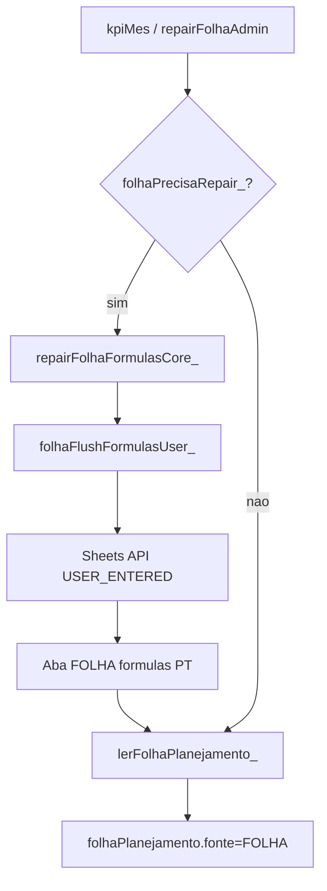

# Deploy GAS v1.5.91 — FOLHA repair USER_ENTERED

**Data:** 13/06/2026  
**Incidente:** **I25** — `INCIDENTE_I25_FOLHA_FORMULAS_NAME_2026-06-13.md`  
**FE pareado:** nenhuma mudança FE (Dashboard já consome `kpiMes.folhaPlanejamento`)  
**Depende de:** Advanced Service **Google Sheets API** no projeto Apps Script

---

## O que mudou

| Antes (v1.5.90) | Depois (v1.5.91) |
|-----------------|------------------|
| `folhaSetPt_` → `setValue('=SE...')` | `folhaFlushFormulasUser_` → **USER_ENTERED** |
| `#NAME?` na aba FOLHA | Fórmulas PT calculam |
| `folhaPlanejamento.fonte: default` | `fonte: FOLHA` |

---

## Publicar

```powershell
cd C:\Users\riboc\Documents\Codex\2026-05-30\files-mentioned-by-the-user-movikids\movikids-github
.\scripts\deploy-gas.ps1
```

1. Apps Script → **Implantar → Gerenciar implantações**
2. **Editar** Web `AKfycbwakQ...` (mesmo Deploy ID)
3. **Nova versão** → Implantar
4. **Nunca** `clasp deploy`

**Sheets API (1ª vez):** Editor → ⚙️ Configurações → Serviços do Google → **Google Sheets API** → Ativar (ou via `gas/appsscript.json` + push).

---

## Reparar aba FOLHA (obrigatório 1× após deploy)

**PowerShell:**

```powershell
Invoke-RestMethod -Uri "https://script.google.com/macros/s/AKfycbwakQ-_aWsF5lFGLsiwB5UvJ4AlpW88krSv8daPeMvULwX5FOIdMhGVgdGd0G35270Y/exec?action=repairFolhaAdmin&adminPin=1416"
```

**Ou** editor: função `repairFolhaFormulasRemote` → ▶ Executar.

**Esperado:**

| Campo | Valor típico (2 func., jun/2026) |
|-------|----------------------------------|
| b25 | ~15,38 |
| b68 | ~5269,96 |
| d36 | 24 |
| folhaPlanejamento.ok | true |
| folhaPlanejamento.fonte | FOLHA |

---

## Testes

```powershell
Invoke-RestMethod -Uri "https://script.google.com/macros/s/AKfycbwakQ-_aWsF5lFGLsiwB5UvJ4AlpW88krSv8daPeMvULwX5FOIdMhGVgdGd0G35270Y/exec?action=ping"
.\scripts\testes\TESTE_FOLHA_FORMULAS_READONLY.ps1
.\scripts\testes\TESTE_FASE9_FOLHA_READONLY.ps1
```

Ping → `"versao":"v1.5.91"`.

**Re-validação 14/06/2026:** `TESTE_FOLHA_FORMULAS_READONLY` ok (12/12) · `TESTE_FASE9_FOLHA_READONLY` ok · incidente I25 **fechado**.

---

## Fluxo repair (diagrama)



---

## Arquivos

| Arquivo | Função |
|---------|--------|
| `MOVIKIDS_Code_v1.5.32_AUTH_OPERADORES_SOBRE_v1.5.31.gs` | Canônico |
| `gas/appsscript.json` | Sheets Advanced Service |
| `scripts/planilha/repairFolhaSheetsApi.ps1` | Repair offline (requer escopo Sheets OAuth) |
| `scripts/testes/TESTE_FOLHA_FORMULAS_READONLY.ps1` | Gate pós-deploy |
