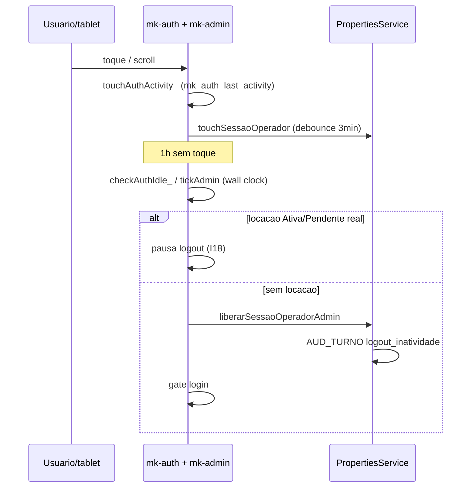

# Incidente I21 — Sessão dual admin/operador e idle 1h não deslogou (09/06/2026)

**Registrado em:** 09/06/2026  
**Mapa:** `MAPA_ERROS_FALHAS_BUGS.md` → **I21**  
**Pacote FASE 5:** **B8** — idle sessão FE+GAS alinhados  
**Correção:** FE **v1.7.94** + GAS **v1.5.72**  
**Operadora citada:** Milena Nunes (id 2)  
**Deploy doc:** `DEPLOY_v1.5.72_SESSAO_IDLE.md`

---

## Resumo executivo

| O que o usuário viu | O que o sistema fazia (bug) |
|---------------------|-----------------------------|
| Milena no **BALCÃO** desde 18:10; às **08:17** do dia seguinte ainda logada | GAS mantinha sessão até **TTL 18h** — idle 1h **não existia no servidor** |
| **TABLET: Administrador** + botão “Sair do admin” | PIN 1416 gravava sessão **ADMIN** local **sem** liberar operador no GAS |
| “Passou mais de 1h sem atividade” — ninguém deslogou | Timer admin usava `setInterval(1000)` — **congelava** com aba/PWA em background |
| URL `?force=1.7.93` | Boot restaurava sessão e **renovava** `mk_auth_last_activity` mesmo após 1h (se locação fantasma) |

**Causa raiz:** modelo de **duas sessões independentes** (local tablet × servidor balcão) + idle só parcial no FE + ausência de `lastActivityAt` no GAS.

---

## Linha do tempo do evento

| Momento | Evidência | Interpretação |
|---------|-----------|---------------|
| **08/06 ~18:10** | Sidebar “BALCÃO: Milena Nunes · Entrou 18:10” | `registrarSessaoOperadorAtiva_` no GAS |
| **08/06 noite** | Sem locações ativas (0 ativas / 0 encerradas hoje) | Sem guarda I18 — idle deveria correr |
| **09/06 08:17** | Screenshot Windows Chrome — ainda logado, `?force=1.7.93` | ~14h desde login; idle 1h **não** efetivo |
| **09/06** | Usuário reporta inatividade >1h | Disparou auditoria de fluxo completo auth/idle |
| **09/06** | Commit **v1.7.94** / **v1.5.72** (B8) | Correção entregue no repo |

---

## Mapa de causas (5 falhas encadeadas)

### C1 — Sessão dual (admin local × operador servidor)

```
PIN 1416 → adminLogin() → sessionStorage = ADMIN
GAS PropertiesService → MK_SESSAO_OPERADOR_ATIVA = Milena (inalterado)
UI: BALCÃO = Milena | TABLET = Administrador
```

- `trocarOperador('inatividade')` com `role === 'admin'` **pulava** `liberarSessaoOperador`.
- “Sair do admin” só chamava `adminLogout()` — **não** liberava balcão no GAS.

### C2 — GAS sem idle 1h (só TTL 18h)

- `MK_SESSAO_OPERADOR_TTL_MS = 18h` — login 18:10 válido até ~12:10 do dia seguinte.
- Nenhum `lastActivityAt` nem expiração por inatividade no servidor.

### C3 — Timer admin por countdown (não relógio real)

- `tickAdmin()` decrementava `adminCountdown` via `setInterval(1000)`.
- Chrome/PWA **suspende** timers em background — countdown não chegava a zero overnight.

### C4 — Boot renovava idle indevidamente

- `mkAuthBoot`: se idle expirado **mas** `mkHasLocacaoAbertaNoTablet_()` (cache stale) → **não** deslogava e ainda chamava `touchAuthActivity_()`.

### C5 — `isAuthIdleExpired_` com `!last` → nunca expira

- Sem `mk_auth_last_activity` no `localStorage`, função retornava `false`.

---

## Correções aplicadas (B8)

| # | Correção | Arquivo |
|---|----------|---------|
| 1 | Idle por **timestamp** (`mkAuthIdleRemainingMs_`, `authActivityBaseline_`) | `mk-auth.js` |
| 2 | `mkAuthReleaseBalcaoServer_` — logout libera GAS (`liberarSessaoOperadorAdmin` na inatividade) | `mk-auth.js` |
| 3 | `adminLogin()` **preserva** sessão operador; só `isAdmin` + `mk_admin_ui_persist` | `mk-admin.js` |
| 4 | `tickAdmin()` usa relógio real; display `MM:SS` + `⏸` com locação aberta (I18) | `mk-admin.js` |
| 5 | Boot: idle expirado → libera GAS + gate; **não** renova activity se expirado | `mk-auth.js` |
| 6 | `mkHasLocacaoAbertaNoTablet_` prioriza `window.sessions` (sync) sobre cache | `mk-auth.js` |
| 7 | GAS `lastActivityAt` + `MK_SESSAO_OPERADOR_IDLE_MS` (1h) + `logout_inatividade` AUD_TURNO | `.gs` |
| 8 | Action `touchSessaoOperador` — heartbeat debounced 3 min no FE | `.gs` + `mk-auth.js` |
| 9 | `adminTeardownUI_` / `wireAdminIdleListeners_` — sem leak de listeners | `mk-admin.js` |
| 10 | Teste `TESTE_SESSAO_IDLE_READONLY.ps1` + guards `pre-push-check` | `scripts/` |

---

## Fluxo pós-correção (referência)



---

## Travas e testes

| Trava | Onde | Check pre-push |
|-------|------|----------------|
| Idle relógio real | `mkAuthIdleRemainingMs_` | `guard.idle.wallclock` |
| Libera balcão no logout | `mkAuthReleaseBalcaoServer_` | `guard.idle.gas.release` |
| Locação aberta pausa idle | `mkHasLocacaoAbertaNoTablet_` | `guard.idle.locacao` (I18) |
| GAS idle 1h | `sessaoOperadorIdleExpirada_` | ping ≥ v1.5.72 |

```powershell
.\scripts\testes\TESTE_SESSAO_IDLE_READONLY.ps1
.\scripts\pre-push-check.ps1
```

**Tablet (obrigatório pós-deploy):**

1. Login Milena → PIN admin 1416 → sidebar mostra BALCÃO + TABLET distintos.
2. Mock idle (DevTools): `localStorage.setItem('mk_auth_last_activity', String(Date.now()-61*60*1000)); location.reload();`
3. Esperado: gate login + `listarOperadoresLogin.sessaoAtiva` null.
4. Com locação **Ativa**: permanece logado; timer admin com `⏸`.

---

## Relação com incidentes anteriores

| ID | Relação |
|----|---------|
| **I18** | Guarda locação aberta — **mantida**; corrigido efeito colateral (cache stale + boot) |
| **I19** | Sessão fantasma PWA — `mkAuthReconcileSessaoFantasma_` continua; GAS idle agora alinha servidor |
| **I17** | Liberar sessão + UI — `mkAuthReleaseBalcaoServer_` unifica logout idle com liberar ADM |

---

## Aprendizados — nunca repetir

1. **Nunca** tratar PIN admin como substituto de logout do operador no GAS.
2. **Nunca** usar só `setInterval` countdown para segurança de sessão — usar **wall clock**.
3. **Nunca** renovar `mk_auth_last_activity` no boot se idle já expirou.
4. **Sempre** alinhar idle FE e GAS (`lastActivityAt` + AUD_TURNO `logout_inatividade`).
5. **Sempre** liberar `MK_SESSAO_OPERADOR_ATIVA` em logout por inatividade (`liberarSessaoOperadorAdmin`).

---

## Validação 09/06/2026

| Teste | Resultado |
|-------|-----------|
| Ping GAS | **v1.5.72** |
| `TESTE_SESSAO_IDLE_READONLY.ps1` | **ok** |
| `TESTE_PROTOCOLO_DIAGNOSTICO.ps1` (completo) | **warn** (FE Pages regex corrigido); demais fases ok |
| B8 FASE 5 | **Fechado** no repo |

*Tablet mock idle (I21) — opcional; ver `DEPLOY_v1.5.72_SESSAO_IDLE.md`.*
