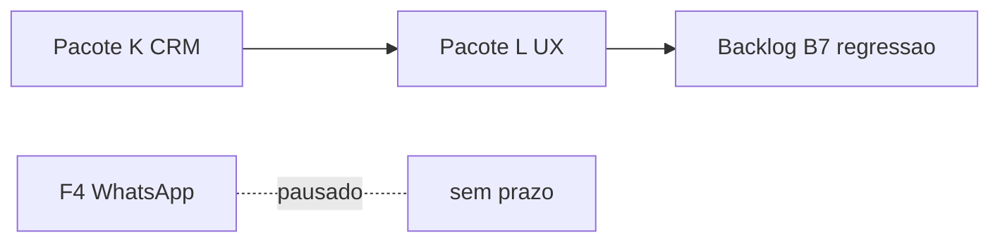

# Decisão operacional — Comunicação via QR Code (jun/2026)

**Data:** 06/06/2026  
**Decisão:** **Pular Sprint 3 (F4 WhatsApp)** e **não investir em SMS gateway** no curto prazo.  
**Canal oficial no balcão:** **QR Code** → portal `acompanhar.html`.

---

## Motivo (problemas reais)

| Problema | Impacto |
|----------|---------|
| Várias mensagens automáticas (WhatsApp/SMS) | Conta **bloqueada 4 dias** |
| SMS no número novo | **Não entrega** — fica sem enviar |
| Risco operacional | Pais sem aviso + loja sem canal confiável |

**Conclusão:** automação de mensagens (F4 + campanhas SMS) **pausada até nova avaliação** — provavelmente meses, não semanas.

---

## O que usar no balcão (agora)

### 1. QR Code do portal (principal)

| Item | Valor |
|------|-------|
| **URL** | https://ribocg-a11y.github.io/movikids/acompanhar.html |
| **Cartaz balcão (imprimir)** | `assets/qr-balcao-imprimir.html` — visual **portal carrossel** · **A5** + gráficos de fundo |
| **Online (após push)** | https://ribocg-a11y.github.io/movikids/assets/qr-balcao-imprimir.html |
| **QR só (SVG/PNG)** | `assets/qr-portal-acompanhar.svg` · `.png` |
| **Regenerar QR** | `node scripts/generate-portal-qr.js` |

**Fluxo:** operador mostra QR na mesa / tablet → responsável escaneia → digita **telefone com DDD** → vê timer das crianças (carrossel v1.7.47+).

### 2. WhatsApp manual (opcional, sem automação)

- Operador pode **copiar link** ou falar o portal — **não** disparar várias mensagens em sequência.
- Botões `abrirWhatsApp` no app permanecem como **fallback manual** (1 conversa por vez); **não** expandir F4.

### 3. SMS — não depender

- Botões SMS no app **não são canal oficial** até gateway estável.
- Se falhar: mensagem no app já sugere QR (`sms-fail-hint`).

---

## O que fica pausado (não fazer)

| Item | Status |
|------|--------|
| **Sprint 3 — F4 WhatsApp completo** | ⏸ **Cancelado do roadmap ativo** |
| Inventário mensagens obrigatórias (W.1–W.6) | ⏸ |
| Novas integrações SMS Gateway | ⏸ |
| Campanhas / dedup / envio em massa | ⏸ |
| Trocar gateway ou número só para “fazer SMS voltar” | ⏸ até política clara |

**Reavaliar quando:** conta WA estável 30+ dias **e** teste manual de 1 SMS/dia com entrega comprovada — não antes.

---

## Roadmap ajustado

| Ordem | Sprint | Foco |
|-------|--------|------|
| **Atual** | K.3–K.4 tablet | Relacionamento + checklist |
| **Próximo** | **L — UX polish** | Balcão mais rápido (DNA portal) |
| **Depois** | B7, B1… | Confiabilidade / KPIs |
| ~~Jul F4~~ | — | **Pausado** |

---

## Checklist balcão (comunicação)

| # | Ação | OK |
|---|------|-----|
| 1 | QR impresso ou em tablet fixo no balcão | [ ] (strip Home v1.7.89 + link Sistema) |
| 2 | Operador treinado: “escaneie e coloque seu telefone” | [ ] |
| 3 | **Não** clicar SMS em sequência para vários clientes | [ ] |
| 4 | Portal testado: timer ±2s após iniciar locação | [ ] |

---

## Documentos relacionados

- `PLANO_CONTINUIDADE_2026-06.md` — roadmap atualizado
- `PACOTE_K_vs_F4_WHATSAPP.md` — F4 marcado pausado
- `ANALISE_SMS_DELIVERY_MILENA_2026-06-03.md` — histórico SMS
- `REGRAS_DE_PUBLICACAO_SEGURA.md` Regra 3 — zona crítica WA (não expandir)

---

*Decisão registrada por solicitação explícita da operação (06/06/2026).*
