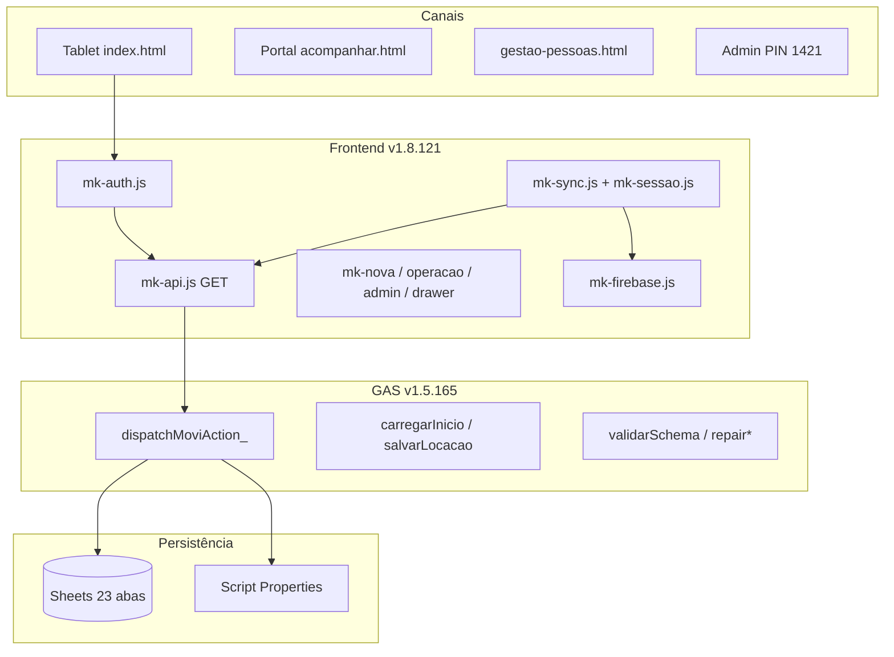

# MOVI KIDS — Diagnóstico completo do sistema (6 camadas)

**Data:** 25/06/2026 · **Base:** auditoria célula I52–I67 · protocolos · `pre-push-check` · sessão 25/06  
**Complementa:** `PLANEJAMENTO_ATUAL_2026-06.md` §9 · `MAPA_CODIGO_ARQUITETURA.md` · `MAPA_ERROS_FALHAS_BUGS.md`

**Pergunta guia:** *se isso falhar, eu saberia? em quanto tempo recupero?*

---

## Scorecard executivo

| Camada | Nota | OK | WARN | GAP |
|--------|------|----|------|-----|
| 1 Código & Arquitetura | **8/10** | 7 | 2 | 0 |
| 2 Dados & Persistência | **9/10** | 8 | 0 | 1 |
| 3 Infra & Deploy | **7/10** | 6 | 2 | 1 |
| 4 Segurança & Acesso | **8/10** | 7 | 2 | 0 |
| 5 Operação & Monitoramento | **8/10** | 6 | 2 | 0 |
| 6 Qualidade & Processos | **8/10** | 7 | 1 | 1 |

**Produção (23/06):** FE **v1.8.121** Pages · GAS **v1.5.165** Web · Planilha **schemaOk=true** · Homolog tablet **✅**

---

## Mapa do sistema — motores e conexões

| Motor | Arquivo | Função crítica |
|-------|---------|----------------|
| **api()** | `mk-api.js` | FE→GAS; escritas críticas só GET (I15) |
| **syncController** | `mk-sync.js` | Cronômetro; merge col Y (I43) |
| **carregarInicio_** | GAS | `COL_LOC_READ_=28` |
| **validarSchema** | GAS | Imunológico planilha |
| **repair*PlanilhaAdmin** | GAS + `REPARAR_*.ps1` | Migrations idempotentes |
| **pre-push-check** | `scripts/pre-push-check.ps1` | ~100 guards |
| **portalRateLimitOk_** | GAS | 20 req/min/telefone |

**Fluxo operacional:** F0 boot → F1 auth → F2 hub → F3 nova → F5 ▶ timer → F7 drawer → F8 encerrar → F9 admin → F10–F14 gestão.

---

# Camada 1 — Código & Arquitetura

| # | Parâmetro | Status | Evidência | Se falhar, saberia? |
|---|-----------|--------|-----------|---------------------|
| 1.1 | Estrutura pastas/módulos | OK | Pacote M: 17× `mk-*.js` | Sim — I22 `guard.html.page-balance` |
| 1.2 | Separação responsabilidades | OK | FE / GAS / Sheets | Sim — incidentes por camada |
| 1.3 | Dependências mapeadas | OK | `mk-version.js`, URL GAS fixa | Sim — ping |
| 1.4 | Padrões consistentes | OK | `api()` central; `resp_`/`err_` | Parcial |
| 1.5 | Tipos/cobertura | WARN | JS sem TS; guards substituem | Não |
| 1.6 | Tratamento erros | OK | I15; toast `mk-core.js` | Parcial tablet |
| 1.7 | Código morto isolado | OK | `arquivo-historico/` | Não auto |
| 1.8 | Docs internas | WARN | `MAPA_CODIGO` header defasado (v1.5.107) | Não |
| 1.9 | Git / versões FE | OK | mk/sw/html **1.8.121** alinhados | Sim — pre-push |

**Zonas P0:** `mk-api.js`, `mk-sync.js`, `mk-operacao.js`, `carregarInicio_`, `mk-auth.js`.

---

# Camada 2 — Dados & Persistência

| # | Parâmetro | Status | Evidência | Se falhar, saberia? |
|---|-----------|--------|-----------|---------------------|
| 2.1 | Schema versionado | OK | I52–I63; 28 cols LOCACOES | **Sim** — `validarSchema` |
| 2.2 | Integridade referencial | OK | FK `operador_id`; veículos CONFIG | Sim — `audit*SampleCore_` |
| 2.3 | Índices queries | N/A | Google Sheets | — |
| 2.4 | Backup/retenção | OK | `BACKUP_RH_PLANILHA.ps1` | Se rodar rotina |
| 2.5 | DR testado | WARN | Repair dry-run; sem DR formal | Parcial |
| 2.6 | Dados sensíveis | OK | PIN hash; admin Script Property | Parcial |
| 2.7 | Logs acesso | OK | Abas AUD_* (I61) | Sim |
| 2.8 | Consistência ambientes | OK | Workbook único | N/A |
| 2.9 | Volume monitorado | OK | 852 locs; `diagnosticoPlanilhaCompletoAdmin` | Sim |

**Auditoria célula 25/06:** camada 1 ok · camada 2 **23/23** · camada 3 OAuth **0 issues**.  
**Protocolo:** `PROTOCOLO_AUDITORIA_CELULA_PLANILHA.md` · `HIGIENE_DADOS_PLANILHA.ps1`.

---

# Camada 3 — Infraestrutura & Deploy

| # | Parâmetro | Status | Evidência | Se falhar, saberia? |
|---|-----------|--------|-----------|---------------------|
| 3.1 | Ambientes | WARN | Prod único; `?force=` tablet | N/A |
| 3.2 | Env segregadas | OK | Script Properties; sem `.env` git | Manual |
| 3.3 | CI/CD | OK | `.github/workflows/ci.yml` | Sim — Actions |
| 3.4 | Rollback | WARN | `ROLLBACK_EMERGENCIA.md` arquivo | Parcial |
| 3.5–3.6 | Recursos/escala | N/A | Serverless | — |
| 3.7 | Rede | OK | Web App GAS + Pages | Sim |
| 3.8 | DNS/SSL | OK | GitHub Pages + Google | Sim |
| 3.9 | Deps externas | OK | Firebase RTDB | Sim — sync |

**Pipeline:** `pre-push-check` → `git push` → `verify-publish-complete` · GAS: Nova versão Web (mesmo Deploy ID `AKfycbwakQ...`).

---

# Camada 4 — Segurança & Acesso

| # | Parâmetro | Status | Evidência | Se falhar, saberia? |
|---|-----------|--------|-----------|---------------------|
| 4.1 | Auth robusta | OK | PIN hash; sessão única; idle I21 | Sim |
| 4.2 | Menor privilégio | OK | Agente §7.3; perfis documentados | Processo |
| 4.3 | Secrets fora código | OK | I64; PIN **1421** Script Property | Sim — guards leak |
| 4.4 | OWASP (I15) | OK | Sem POST browser escritas críticas | Sim — paridade HTTP |
| 4.5 | Rate limiting | OK | Portal 20/min/tel | Sim — 429 |
| 4.6 | Auditoria admin | OK | AUD_TURNO, AUDITORIA | Sim |
| 4.7 | Rotação credenciais | WARN | `ROTACAO_PIN_ADMIN.md` manual | Manual |
| 4.8 | SAST/DAST | GAP | Guards estáticos apenas | Parcial |
| 4.9 | Plano incidentes | OK | I1–I67; `MAPA_ERROS` | Processo |

---

# Camada 5 — Operação & Monitoramento

| # | Parâmetro | Status | Evidência | Se falhar, saberia? |
|---|-----------|--------|-----------|---------------------|
| 5.1 | Logs estruturados | GAP | Sem APM/Sentry | **Não** |
| 5.2 | Alertas automáticos | WARN | FASE 17 `alertasInteligentes_`; homolog ⏳ | Parcial |
| 5.3 | Dashboard saúde | OK | ping; aba DASHBOARD | Sim |
| 5.4 | Health checks | OK | `verify-gas-deploy`; B6 | Sim — scripts |
| 5.5 | SLA/SLO | GAP | Não formalizado | Não |
| 5.6 | Runbooks | OK | HANDOFF; PROTOCOLO_DIAGNOSTICO | Se executar |
| 5.7 | On-call | N/A | Loja + sócio | — |
| 5.8 | Post-mortems | OK | `docs/arquivo/incidentes/` | Processo |
| 5.9 | Uptime histórico | WARN | Ping manual | Parcial |

---

# Camada 6 — Qualidade & Processos

| # | Parâmetro | Status | Evidência | Se falhar, saberia? |
|---|-----------|--------|-----------|---------------------|
| 6.1 | Testes integração | OK | 77× `TESTE_*.ps1` | Se rodar |
| 6.2 | Cobertura mínima | GAP | Sem % coverage | Não |
| 6.3 | Code review | OK | GitHub + agente | Processo |
| 6.4 | Testes carga | GAP | Não implementado | Não |
| 6.5 | Ambiente teste | WARN | Readonly em prod API | Cuidado |
| 6.6 | Docs externas | OK | README, AGENTS, DESIGN_SYSTEM | Sim |
| 6.7 | Changelog | OK | Header `.gs`; incidentes datados | Sim |
| 6.8 | Onboarding | OK | HANDOFF; regras `.cursor/` | Sim |
| 6.9 | Débito técnico | OK | PLANEJAMENTO; HANDOFF ⏳ | Processo |

**Matriz trava→teste (P0):** I15→paridade HTTP · I20/I43→`TESTE_I20`+`TESTE_I43` · I22→`check-operacao-livre` · I24→`verify-publish-complete`.

---

## Buracos no quebra-cabeça (síntese)

| P | Buraco | Camada |
|---|--------|--------|
| **P0** | ~~Homolog tablet não fechada (I43, I42, I47)~~ | ✅ 23/06 |
| **P0** | Raykelly cadastro incompleto (gate 428) | 2 + produto |
| **P1** | FASE 17 fechamento formal + decisão F9 | 1 + 5 |
| **P1** | Docs versão defasados (`ESTADO_ATUAL`, `MAPA_CODIGO`) | 1 + 6 |
| **P1** | RH holerites não persistidos (RH-G1) | 2 |
| **P2** | Sem telemetria central (APM) | 5 |
| **P2** | CI `-SkipNetworkTests` | 3 + 6 |
| **P2** | FASE 10–14 produto abertas | 1 |

---

## Rotinas recomendadas

| Frequência | Comando / ação |
|------------|----------------|
| Pré-push FE | `.\scripts\pre-push-check.ps1` |
| Pós-push | `.\scripts\verify-publish-complete.ps1` |
| Pós-GAS Web | `.\scripts\verify-gas-deploy.ps1` + tablet ▶ |
| Semanal | ping + `validarSchema` |
| Mensal | `HIGIENE_DADOS_PLANILHA.ps1` → `AUDITORIA_CELULA_PLANILHA.ps1` → `BACKUP_RH_PLANILHA.ps1` |

---

**Próximo documento de ação:** `PLANEJAMENTO_ATUAL_2026-06.md` §9 (prioridades pós-diagnóstico).
