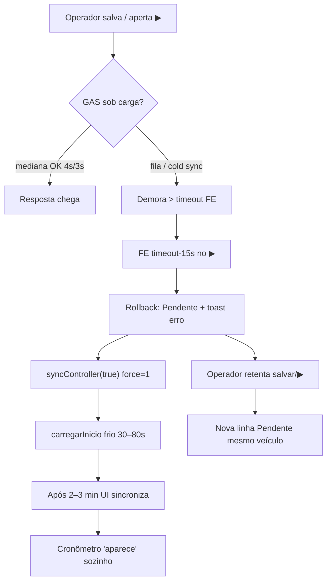

# INCIDENTE I143 — Salvar/▶ “erro” + cronômetro some + duplicatas (06/08/2026)

**Status:** ✅ corrigido FE **v1.9.96** + GAS Web **v1.5.210**  
**Sintoma reportado:** ao salvar locação aparece erro; ▶ não inicia; após 2–3 min o cronômetro aparece; se ficar tentando, várias locações do mesmo veículo.

---

## Evidência ao vivo (antes do fix)

| ID | Status | Veículo | Criança | Responsável |
|----|--------|---------|---------|-------------|
| 2494 | Ativa | Carro 02 | Maria Alice E Arthur | Isabela Barbosa |
| 2496 | Pendente | Carro 02 | (mesma) | (mesma) |
| 2497 | Pendente | Carro 02 | (mesma) | (mesma) |

Latências medidas no diagnóstico:

| Ação | Tempo |
|------|-------|
| `carregarInicio` frio | **~79s** |
| `listarAtivas` | ~7–11s |
| `salvarLocacao` (isolado) | ~4–6s |
| `iniciarTimer` (isolado) | ~3–4s |

---

## Cadeia causal (não foi “GAS quebrado”)

1. **▶ timeout FE = 15s** — insuficiente quando a fila GAS está ocupada (mesmo com I125d ~3s no caminho quente).
2. **Catch do ▶ fazia rollback** do otimista I20 + **`syncController(true)`** (force frio).
3. **Unstick do salvar (42s)** dizia *“tente salvar de novo”* enquanto o GAS ainda podia estar gravando.
4. **Sem trava de veículo já aberto** no `salvarLocacao_` → cada retry = nova linha.

I125d **não regrediu** o batch (salvar/▶ isolados continuam ~4s/~3s). A falha é de **política FE de timeout/retry** + **lentidão residual de sync frio** em planilha grande (~2400 linhas).

---

## Correção

| Camada | Versão | Mudança |
|-------|--------|---------|
| FE | v1.9.96 | ▶ timeout 28s; timeout **mantém** otimista; catch **sem** force=1; dedup 90s; unstick sem pedir retry |
| GAS | v1.5.210 | `veiculoJaAberto_` → 409 se Ativa/Pendente |

### Validação pós Nova versão (06/08)

| Gate | Resultado |
|------|-----------|
| ping | **v1.5.210** ✅ |
| validarSchema | ok ✅ |
| salvar mediana | **~3.9s** ✅ |
| ▶ mediana | **~3.1s** · drift **0** ✅ |
| 2º salvar mesmo veículo | **409 bloqueado** ✅ |
| limpeza TESTE_ | total=2 · fantasma=0 ✅ |

Artefato: `/opt/cursor/artifacts/teste-i143-pos-deploy.json`

---

## Família no MAPA (por que “voltou”)

Ver § diagnóstico em `MAPA_ERROS_FALHAS_BUGS.md` e resumo na resposta ao usuário: I20 · I32 · I33 · I43 · I86 · I98/I99 · I122 · I125 · **I143**.
