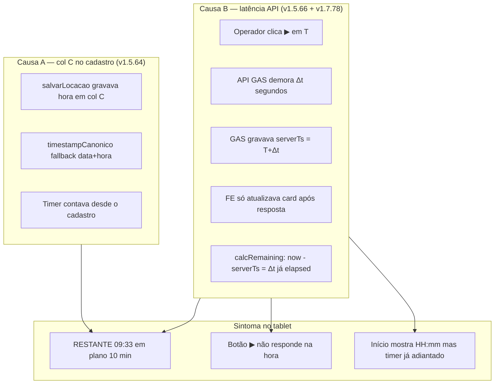
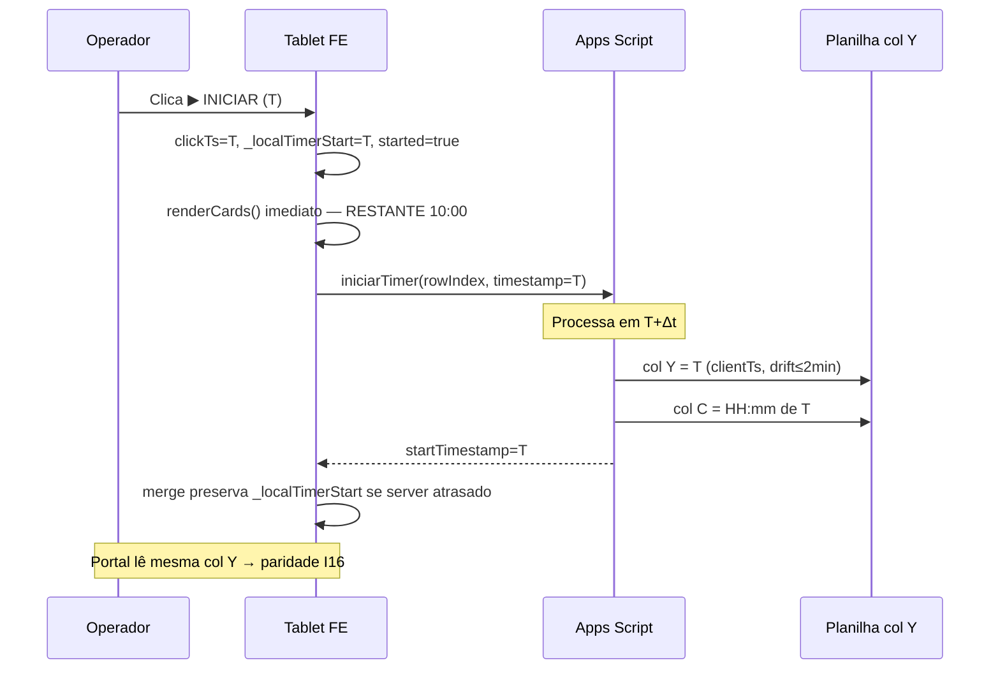

# I20 — Cronômetro adiantado / botão ▶ lento — resolução definitiva

**Registrado em:** 07/06/2026  
**Status:** **RESOLVIDO** em produção (tablet validado pelo operador)  
**Versões finais:** GAS **v1.5.66** · FE **v1.7.78**  
**Mapa vivo:** `MAPA_ERROS_FALHAS_BUGS.md` (linha I20)  
**Incidente relacionado:** `../arquivo/incidentes/INCIDENTE_CRONOMETRO_PORTAL_AUTH_2026-06-05_06.md` (I16 + I20 fase 1)

---

## Resumo executivo

O operador via o cronômetro **adiantado** ao apertar ▶ (ex.: plano 10 min começando em **09:33**, **09:50** ou com **~3–27 s** já consumidos). O botão **não respondia na hora** — o card só mudava quando a API GAS respondia.

**Causa raiz em duas camadas** (ambas precisavam de correção):

| # | Camada | Causa | Sintoma |
|---|--------|-------|---------|
| **A** | GAS + planilha (05/06) | Col **C** preenchida no cadastro; FE inferia início por `data + horaInicio` | Timer **sozinho** e adiantado **antes** do ▶ |
| **B** | GAS + FE (06–07/06) | `iniciarTimer_` gravava **`serverTs`** (fim da requisição); FE só ligava UI **após** a resposta | Ao ▶: espera + card já com **segundos perdidos**; `horaInicio` HH:mm **esconde** o atraso |

**Solução definitiva (07/06):**

- **GAS v1.5.66:** col Y = **`clientTs`** (instante do clique) quando drift ≤ 2 min.
- **FE v1.7.78:** início **otimista** no clique; `mergeSessaoCanonica` preserva `_localTimerStart`; `effectiveStartTs_` no countdown.

---

## Linha do tempo (cronologia completa)

| Data | Versão | O que aconteceu | Resultado |
|------|--------|-----------------|-----------|
| **05/06** | — | Operador reporta timer em 9:30 em plano 10 min **sem** apertar ▶ | Incidente **I20** aberto |
| **05/06** | GAS **v1.5.64** | `salvarLocacao_`: col C vazia, Y=0, Pendente; `timestampCanonico_` sem fallback | Corrige camada **A** (timer sozinho) |
| **05/06** | FE **v1.7.73–74** | `canonSessao_`, `sessaoTimerIniciado_`; timer só com col Y válida | Balcão respeita Pendente |
| **06/06** | FE **v1.7.76** | Separa SMS do ▶; `iniciarContagemDireto_` sem modal; dois botões no card pendente | SMS não inicia timer; UX botões ainda pesada |
| **06/06** | — | Operador: ao ▶ ainda **09:33** (perda ~27 s); botões grandes | Patches I20 fase 1 **não** resolvem camada **B** |
| **07/06** | — | Investigação: latência API + `serverTs` no fim da req; tablet em `?force=1.7.76` | Causa raiz **B** identificada |
| **07/06** | GAS **v1.5.66** | `iniciarTimer_` usa `canonTs = clientTs` se drift ≤ 120 s | Col Y = instante do **clique** |
| **07/06** | FE **v1.7.77–78** | Início otimista; `_localTimerStart`; merge anti-stomp; botão “⏳ Iniciando…” | Resposta imediata + 10:00 no clique |
| **07/06** | — | Push `258e9b9`; Pages **v1.7.78**; ping GAS **v1.5.66** | **Operador confirma: ARRUMOU** |

---

## Diagrama de causa (fishbone simplificado)



---

## Fluxo correto após correção (v1.5.66 + v1.7.78)



---

## Semântica das colunas (regra de ouro — nunca violar)

| Coluna | Índice | Nome | No cadastro (`salvarLocacao_`) | No ▶ (`iniciarTimer_`) |
|--------|--------|------|--------------------------------|-------------------------|
| **B** | 2 | Data | `dd/MM/yyyy` hoje | (inalterada) |
| **C** | 3 | Hora Início | **`''` vazia** | `HH:mm` do **clique** |
| **O** | 15 | Status | `Pendente` | `Ativa` |
| **Y** | 25 | startTimestamp | **`0`** | **`clientTs`** (ms) se drift ≤ 2 min; senão `serverTs` |

> **Não inferir** `startTimestamp` por `data + horaInicio`. Só col **Y** após `iniciarTimer`.

---

## Tentativas que NÃO resolveram (lições)

| Tentativa | Por que falhou |
|-----------|----------------|
| Separar SMS do modal (v1.7.76) | Corrigiu acoplamento SMS+timer, **não** a latência `serverTs` |
| Guard col C vazia (v1.5.64) | Corrigiu timer **sozinho**, **não** perda de segundos no ▶ |
| `started=true` só após GAS (v1.7.74) | Evitou falso ativo, **piorou** UX — espera + timer adiantado na resposta |
| Achar “relógio do tablet 27 s adiantado” | Descartado: `Início` e relógio do sistema no **mesmo minuto**; perda = latência API |
| Grid 50/50 “Enviar SMS” + ▶ no card pendente | UX ruim (botões gigantes); corrigido em v1.7.78 com `.pending-actions` |

---

## Correção final — arquivos e funções

### GAS (`MOVIKIDS_Code_v1.5.32_AUTH_OPERADORES_SOBRE_v1.5.31.gs`)

| Função | Comportamento v1.5.66 |
|--------|----------------------|
| `salvarLocacao_` | Col C `''`, col Y `0`, status `Pendente` |
| `iniciarTimer_` | `canonTs = clientTs` se `driftMs ≤ 120000`; grava col Y e C; idempotente se já Ativa (v1.5.65) |
| `timestampCanonico_` | Só col Y ≥ 1e12; `return 0` sem fallback |
| `ping_` | `versao: v1.5.66` |

### Frontend

| Arquivo | Função / trecho | Papel |
|---------|-----------------|-------|
| `mk-operacao.js` | `iniciarContagemDireto_` | Feedback imediato no botão |
| `mk-operacao.js` | `iniciarContagem` | `clickTs`, `_localTimerStart`, `_iniciandoTimer`, otimista |
| `mk-sessao.js` | `effectiveStartTs_` | Countdown usa instante do clique |
| `mk-sessao.js` | `calcRemaining` | `Date.now() - effectiveStartTs_` |
| `mk-sync.js` | `mergeSessaoCanonica` | Não reverte Ativa→Pendente durante API; preserva `_localTimerStart` |
| `mk-home.js` | `buildCard` pendente | `.pending-actions` — ▶ principal, SMS secundário |
| `mk-app.css` | `.pending-actions` | Botões compactos |
| `mk-nova.js` | `confirmarLocacaoEEnviarSms_` | Salva + SMS, **sem** `iniciarTimer` |

### Portal (`acompanhar.html`)

- Lê `startTimestamp` da col Y via GAS (`timestampCanonico_`).
- Com v1.5.66, col Y = `clientTs` → **paridade I16** mantida.

---

## Travas anti-regressão (obrigatórias)

### Estáticas (`scripts/pre-push-check.ps1`)

| Check | O que protege |
|-------|---------------|
| `guard.gas.salvar.horaVazia` | Col C vazia no cadastro |
| `guard.gas.timestamp.noFallback` | Sem inferir por data+hora |
| `guard.gas.iniciar.clientTs` | `iniciarTimer_` usa `canonTs` / `clientTs` |
| `guard.fe.iniciar.otimista` | `clickTs`, `_localTimerStart` em `mk-operacao.js` |
| `guard.sessao.effectiveStart` | `effectiveStartTs_` em `mk-sessao.js` |
| `guard.sync.localTimer` | `_localTimerStart` em `mergeSessaoCanonica` |
| `guard.nova.sms.sem.autoStart` | Cadastro não auto-inicia |
| `guard.iniciar.direto` | ▶ sem modal acoplado |

### Testes automatizados

```powershell
.\scripts\pre-push-check.ps1
.\scripts\testes\TESTE_I20_COMPLETO_PROD.ps1
.\scripts\testes\TESTE_4_FLUXOS_CADASTRO_I20.ps1
.\scripts\testes\TESTE_PARIDADE_CRONOMETRO_PORTAL_BALCAO.ps1
```

| Teste | Valida |
|-------|--------|
| `TESTE_I20_COMPLETO_PROD` | Pendente 600s; SMS não inicia; `clientTs` na col Y (GAS ≥1.5.66); FE otimista |
| `TESTE_4_FLUXOS_CADASTRO_I20` | Dois botões cadastro (salvar+SMS vs só salvar) |
| `TESTE_PARIDADE_CRONOMETRO` | Portal = balcão (I16) |

### Tablet obrigatório (não substituir por PowerShell)

1. Nova locação 10 min → **Pendente**, display **10:00**, parado.
2. Aguardar 30 s **sem** ▶ → continua **10:00**.
3. Clicar ▶ → botão **“⏳ Iniciando…”** **na hora**; card ativo com **10:00** (±1 s).
4. Após 10 s → **09:50** (±1 s), não pular dezenas de segundos.
5. Portal no celular → ±2 s do balcão (I16).
6. URL tablet: `?force=1.7.78` (ou versão atual em `mk-version.js`).

---

## O que NÃO fazer de novo

1. Gravar **hora na col C** em `salvarLocacao` ou qualquer fluxo que não seja `iniciarTimer`.
2. Usar **`serverTs` exclusivo** em `iniciarTimer_` quando `clientTs` está dentro de 2 min (perde Δt da API).
3. Esperar resposta GAS **antes** de mostrar o card ativo (perde Δt na UX).
4. Deixar `mergeSessaoCanonica` **sobrescrever** `_localTimerStart` com timestamp mais tardio do servidor.
5. Declarar I20 fechado **sem teste tablet** após mudança em `iniciarContagem`, `iniciarTimer_` ou `mergeSessaoCanonica`.
6. Publicar FE sem bump **`mk-version.js` + `sw.js` + `index.html` ?v=** juntos.
7. Publicar GAS sem **Nova versão Web** no deploy `AKfycbwakQ...`.

---

## Deploy e links

| O quê | Link / caminho |
|-------|----------------|
| Editor GAS | https://script.google.com/home/projects/19SIhkX9Tk7FiJA1JXu1OrUwssHdr3H5zc8q3rOjmBvqgWfXuHlk8xyf8/edit |
| Ping (≥ v1.5.66) | https://script.google.com/macros/s/AKfycbwakQ-_aWsF5lFGLsiwB5UvJ4AlpW88krSv8daPeMvULwX5FOIdMhGVgdGd0G35270Y/exec?action=ping |
| FE tablet | https://ribocg-a11y.github.io/movikids/?force=1.7.78 |
| `.gs` canônico PC | `MOVIKIDS_Code_v1.5.32_AUTH_OPERADORES_SOBRE_v1.5.31.gs` |
| Deploy doc | `DEPLOY_GAS_v1.5.32_AUTH.md` |

**Commits de referência:**

- `04a8e97` — I20 fase 1: SMS separado, v1.7.76
- `258e9b9` — I20 definitivo: clientTs + otimista, v1.5.66 + v1.7.78

---

## Relação com outros incidentes

| ID | Relação |
|----|---------|
| **I16** | Paridade portal × balcão — **depende** de col Y correta; I20 garante **quando** Y é gravada |
| **I15** | GET no browser — independente, mas testes tablet são comuns |
| **I17–I19** | Auth/sync — não confundir com I20 |

---

## Retrospectiva — por que demorou 4 iterações?

Ver **`PROTOCOLO_DIAGNOSTICO_E_TESTES.md`** §1–3: maturidade 3→4, anti-padrões, checklist de 14 dimensões esquecidas, fluxos F0–F14.

**Daqui em diante:** pedido de teste → `TESTE_PROTOCOLO_DIAGNOSTICO.ps1` (não só `TESTE_I20`).

---

## Histórico deste documento

| Data | Ação |
|------|------|
| 07/06/2026 | Criado após validação do operador (“ARRUMOU”); consolida fases A+B e travas |
| 07/06/2026 | Protocolo mestre de diagnóstico derivado desta retrospectiva |
