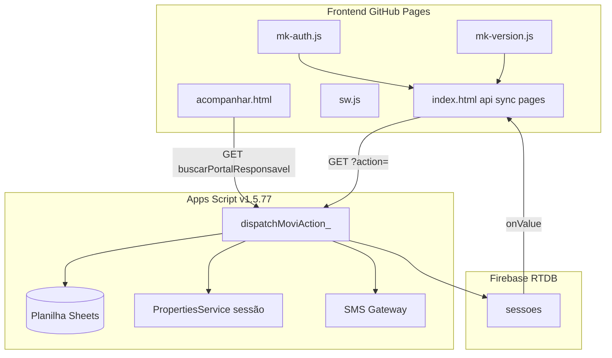
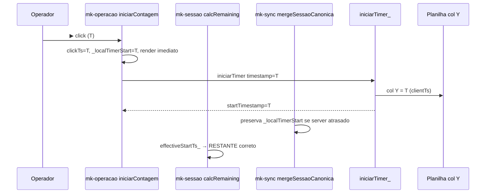
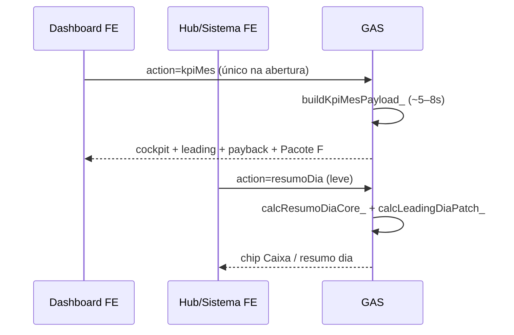

# MOVI KIDS — Mapa do código e arquitetura

**Atualizado:** 10/06/2026 (FE **v1.8.10** · GAS **v1.5.80** · FASE 9 Folha)  
**Função:** anatomia do sistema — o que é cada parte, o que liga com o quê, o que é zona sensível.  
**Complementa:** `ESTADO_ATUAL.md`, `ACESSOS_E_AUTORIZACOES.md`, `REGRAS_DE_PUBLICACAO_SEGURA.md`, `MAPA_ERROS_FALHAS_BUGS.md`, **`PROTOCOLO_DIAGNOSTICO_E_TESTES.md`**

---

## 1. Analogia do corpo humano

| Parte | O que é no MOVI KIDS | Arquivos / camada |
|-------|----------------------|-------------------|
| **Cérebro** | Regras de negócio, dados, financeiro, auth servidor | `MOVIKIDS_Code_...gs` (GAS) + planilha `MOVIKIDS_Planilha_Base` |
| **Coração** | Pulso operacional — sync balcão, timer, locações ativas | `carregarInicio` (GAS) + `syncController` (`mk-sync.js`) + Firebase `sessoes` |
| **Sistema nervoso** | Comunicação FE ↔ GAS | `api()` em `mk-api.js` + `doGet`/`dispatchMoviAction_` (GAS) |
| **Rosto / identidade** | Versão, URL GAS, cache | `mk-version.js`, `sw.js`, bloco anti-stale no `index.html` |
| **Imunológico** | Travas P0, CI, incidentes | `pre-push-check.ps1`, `.cursor/rules/`, `REGRAS_DE_PUBLICACAO_SEGURA.md` |
| **Mãos (braços)** | Ações do operador no balcão | Nova locação, drawer, encerrar, SMS manual — `index.html` + 5 escritas GAS |
| **Olhos (gestão)** | KPIs, payback, cockpit, leading | Dashboard, Caixa admin — `kpiMes` + `resumoDia` (GAS) + `mk-admin.js` |
| **Pernas (canais externos)** | Portal pais, foto, cronômetro curto | `acompanhar.html`, `foto-moldura.html`, `track.html` |
| **Pele** | Visual único | `mk-app.css` (base) + `mk-design.css` (aditivo Pacote A) |
| **Porta de entrada** | Quem pode entrar + idle 1h + splash boot | `mk-auth.js` — `mkAuthBoot`, `hideSplash_`, `mkAuthReleaseBalcaoServer_` |
| **Dedos finos** | Scripts pontuais, emergência, testes | `scripts/testes/`, `scripts/ops/`, `google-drive-sheets-auth` |

**Monólito modularizado (Pacote M fechado):** `index.html` **~1.378 linhas** (v1.7.87) — **zero JS inline** (só HTML + `<script src>`). Módulos: M.1–M.17 (`mk-globals.js`, `mk-core.js` … `mk-boot.js`). Plano: `PACOTE_M_MODULARIZACAO.md`.

---

## 2. Mapa de arquivos (raiz)

```
movikids-github/
├── CÉREBRO + NERVOSO
│   └── MOVIKIDS_Code_v1.5.32_AUTH_OPERADORES_SOBRE_v1.5.31.gs   ← único GAS canônico
├── CORAÇÃO + MÃOS (balcão)
│   ├── index.html          ← app principal (UI + páginas)
│   ├── mk-auth.js          ← auth operadores/admin (extraído v1.7.48+)
│   ├── mk-update.js        ← reload seguro pós-update
│   ├── mk-version.js       ← versão FE + URL GAS
│   ├── mk-stale-sync.js    ← anti-stale (M.2)
│   ├── mk-cache-bust.js    ← cache bust pós versão (M.2)
│   ├── mk-firebase.js      ← RTDB sessoes (M.2)
│   ├── mk-api.js           ← api() + guards I15 (M.3)
│   ├── mk-sync.js          ← syncController + merge (M.4)
│   ├── mk-sessao.js        ← SMS + timer sessão (M.5)
│   ├── mk-nova.js          ← Nova locação (M.6)
│   ├── mk-drawer.js        ← Drawer + encerrar (M.7)
│   ├── mk-home.js          ← Cards + painel (M.9)
│   ├── mk-nav.js           ← showPage + sidebar (M.10)
│   ├── mk-admin.js         ← PIN, KPIs, caixa, config (M.11)
│   ├── mk-historico.js     ← histórico + analytics (M.12)
│   ├── mk-relacionamento.js← CRM K.3 (M.13)
│   ├── mk-custos.js        ← página custos (M.14)
│   ├── mk-avulso.js        ← lançamento avulso (M.15)
│   ├── mk-globals.js       ← PRECOS, sessions, APP_VERSION (M.17)
│   ├── mk-core.js          ← toast, init, config (M.16)
│   ├── mk-boot.js          ← DOMContentLoaded + SW (M.17)
│   └── sw.js               ← PWA cache
├── PERNAS (outros canais)
│   ├── acompanhar.html     ← portal responsável
│   ├── foto-moldura.html
│   └── track.html          ← cronômetro curto
├── PELE
│   ├── mk-app.css          ← base legado (ex-inline, Pacote M.1)
│   └── mk-design.css       ← aditivo Pacote A
├── CONFIG deploy
│   ├── gas-endpoint.json   ← override URL GAS (fallback)
│   ├── manifest.json
│   └── gas/ + .clasp.json  ← clasp push (Code.gs gerado)
├── IMUNOLÓGICO
│   └── scripts/pre-push-check.ps1
├── DEDOS (testes / ops / homolog)
│   ├── scripts/testes/*.ps1
│   ├── scripts/ops/mock-idle-tablet.html
│   └── assets/mock-idle-homolog.html   ← mock idle I21 (Pages HTTPS)
├── ARQUIVO (não implantar)
│   └── arquivo-historico/*.gs
└── DOCUMENTAÇÃO
    └── docs/ativos/        ← processos, handoff, este mapa
```

---

## 3. O que conecta com o quê



### Contrato FE → GAS

| Elo | Onde | Deve estar alinhado com |
|-----|------|-------------------------|
| URL exec | `mk-version.js` `MK_GAS_EXEC_URL` | `.gs` `DEPLOY_ID` / `WEBAPP_URL` |
| Versão FE | `mk-version.js` `MK_VERSION` | `sw.js` `SW_VERSION`, `?force=` tablet |
| Versão GAS | header `.gs` + `ping` | Produção após Nova versão Web |
| Escritas balcão | `api()` GET + 5 actions | `WRITE_ACTIONS_CRITICAS_` no GAS |
| Operador nas escritas | `operadorApiParams_()` | GAS valida `operador`/`operadorId` |
| KPIs admin | `action=kpiMes` | `buildKpiMesPayload_` → cockpit, leading, payback, **viabilidadeContratacao**, alertas |
| Resumo dia (leve) | `action=resumoDia` | `calcResumoDiaCore_` + `calcLeadingDiaPatch_` (v1.5.77) |
| Dados mestres | `SHEET_ID` no `.gs` | Planilha `1ULMUx8AqZkZ75Ed0iRK...` |

### Sync em tempo real (3 canais)

| Canal | Função |
|-------|--------|
| **Poll** | `carregarInicio` a cada 5–15s |
| **Firebase** | `sessoes` → atualiza cards/timer sem esperar poll |
| **BroadcastChannel** | Abas do mesmo tablet sincronizadas |

### Cronômetro — fluxo I20 (v1.5.66+ + FE v1.7.78+; atual v1.7.87) — **zona P0**

Doc mestre: `INCIDENTE_I20_CRONOMETRO_RESOLUCAO_2026-06-07.md`



| Etapa | Arquivo | Função | Regra |
|-------|---------|--------|-------|
| Cadastro | GAS `salvarLocacao_` | — | Col C `''`, Y `0`, Pendente |
| Clique ▶ | `mk-operacao.js` | `iniciarContagem` | Otimista em T; API em background |
| Gravação | GAS `iniciarTimer_` | — | Y = `clientTs` se drift ≤ 2 min |
| Merge | `mk-sync.js` | `mergeSessaoCanonica` | Não stomp `_localTimerStart` |
| Display | `mk-sessao.js` | `effectiveStartTs_`, `calcRemaining` | Countdown desde T |
| Portal | `acompanhar.html` | `canonLoc_`, `restante()` | Lê mesma col Y (I16) |

**Nunca alterar** este fluxo sem: `TESTE_I20_COMPLETO_PROD.ps1` + teste tablet ▶→10:00.

---

## 4. Partições no GAS (`.gs`)

| Seção | Linhas ~ | Responsabilidade |
|-------|---------|------------------|
| Constantes | 60–125 | `SHEET_ID`, `DEPLOY_ID`, preços, veículos, PIN admin |
| Router | 252–361 | `doGet`, `doPost`, `dispatchMoviAction_` — **porta de tudo** |
| Locações | 472–948 | CRUD locação + auditoria |
| KPIs / Payback / Cockpit / Leading | 1011–1605 | `buildKpiMesPayload_`, `calcLeadingDiaPatch_` (v1.5.77), narrativaExecutiva |
| Balcão sync | 1606–1817 | `carregarInicio`, timer |
| CRM / Portal | 2589–3032 | Responsáveis, portal, import K.1 |
| SMS | 3033–3660 | Gateway DJVJRL |
| Auth operadores | 4176–4520 | PIN, sessão única, idle 1h (`lastActivityAt`), `touchSessaoOperador`, APIs admin |

**Regra:** nova `action` → registrar em `dispatchMoviAction_` + documentar se é escrita crítica.

---

## 5. Partições no Frontend (`index.html`)

| Bloco | Conteúdo |
|-------|----------|
| Head anti-stale | Força `mk-version.js` fresco antes do cache |
| CSS | `mk-app.css` + `mk-design.css` (extraído M.1) |
| Firebase module | Listener `sessoes` |
| `api()` + guards | **Zona P0** — I15 |
| `syncController` | Poll + merge com Firebase |
| Páginas `#page-*` | Home, Nova, Dashboard, Caixa, Admin, … |
| Drawer Pacote D | Encerrar / estender / editar / cancelar |
| Inline boot | `mkAuthBoot()`, register SW |

**Extraídos (bem definidos):** `mk-auth.js`, `mk-version.js`, `mk-update.js`, `mk-design.css`.

**Dívida em redução:** JS admin/gestão ainda em `index.html` — Pacote M fases **M.10–M.17** (`PACOTE_M_MODULARIZACAO.md`). Meta: index &lt; 1.100 linhas.

---

## 6. Fluxo de processo (desenvolvimento → produção)

```
1. PLANO_PRIORIDADES     → o que fazer (fase ativa)
2. Escopo + arquivos     → REGRAS Regra 1 (o que pode / não pode mexer)
3. Código local          → agente ou você
4. check-operacao-livre  → se FE crítico (Regra 14 / I22) — 0 Ativa/Pendente
5. pre-push-check.ps1    → versões, guards I15–I22
6. Testes .ps1           → conforme área (HTTP, portal, cronômetro, kpiMes)
7. git push (se pedido)  → GitHub Pages (FE)
8. clasp push (se pedido)→ código no projeto GAS
9. Nova versão Web       → SÓ VOCÊ no editor Google
10. Tablet ?force=       → SÓ VOCÊ / Ops
11. Atualizar HANDOFF    → versões + checklist + MAPA_ERROS se incidente
```

**Pacote deploy (regra de ouro):** toda entrega GAS+FE inclui doc `DEPLOY_v*.md` **completo** (modelo `DEPLOY_v1.5.76`) + FE quando aplicável — ver `DEPLOY_v1.5.78_FASE7_KPI_PERF.md`.

**Diretrizes claras:** `REGRAS_DE_PUBLICACAO_SEGURA.md` (12 regras), `.cursor/rules/`, `ACESSOS_E_AUTORIZACOES.md`.

---

## 7. Chaves mestras — mexeu, pode quebrar tudo

| # | Zona | Arquivo | Efeito se errar |
|---|------|---------|-----------------|
| **K1** | `api()` + GET guard | `mk-api.js` | Tablet: *Erro de conexão* em lançamento (I15) |
| **K2** | `MK_GAS_EXEC_URL` / `DEPLOY_ID` | `mk-version.js`, `.gs` | 404, caixa morto (I1) |
| **K3** | `SHEET_ID` | `.gs` L61 | Dados errados ou vazios |
| **K4** | `ADMIN_PIN` 1416 | `.gs`, `mk-auth.js` | Admin e financeiro bloqueados |
| **K5** | Sessão única balcão + idle 1h | `.gs` `MK_SESSAO_OPERADOR_ATIVA` + `mk-auth.js` / `mk-admin.js` | 409, trava operador; idle dual (I17, I19, **I21**) |
| **K6** | `mk-version` = `sw.js` | `mk-version.js`, `sw.js` | Tablet em versão fantasma |
| **K7** | `clasp deploy` | terminal | URL morta — **proibido** |
| **K8** | SMS Script Properties | GAS (não no repo) | SMS para de enviar |
| **K9** | `hashPin_` / OPERADORES | `.gs` + aba planilha | Login operador quebrado |
| **K10** | Paridade cronômetro | `timestampCanonico_` GAS + portal | Timer divergente (I16) |

---

## 8. Zonas sensíveis — exigem confirmação explícita

Antes de alterar, **declarar escopo** (Regra 1) e **pedir OK** do responsável:

| Zona | Por quê | Validar com |
|------|---------|-------------|
| `api()`, `mkGuardEscritaBrowser_` | P0 operação balcão | `TESTE_PARIDADE_HTTP_BROWSER_GAS.ps1` + **tablet** |
| `mk-auth.js` (sessão, idle, reconcile, release GAS) | I17, I18, I19, **I21** | Tablet + `TESTE_SESSAO_IDLE_READONLY` |
| `mk-admin.js` (`adminLogin` overlay, `tickAdmin` wall clock) | I18, **I21** | Timer `MM:SS` + `⏸` |
| `DEPLOY_ID` / URLs GAS | Produção inteira | ping + Regra 9 |
| `ADMIN_PIN` / APIs admin | Segurança financeira | Homologação admin |
| `encerrarLocacao` / financeiro | Caixa real | Nunca só PowerShell |
| `limparLocacoesTesteAdmin` / planilha limpa | Dados produção | Motivo + dry-run |
| `importarResponsaveisAdmin` | CRM 240 cadastros | `dryRun=1` primeiro |
| SMS gateway / credenciais | Comunicação pais | Envio teste controlado |
| Firebase config | Sync tempo real | Balcão + portal mesma locação |
| `mk-admin.js` (`carregarKPIs*`, cockpit, mutex) | I23 — KPIs travados | `TESTE_KPI_MES_READONLY` + Dashboard PC |
| `index.html` `#page-dashboard` | I22 — HTML quebra Home global | `guard.html.page-balance` + tablet F0 |
| `OPERADORES_SISTEMA` na planilha | PIN hash | `resetarPinOperadorAdmin` preferível |

**Pode evoluir com mais liberdade:** textos UI, cores (DNA), KPIs só leitura admin, docs, testes readonly.

---

## 9. Fluxo auth — idle 1h (B8 / I21)

| Camada | Artefato | Comportamento |
|--------|----------|---------------|
| **FE relógio** | `mk_auth_last_activity` + `mkAuthIdleRemainingMs_` | Expiração por timestamp (não countdown) |
| **FE guarda I18** | `mkHasLocacaoAbertaNoTablet_` | Pausa logout se `window.sessions` tem Ativa/Pendente |
| **FE admin overlay** | `adminLogin()` sem sobrescrever operador | `isAdmin` + `mk_admin_ui_persist`; TABLET vs BALCÃO na sidebar |
| **FE logout** | `mkAuthReleaseBalcaoServer_` → `trocarOperador` | Inatividade chama `liberarSessaoOperadorAdmin` no GAS |
| **FE heartbeat** | `touchSessaoOperador` (debounce 3 min) | Renova `lastActivityAt` no servidor com atividade real |
| **GAS sessão** | `MK_SESSAO_OPERADOR_ATIVA` | `lastActivityAt`; idle 1h → `logout_inatividade` em AUD_TURNO |
| **GAS TTL** | `MK_SESSAO_OPERADOR_TTL_MS` (18h) | Teto absoluto; idle 1h é a regra operacional |

**Design (timer admin):** `.admin-timer` em `index.html` — `MM:SS` derivado do wall clock; sufixo `⏸` quando I18 pausa (`mk-app.css` tabular-nums).

**Incidente:** `docs/arquivo/incidentes/INCIDENTE_I21_SESSAO_IDLE_DUAL_2026-06-09.md`

---

## 10. Mapa de métricas (Pacote I — uma métrica, um lugar)

| Métrica | Lugar canônico |
|---------|----------------|
| Faturamento **hoje** (detalhe) | **Caixa** |
| Chip “Hoje” na Home | Atalho → Caixa |
| Faturamento **mês**, margem, resultado, payback, ocupação | **Cockpit** `#mk-exec-cockpit` |
| OPEX total do mês (`cusMes`) | **CTO strip** `#nk-cto-strip` (waterfall resultado) |
| Custo por locação (derivado) | **Leading** `#mk-leading-row` |
| Custos por categoria (detalhe) | **Gestão avançada** (abaixo) |
| Ticket médio, R$/h, break-even | **Leading** `#mk-leading-row` |
| Ano, locações, cancelamentos, extras, caixa hoje | **Dashboard** linha `#new-kpi-row` |
| Contagem ativas/encerradas hoje | **Home** stats-bar |
| Diagnóstico técnico | **Sistema** |

Duplicar KPI em Home operador = **proibido** (Pacote I).

---

## 11. Resposta rápida: estamos 100% organizados no código?

| Aspecto | Status |
|---------|--------|
| Processos publicar / handoff / acessos | ✅ Documentados |
| Arquivos canônicos na raiz | ✅ Limpos (onda 2) |
| Partições GAS | ✅ Seções lógicas no `.gs` |
| Partições FE | 🟡 M.1 CSS ok; `index.html` JS ainda monolito (M.2+) |
| Mapa conexões FE↔GAS↔planilha | ✅ **este arquivo** |
| Chaves mestras + zonas sensíveis | ✅ §7 e §8 |
| Diagrama único | ✅ §3 (mermaid) |

**Honesto:** M.1 removeu CSS do monólito; JS (~5,5k linhas) é a próxima fatia (Pacote M).

---

## 12. Dashboard admin — kpiMes, cockpit e leading (FASE 6–7 / I23)

### 12.1 Fluxo de dados



| Consumidor FE | Função | Action GAS | Payload |
|---------------|--------|------------|---------|
| **Dashboard** (`showPage dashboard`) | `carregarKPIsDashboard` | `kpiMes` | Completo — cockpit `#mk-exec-cockpit`, leading, payback |
| **Hub / Sistema / Caixa chip** | `carregarKPIs` | `resumoDia` | Leve — totais do dia + `leadingDia` patch (v1.5.77+) |
| **Troca mês Dashboard** | `carregarKPIsDashboard(m, a)` | `kpiMes` | Fila `_kpiDashPending` se load em andamento |

### 12.2 Mutex FE (I23)

| Lock | Escopo | Evita |
|------|--------|-------|
| `_kpiHubInFlight` | `carregarKPIs` | Hub bloquear hub |
| `_kpiDashInFlight` | `carregarKPIsDashboard` | Dashboard abortar silenciosamente quando hub carregava |

**Antes (I23):** `_kpiInFlight` único — segunda chamada retornava sem renderizar.

**Depois (v1.8.4):** locks separados; Dashboard **não** chama `resumoDia` em paralelo com `kpiMes`.

### 12.3 GAS — peso por action

| Action | Função principal | Custo | Uso |
|--------|------------------|-------|-----|
| `kpiMes` | `buildKpiMesPayload_` | **Alto** (~6s prod) | Dashboard admin, PDF gestão |
| `resumoDia` | `calcResumoDiaCore_` + `calcLeadingDiaPatch_` | **Baixo** | Caixa, chip admin, refresh leve |

**Antes v1.5.77:** `enrichResumoDiaLeading_` chamava `buildKpiMesPayload_` inteiro em cada `resumoDia` (FASE 7 regressão).

**Depois v1.5.77:** `calcLeadingDiaPatch_` — só métricas leading do dia, sem payback/auditoria completa.

### 12.4 Abrangência ao alterar Dashboard/KPIs

| Dimensão | Verificar |
|----------|-----------|
| HTML `#page-dashboard` | Balanceamento `<div>` (I22) |
| Tipografia cockpit | `#mk-exec-cockpit` — Nunito 700, não Fredoka 900 (v1.8.3+) |
| Mutex | Hub + Dashboard em paralelo (I23) |
| GAS ping | `ping_()` = header versão |
| Testes readonly | `TESTE_KPI_MES_READONLY.ps1`, `TESTE_RESUMO_DIA_READONLY.ps1` |
| Tablet | Home F0 após `index.html`; Dashboard = **PC admin** |

**Depois v1.5.78 (I23 fase 2):** `kpiMes&lite=1` → topo rápido; cache GAS 90s + FE sessionStorage 5 min.

**Incidentes:** I22 · I23 (`INCIDENTE_I23_*`) · deploy **`DEPLOY_v1.5.78_FASE7_KPI_PERF.md`**

---

## 13. FASE 9 — Folha CLT + viabilidade contratação (v1.5.80 / v1.8.10)

| Peça | Onde |
|------|------|
| Planilha | Aba **FOLHA** — B68 custo total · B5 nº func. |
| GAS | `lerFolhaPlanejamento_`, `buildViabilidadeContratacao_` |
| API | `kpiMes.folhaPlanejamento`, `kpiMes.viabilidadeContratacao` |
| Alertas | `CONTRATACAO_VIAVEL`, `CONTRATACAO_AGUARDAR`, `CONTRATACAO_NAO_VIAVEL` |
| FE | `#mk-contratacao-panel` · `renderContratacaoPanel_` (só admin Dashboard) |
| Leading | `breakEvenComFolha`, `custoDiaComFolha` |

Doc: **`FASE_9_FOLHA_VIABILIDADE_CLT.md`** · deploy **`DEPLOY_v1.5.80_FASE9_FOLHA_VIABILIDADE.md`**

---

*Revisar ao extrair novo módulo do `index.html` ou ao adicionar `action` no GAS.*
