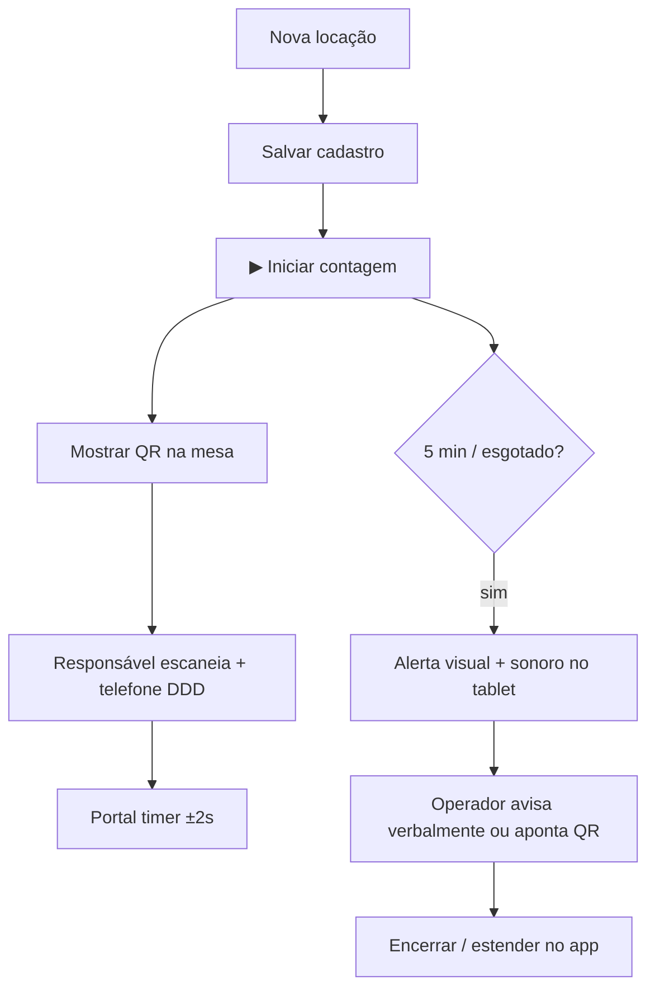

# Operação — Comunicação só QR (sem SMS/WhatsApp)

**Atualizado:** 14/06/2026  
**Decisão canônica:** `DECISAO_COMUNICACAO_QR_CODE_2026-06.md`  
**Código FE:** `MK_COMUNICACAO_MODO = 'qr_only'` em `mk-globals.js` · FE **v1.8.20+**

---

## Modo atual da loja

| Canal | Status operação |
|-------|-----------------|
| **QR → portal** `acompanhar.html` | ✅ **Único canal oficial** |
| **SMS** (gateway GAS) | ⏸ **Não enviar** — serviço contratado; reativar depois |
| **WhatsApp** (manual ou auto) | ⏸ **Não usar** na operação |
| **Alertas no app** (5 min, esgotado, beep, modal) | ✅ **Continuam** — só sem disparo de mensagem |

---

## Fluxo operacional (balcão)

**Não fazer na operação:**
- Clicar "Enviar SMS" nos cards (botões ocultos em v1.8.20)
- Obrigar envio de SMS antes de encerrar com extra
- Disparar WhatsApp em sequência para vários clientes
- Depender de entrega SMS para o responsável "saber" do tempo

---

## O que o operador faz

| Situação | Ação |
|----------|------|
| Cadastro salvo | ▶ Iniciar · mostrar **Cartaz QR** ou strip "Portal dos pais" na Home |
| 5 min restantes | Alerta toca — avisar na loja + QR |
| Tempo esgotado (extra) | Alerta vermelho — **encerrar quando conveniente** (sem SMS obrigatório) |
| Estender plano | Confirmar extensão no app — **sem SMS automático** |
| Responsável quer acompanhar | QR + DDD no portal |

**Links:**
- Cartaz: `assets/qr-balcao-imprimir.html`
- Portal: https://ribocg-a11y.github.io/movikids/acompanhar.html

---

## Reativar SMS/WhatsApp (futuro)

1. Serviço de mensagens homologado + entrega comprovada  
2. Alterar `MK_COMUNICACAO_MODO` para `'full'` em `mk-globals.js`  
3. Bump FE + atualizar este doc + `DECISAO_*` + `PROTOCOLO` fluxos F2/F4/F8  
4. Testes `TESTE_I20` B1 (SMS) + tablet  

---

## Documentos operacionais atualizados

- `PROTOCOLO_DIAGNOSTICO_E_TESTES.md` — fluxos F2/F4/F8  
- `HANDOFF_NOVO_CHAT.md` — regra comunicação  
- `ACESSOS_E_AUTORIZACOES.md` — papel operador  
- `CHECKLIST_PACOTE_L.md` — treinamento QR  

*Código GAS SMS permanece no repo — não é canal operacional até reativação.*
