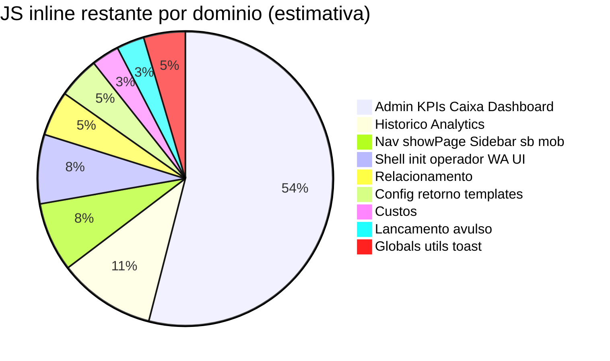
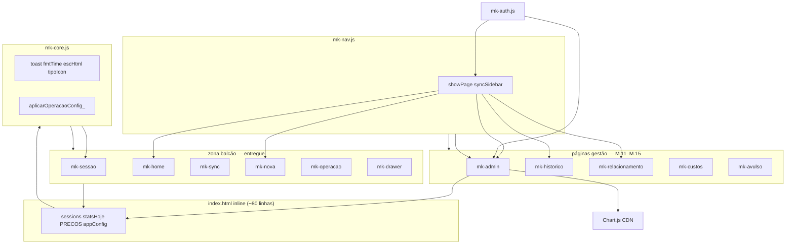

# Pacote M — Modularização do frontend

**Início:** 07/06/2026  
**Atualizado:** 07/06/2026 (planejamento detalhado M.10–M.17)  
**Objetivo:** reduzir monólito `index.html` sem mudar comportamento — extrair JS em fatias com validação por fluxo (`PROTOCOLO_DIAGNOSTICO_E_TESTES.md`).

---

## Panorama atual (v1.7.80)

| Artefato | Linhas | Papel |
|----------|--------|-------|
| `index.html` (total) | **~2.342** | HTML ~1.360 + JS inline **~780** |
| `mk-admin.js` | 1.563 | Admin PIN, KPIs, caixa, config (M.11) |
| `mk-nav.js` | 148 | Navegação + sidebar (M.10) |
| `mk-operacao.js` | 736 | Operação balcão (M.8) |
| `mk-nova.js` | 634 | Nova locação (M.6) |
| `mk-auth.js` | 1.005 | Auth operadores (extraído antes do M) |
| `mk-home.js` | 356 | Cards + painel (M.9) |
| `mk-drawer.js` | 329 | Drawer + encerrar (M.7) |
| `mk-sessao.js` | 336 | Sessão/SMS/timer (M.5) |
| `mk-sync.js` | 283 | Sync (M.4) |
| Outros `mk-*.js` | ~350 | api, bootstrap, update, version |
| `mk-app.css` | ~1.450 | CSS legado (M.1) |

**Progresso:** CSS e **zona operacional balcão** (nova → drawer → operação → home cards) já estão fora do monólito.  
**Dívida:** ~**2.400 linhas JS** no inline — **~100 `function`** restantes — concentradas em **admin/gestão**, **histórico/analytics**, **navegação** e **páginas secundárias**.

**Carga atual (v1.7.78):** bloco inline **antes** dos `mk-*.js` no final do `<body>`. Cada extração remove do inline e insere `<script src="mk-*.js">` **imediatamente após** o `</script>` do inline (transição até M.17). Ordem alvo final na seção [Ordem de carga alvo](#ordem-de-carga-alvo-após-m17).



---

## Status das fases

| Fase | Entrega | Versão | Status |
|------|---------|--------|--------|
| **M.1** | CSS legado → `mk-app.css` | v1.7.65 | ✅ |
| **M.2** | `mk-stale-sync`, `mk-cache-bust`, `mk-firebase` | v1.7.66 | ✅ |
| **M.3** | `mk-api.js` (api + guards I15) | v1.7.67 | ✅ |
| **M.4** | `mk-sync.js` | v1.7.68 | ✅ |
| **M.5** | `mk-sessao.js` | v1.7.69 | ✅ |
| **M.6** | `mk-nova.js` | v1.7.70 | ✅ |
| **M.7** | `mk-drawer.js` | v1.7.71 | ✅ |
| **M.8** | `mk-operacao.js` | v1.7.72 | ✅ |
| **M.9** | `mk-home.js` (cards, painel, encHoje) | v1.7.74 | ✅ |
| **M.10** | `mk-nav.js` (navegação + sidebar) | v1.7.79 | ✅ |
| **M.11** | `mk-admin.js` (PIN, KPIs, caixa, dashboard, config) | v1.7.80 | ✅ |
| **M.12** | `mk-historico.js` (período, analytics, ranking) | v1.7.81 | ✅ |
| **M.13** | `mk-relacionamento.js` (CRM K.3) | v1.7.83 | ✅ |
| **M.14** | `mk-custos.js` | v1.7.83 | ⬜ |
| **M.15** | `mk-avulso.js` (lançamento avulso) | v1.7.84 | ⬜ |
| **M.16** | `mk-core.js` (utils, toast, tipos, config apply) | v1.7.85 | ⬜ |
| **M.17** | Enxugar inline → só globals + boot | v1.7.86 | ⬜ |

**Meta final:** `index.html` **~900–1.100 linhas** (só HTML + bloco mínimo de estado global).

---

## Regras do Pacote M (não negociáveis)

1. **Uma fase = um arquivo = um bump de versão** (`mk-version`, `sw`, `index.html ?v=`).
2. **Zero mudança de comportamento** — só mover código; diff funcional vazio.
3. **Matriz de impacto** antes de cada fase (`PROTOCOLO_DIAGNOSTICO_E_TESTES.md` §4).
4. **Validação por fase:**
   ```powershell
   .\scripts\pre-push-check.ps1
   .\scripts\testes\TESTE_PROTOCOLO_DIAGNOSTICO.ps1 -Foco <fluxos da fase>
   ```
5. **Tablet** nas fases que tocam operação (M.8–M.10) ou admin (M.11–M.12).
6. **`sw.js`:** cada novo `mk-*.js` entra em `NETWORK_FIRST`.
7. **Ordem de carga** documentada abaixo — nunca circular.

---

## Ordem de carga alvo (após M.17)

```
HEAD (anti-stale)
  mk-stale-sync.js
  mk-version.js
  mk-api.js
  mk-design.css, mk-cache-bust.js, Chart.js, mk-app.css
  mk-firebase.js (module)

BODY — bloco inline MÍNIMO (~80 linhas)
  sessions, statsHoje, PRECOS, appConfig, isAdmin, kpiData
  APP_VERSION, PORTAL_RESPONSAVEL_URL

BODY — módulos (ordem fixa)
  mk-core.js          ← toast, fmtTime, escHtml, tipoIcon*, aplicarOperacaoConfig_
  mk-sessao.js
  mk-home.js
  mk-sync.js
  mk-nav.js           ← showPage, syncSidebar (antes de admin e páginas)
  mk-nova.js
  mk-operacao.js
  mk-drawer.js
  mk-custos.js
  mk-relacionamento.js
  mk-historico.js
  mk-avulso.js
  mk-admin.js         ← maior; depende de showPage, Chart, api
  mk-update.js
  mk-auth.js

BOOT
  DOMContentLoaded → mkAuthBoot()
```

\* `tipoIcon` hoje duplicado em `index.html` e usado por `mk-home.js` — consolidar em `mk-core.js` na M.16.

---

## Inventário do JS inline restante (linhas ~1361–4016)

| Bloco | Linhas ~ | Funções-chave | Fase |
|-------|----------|---------------|------|
| Globals + config apply | 1361–1457 | `PRECOS`, `aplicarOperacaoConfig_`, `apiParamsComAuth_` | M.16 |
| **Sidebar shell (nav)** | **1458–1497** | `sbSetAdminNavOpen_`, `mobMenuOpen_`, `sbSairSessaoClick_` | **M.10** |
| Shell operador / WA mode | 1499–1600 | `atualizarOperadorUI_`, `trocarModoWhatsApp` | M.16 |
| `init`, datas | 1600–1665 | `init()`, `setDefaultDate()` | M.16 |
| Utils | 1665–1685 | `fmtTime`, `escHtml` | M.16 |
| Stats home | 1685–1710 | `updateStats`, `loadCustosHoje` | M.16 / mk-home |
| Histórico | 1710–1810 | `buscarHistorico`, `renderHistListLazy_` | M.12 |
| Relacionamento | 1810–1935 | `carregarRelacionamento`, `salvarResponsavelRel` | M.13 |
| Custos | 1935–2000 | `salvarCusto`, `renderCustos` | M.14 |
| Toast | 2000–2015 | `toast()` | M.16 |
| Ranking veículo hist | 2020–2095 | `filtrarPorVeiculo`, `renderVrankSection` | M.12 |
| **Admin monólito** | 2095–3530 | PIN, KPIs, charts, caixa, opCfg, relatório | **M.11** |
| Navegação core | 3476–3585 | `mkPaginaGestaoPermitida_`, `showPage`, `syncSidebar*`, `show*Sidebar` | **M.10** |
| tipoIcon (dup) | 3590–3610 | `tipoIcon`, `tipoCor`, `tipoLabel` | M.16 |
| Config / retorno / diag | 3610–3790 | `irParaConfig`, `atualizarDiagnostico`, hub admin | M.11 |
| Analytics período | 3790–3940 | `setPeriod`, `renderAnalyticsCards`, charts hist | M.12 |
| Lançamento avulso | 3940–4015 | `salvarLancamentoAvulso` | M.15 |

---

## Fases M.10–M.17 (especificação)

### M.10 — `mk-nav.js` · ~148 linhas · v1.7.79 ✅

**Extrair (11 funções — inventário exato):**

| Função | Linha ~ | Notas |
|--------|---------|-------|
| `sbSetAdminNavOpen_` | 1458 | localStorage `mk_sb_admin_open` |
| `sbToggleAdminNav_` | 1469 | accordion admin na sidebar |
| `mobMenuOpen_` | 1474 | overlay mobile `<1024px` |
| `mobMenuClose_` | 1482 | chamado no início de `showPage` |
| `sbSairSessaoClick_` | 1490 | admin → `adminLogout`; operador → `trocarOperador` |
| `mkPaginaGestaoPermitida_` | 3476 | supervisor: só `caixa` + `historico` |
| `showPage` | 3483 | **hub** — ver mapa de side-effects abaixo |
| `syncSidebar` | 3533 | `.sb-btn.active` |
| `syncSidebarStatus` | 3542 | dot online/offline |
| `showAdminSidebar` | 3554 | revela secção admin |
| `hideAdminSidebar` | 3564 | esconde + reset display botões |
| `showSupervisorSidebar` | 3576 | esconde dash/ops/config/sys |

**Não extrair nesta fase (ficam no inline até M.11):** `abrirAdmin`, `irAdmin`, `adminLogin` — chamam `showPage` mas pertencem ao domínio admin.

**Posição no HTML (transição):**
```html
</script>          <!-- fim inline (~2.200 linhas após M.10) -->
<script src="mk-nav.js?v=1.7.79"></script>   <!-- NOVO: antes de mk-sessao -->
<script src="mk-sessao.js?v=1.7.79"></script>
...
```
`sw.js` → adicionar `'mk-nav.js'` em `NETWORK_FIRST`.

**Dependências (runtime, não import):** `isAdmin`, `kpiData`; funções ainda no inline: `carregarKPIs`, `renderCharts`, `buscarHistorico`, `salvarNovaDraft_`, `resetNova`, etc.; `mk-auth`: `mkAuthIsAdmin`, `mkAuthIsSupervisor`.

**Fluxos protocolo:** F1 (navegação), F12 (páginas admin).

**Risco:** médio — `showPage` é hub de side-effects; **copiar literal**, zero refactor.

#### Mapa de side-effects de `showPage` (não alterar na M.10)

| `name` | Side-effects obrigatórios |
|--------|---------------------------|
| *(qualquer)* | `mobMenuClose_` se `<1024px`; toggle `.page.active` + nav bottom |
| admin pages sem permissão | `abrirAdmin()` + return |
| sair de `nova` | `salvarNovaDraft_()` |
| `lancamento` | `resetAvulsoForm_()` |
| `nova` | draft / `resetNova` / `atualizarVeiculoGrid` (4 ramos) |
| `painel` | `renderPainel()` |
| `relacionamento` | `carregarRelacionamento()` |
| `dashboard` | `carregarKPIs` + `renderCharts` (duplo — manter como está) |
| `custos` | `loadCustosHoje()` |
| `historico` | `buscarHistorico()` |
| `admin` | `resetAdminTimer`, KPIs/hub |
| `sistema` | `resetAdminTimer`, `atualizarDiagnostico` |
| `operadores` | `refreshOperadoresAdmin_()` |
| *(se kpiData)* | `showAdminHomeKpis(kpiData)` |

#### Receita de implementação M.10 (passo a passo)

1. **Matriz §4** do protocolo: marcar F1 + F12.
2. Criar `mk-nav.js` — copiar blocos 1458–1497 e 3475–3585 **sem editar lógica**.
3. Remover esses blocos do `index.html`.
4. Inserir `<script src="mk-nav.js?v=1.7.79">` após `</script>` do inline.
5. Bump: `mk-version.js`, `sw.js` (`SW_VERSION` + `NETWORK_FIRST`), todos `?v=` no `index.html`.
6. `pre-push-check.ps1` — adicionar guard se desejado: `mk-nav.js` existe e `showPage` não está no inline.
7. Testes:
   ```powershell
   .\scripts\pre-push-check.ps1
   .\scripts\testes\TESTE_PROTOCOLO_DIAGNOSTICO.ps1 -Foco infra
   ```
8. **Tablet** (checklist manual):
   - [ ] Home → Nova → Painel → voltar (draft preservado)
   - [ ] Menu mobile abre/fecha; troca de página fecha overlay
   - [ ] Operador: Gerenciar → PIN → admin sidebar expande
   - [ ] Supervisor: só Caixa + Histórico na sidebar
   - [ ] Admin: Dashboard, Caixa, Config, Sistema abrem sem erro console
9. Atualizar `MAPA_CODIGO_ARQUITETURA.md` §2, `ESTADO_ATUAL.md`, este doc (M.10 ✅).

**DoD:**
- [x] `index.html` −~200 linhas (~3.556)
- [x] `grep "function showPage" index.html` → 0
- [ ] Todas as páginas abrem; sidebar active correto (tablet)
- [ ] Supervisor vê só caixa/histórico (tablet)
- [x] `pre-push-check` verde

---

### M.11 — `mk-admin.js` · ~1.420 linhas · v1.7.80

**Entrega recomendada em 2 PRs** (um bump v1.7.80 só no PR final):

| PR | Conteúdo | Linhas ~ | Revisão |
|----|----------|----------|---------|
| **M.11-A** | Estado admin (`isAdmin`, `kpiData`, charts refs) + PIN + `adminLogin/Logout` + `tickAdmin` + `irAdmin` | 2096–2279 | Sessão, idle I18, supervisor→caixa |
| **M.11-B** | `opCfg*` + KPIs/charts + caixa + relatório + config + sistema/diag | 2281–3474 + 3615–3795 | Dashboard payback, caixa copiar |

PR-A pode mergear em branch `feat/m11-admin` sem bump; PR-B extrai o resto + `mk-admin.js` + v1.7.80.

**Extrair (maior fatia):**
- PIN admin: `abrirAdmin` … `verificarPin`
- Sessão admin: `adminLogin`, `adminLogout`, `tickAdmin`, `irAdmin`
- Operacao config editor: `opCfg*` … `salvarOperacaoConfigAdmin_`
- KPIs / payback: `carregarKPIs`, `renderCharts`, `mudarMesDash`, `renderSemanasChart_`
- Caixa: `inicializarCaixa`, `carregarCaixa`, `copiarFechamentoCaixa`
- Relatório mensal: `initRelMesSel`, `carregarPreviewRelatorio`, `enviarRelatorioEmail`, `salvarRelatorioDrive`, `carregarHistRelatorios`
- Config mensagens: `irParaConfig`, `salvarCfgField`, `carregarRetorno`, `restaurarPadrao`
- Sistema: `atualizarDiagnostico`, `atualizarHubAdmin_`, `carregarResumoOperacaoConfig_`

**Dependências:** `mk-nav` (`showPage`, `irAdmin`), Chart.js, `api`, `toast`, `escHtml`.

**Fluxos:** F12, payback memorial, Pacote F.

**Testes:**
```powershell
.\scripts\testes\TESTE_PACOTE_F_KPI_READONLY.ps1
.\scripts\testes\TESTE_PROTOCOLO_DIAGNOSTICO.ps1 -Foco completo
```
Tablet: Dashboard, Caixa, Config templates, Sistema/diagnóstico.

**Risco:** alto — muitas chamadas GAS; não misturar com refatoração de KPI.

**Variáveis que migram com M.11** (hoje no inline ~2098–2107):
`isAdmin`, `adminTimerInt`, `ADMIN_IDLE_SEC`, `adminCountdown`, `kpiData`, `chartsRendered`, `chartDiario|chartExtrasDia|chartHistExt|chartHoras`, `HIST_CACHE_TTL_MS`, `ADMIN_PIN`, `pinBuffer`, `opCfgEditorTab_`, `opCfgPreviewTab_`, `opCfgDraftPrecos_`, `OPCFG_TIPOS_`, `OPCFG_PLANOS_`.

**Posição de carga:** após `mk-nav.js`, antes de `mk-historico.js` (quando existir) ou após `mk-avulso.js` na ordem alvo.

**DoD:**
- [ ] Dashboard gráficos renderizam
- [ ] Payback card visível (GAS v1.5.63+)
- [ ] Caixa copiar fechamento
- [ ] Admin idle 1h respeita I18 (`mkHasLocacaoAbertaNoTablet_`)

---

### M.12 — `mk-historico.js` · ~280 linhas · v1.7.81

**Extrair:** `buscarHistorico`, `setPeriod`, `getDates`, `renderAnalyticsCards`, `renderHistExtChart_`, `filtrarPorVeiculo`, `renderVrankSection`, caches hist.

**Fluxos:** página Histórico (admin/operador conforme role).

**Testes:** tablet ou PC — filtros período, ranking veículo, chart extras.

---

### M.13 — `mk-relacionamento.js` · ~130 linhas · v1.7.82

**Extrair:** `carregarRelacionamento`, edição responsável, badges K.3.

**Testes:** `TESTE_RELACIONAMENTO_MOVIKIDS_READONLY.ps1`

**Fluxos:** F13.

---

### M.14 — `mk-custos.js` · ~80 linhas · v1.7.83

**Extrair:** `salvarCusto`, `renderCustos`, `selCat`, `loadCustosHoje`.

**Fluxos:** página Custos.

---

### M.15 — `mk-avulso.js` · ~80 linhas · v1.7.84

**Extrair:** `salvarLancamentoAvulso`, `selAvulsoTipo`, `selAvulsoPlano`, `resetAvulsoForm_`.

**Fluxos:** escrita GAS `salvarLancamentoAvulso` (não é uma das 5 críticas I15, mas usa `api()`).

---

### M.16 — `mk-core.js` · ~200 linhas · v1.7.85

**Extrair:**
- `toast`, `fmtTime`, `escHtml`
- `tipoIcon`, `tipoCor`, `tipoLabel` (remover duplicata)
- `aplicarOperacaoConfig_`, `mkExibirFinanceiro_`, `mkAuthCanEditarLocacao_`
- `apiParamsComAuth_`, `adicionalPorMinSessao_`, `fmtHoraTurno_`
- `init()`, `setDefaultDate()` (ou manter init mínimo no inline)
- `atualizarOperadorUI_`, WhatsApp mode UI

**Ordem:** carregar **antes** de `mk-sessao` (toast/fmtTime usados em todo lugar).

**Risco:** alto — funções transversais; extrair por último utilitário ou em passo cuidadoso após nav/admin.

**Nota:** pode ser feito **antes** de M.11 se `toast`/`fmtTime` atrapalharem testes dos outros módulos — ordem ajustável: **M.10 → M.16-core parcial (toast/fmt) → M.11 → …**

---

### M.17 — Enxugar inline · v1.7.86

**Deixar só no inline (~80 linhas):**
```javascript
// Estado global compartilhado (intencional até pacote ES modules)
let sessions = [], statsHoje = { n: 0, fat: 0 }, encHojeData = [];
let PRECOS = { ... };  // ou carregar de operacaoConfig
let appConfig = {}, kpiData = null, isAdmin = false;
const APP_VERSION = window.MK_VERSION;
```

**Remover:** todo o resto já extraído.

**DoD:**
- [ ] `index.html` < 1.100 linhas
- [ ] Nenhuma `function` longa no inline (só const/let)
- [ ] `grep "^function" index.html` → 0 resultados

---

## Matriz de impacto por fase (protocolo F0–F14)

| Fase | Fluxos impactados | Incidentes | Teste foco |
|------|-------------------|------------|------------|
| M.10 | F1, F12 navegação | I19 roles | Tablet todas páginas |
| M.11 | F12 admin financeiro | I18 idle, payback | `TESTE_PACOTE_F_KPI` + tablet |
| M.12 | F12 histórico | — | Período custom + chart |
| M.13 | F13 CRM | K.3 badge | `TESTE_RELACIONAMENTO` |
| M.14 | Custos | — | Salvar custo teste |
| M.15 | Avulso | I15 api | Salvar avulso |
| M.16 | **Todos** | I15, I20 utils | `pre-push` + protocolo completo |
| M.17 | **Todos** | I3 cache ordem | Protocolo P0 + tablet |

---

## O que NUNCA sai do `index.html` (por ora)

| Item | Motivo |
|------|--------|
| HTML das 12+ páginas | SPA single-file GitHub Pages |
| `sessions`, `statsHoje`, `PRECOS` globais | Contrato entre 10+ módulos sem bundler |
| `DOMContentLoaded → mkAuthBoot` | Ordem de boot |
| Gate HTML `mk-auth-gate` | Primeiro paint |

**Futuro (pós M.17):** avaliar ES modules + `import` só se houver bundler ou Vite — fora do escopo 2026-Q2.

---

## Cronograma sugerido

| Semana | Fase | Esforço | Paralelo operação |
|--------|------|---------|-------------------|
| 1 | **M.10** nav | 2–3 h | Fora do pico |
| 2 | **M.11** admin (split em 2 PRs se possível: KPIs + caixa/config) | 6–8 h | Só PC admin |
| 3 | M.12 + M.13 | 3–4 h | — |
| 4 | M.14 + M.15 + M.16 | 4–5 h | — |
| 5 | M.17 + doc final | 2 h | Homologação I.5 |

**Total estimado:** ~18–22 h agente + tablet em cada marco.

---

## Checklist por PR (copiar)

```markdown
## Pacote M.X — mk-*.js

- [ ] Só move código (sem refactor)
- [ ] mk-version + sw + index ?v= alinhados
- [ ] sw.js NETWORK_FIRST no novo arquivo
- [ ] MAPA_CODIGO §2 atualizado
- [ ] pre-push-check.ps1 verde
- [ ] TESTE_PROTOCOLO_DIAGNOSTICO -Foco <x> verde
- [ ] Tablet: <páginas listadas>
- [ ] ESTADO_ATUAL entregas recentes
```

---

## Histórico M.1–M.9 (resumo)

| Versão | Δ index.html |
|--------|----------------|
| M.1 | −1.441 (CSS) |
| M.2 | −140 |
| M.3 | −130 |
| M.4 | −300 |
| M.5 | −288 |
| M.6 | −627 |
| M.7 | −335 |
| M.8 | −316 |
| M.9 | −335 (home/painel) |
| **Acumulado** | **~8.495 → ~3.756** (−56%) |

---

## Grafo de dependências (pós M.17)



**Regra:** `mk-nav` não importa `mk-admin` — só chama funções globais por nome (padrão atual do projeto).

---

## Estado global — quem fica onde

| Variável / const | Dono final | Motivo |
|------------------|------------|--------|
| `sessions`, `statsHoje`, `encHojeData` | inline | contrato sync + home + operação |
| `PRECOS`, `PLANO_LABELS`, `appConfig` | inline → futuro `operacaoConfig` | lido por 8+ módulos |
| `isAdmin`, `kpiData`, `pinBuffer` | `mk-admin.js` | só gestão |
| `catSel`, `custosHoje` | `mk-custos.js` | página custos |
| `currentPeriod`, caches hist | `mk-historico.js` | analytics |
| `avulsoState` | `mk-avulso.js` | lançamento avulso |
| `WA_MODE_KEY` + modo WA UI | `mk-core.js` | transversal auth/nova |
| `timerInterv` | inline ou `mk-sessao` | já referenciado em sessão |

**Não mover `isAdmin` antes de M.11** — `mk-nav.showPage` e `mk-auth` leem `window.isAdmin` / `isAdmin` hoje.

---

## Armadilhas conhecidas (evitar regressão)

| # | Armadilha | Mitigação |
|---|-----------|-----------|
| 1 | Extrair `showPage` e esquecer `sb*` (linhas 1458) | Inventário M.10 lista 12 funções |
| 2 | `showPage('dashboard')` chama KPI **duas vezes** | Comportamento legado — não “otimizar” na extração |
| 3 | `irAdmin` fora de `mk-nav` mas chama `showPage` | OK — `mk-nav` carrega antes de qualquer clique |
| 4 | `tipoIcon` duplicado (`index` + usado em `mk-home`) | Só consolidar na M.16 |
| 5 | Ordem script: inline define, módulos estendem | Novo `mk-*.js` sempre **após** `</script>` inline até M.17 |
| 6 | Bump versão esquecido em um `?v=` | `pre-push-check` valida alinhamento |
| 7 | M.11 + refactor KPI payback junto | Proibido — só mover código |
| 8 | Supervisor vê botões admin após nav | Testar `showSupervisorSidebar` + `mkPaginaGestaoPermitida_` |

---

## Projeção de linhas pós-fases

| Marco | `index.html` total | JS inline | Δ acumulado vs hoje |
|-------|-------------------|-----------|---------------------|
| Hoje v1.7.79 (M.10 ✅) | ~3.556 | ~2.196 | −200 |
| M.11 admin | ~2.130 | ~776 | −1.620 |
| M.12–M.15 | ~1.240 | ~336 | −2.060 |
| M.16 core | ~1.040 | ~136 | −2.260 |
| M.17 enxugar | **~900–1.100** | **~80** | **−2.316 (~71%)** |

---

## Referências

- Arquitetura: `MAPA_CODIGO_ARQUITETURA.md` §2–5
- Testes: `PROTOCOLO_DIAGNOSTICO_E_TESTES.md`
- Handoff: `HANDOFF_NOVO_CHAT.md` (próximo técnico = M.11)
- Auth admin PIN: `ACESSOS_E_AUTORIZACOES.md`

*Próxima ação: **M.12 `mk-historico.js`** + validação tablet M.10+M.11 (`?force=1.7.80`).*

