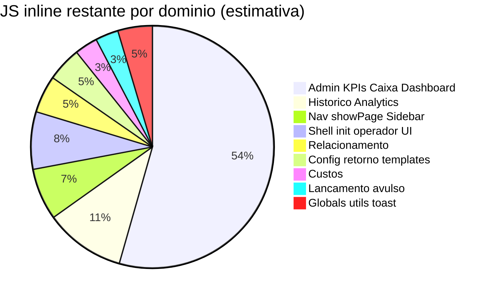

# Pacote M — Modularização do frontend

**Início:** 07/06/2026  
**Atualizado:** 07/06/2026 (planejamento M.10+)  
**Objetivo:** reduzir monólito `index.html` sem mudar comportamento — extrair JS em fatias com validação por fluxo (`PROTOCOLO_DIAGNOSTICO_E_TESTES.md`).

---

## Panorama atual (v1.7.78)

| Artefato | Linhas | Papel |
|----------|--------|-------|
| `index.html` (total) | **~3.756** | HTML ~1.360 + JS inline **~2.396** |
| `mk-operacao.js` | 736 | Operação balcão (M.8) |
| `mk-nova.js` | 634 | Nova locação (M.6) |
| `mk-auth.js` | 1.005 | Auth operadores (extraído antes do M) |
| `mk-home.js` | 356 | Cards + painel (M.9) |
| `mk-drawer.js` | 329 | Drawer + encerrar (M.7) |
| `mk-sessao.js` | 336 | Sessão/SMS/timer (M.5) |
| `mk-sync.js` | 283 | Sync (M.4) |
| Outros `mk-*.js` | ~350 | api, bootstrap, update, version |
| `mk-app.css` | ~1.450 | CSS legado (M.1) |

**Progresso:** CSS e **zona operacional balcão** (nova → drawer → operação → home cards) já estão fora do monólito.  
**Dívida:** ~**2.400 linhas JS** no inline — concentradas em **admin/gestão**, **histórico/analytics**, **navegação** e **páginas secundárias**.



---

## Status das fases

| Fase | Entrega | Versão | Status |
|------|---------|--------|--------|
| **M.1** | CSS legado → `mk-app.css` | v1.7.65 | ✅ |
| **M.2** | `mk-stale-sync`, `mk-cache-bust`, `mk-firebase` | v1.7.66 | ✅ |
| **M.3** | `mk-api.js` (api + guards I15) | v1.7.67 | ✅ |
| **M.4** | `mk-sync.js` | v1.7.68 | ✅ |
| **M.5** | `mk-sessao.js` | v1.7.69 | ✅ |
| **M.6** | `mk-nova.js` | v1.7.70 | ✅ |
| **M.7** | `mk-drawer.js` | v1.7.71 | ✅ |
| **M.8** | `mk-operacao.js` | v1.7.72 | ✅ |
| **M.9** | `mk-home.js` (cards, painel, encHoje) | v1.7.74 | ✅ |
| **M.10** | `mk-nav.js` (navegação + sidebar) | v1.7.79 | ⬜ **próximo** |
| **M.11** | `mk-admin.js` (PIN, KPIs, caixa, dashboard, config) | v1.7.80 | ⬜ |
| **M.12** | `mk-historico.js` (período, analytics, ranking) | v1.7.81 | ⬜ |
| **M.13** | `mk-relacionamento.js` (CRM K.3) | v1.7.82 | ⬜ |
| **M.14** | `mk-custos.js` | v1.7.83 | ⬜ |
| **M.15** | `mk-avulso.js` (lançamento avulso) | v1.7.84 | ⬜ |
| **M.16** | `mk-core.js` (utils, toast, tipos, config apply) | v1.7.85 | ⬜ |
| **M.17** | Enxugar inline → só globals + boot | v1.7.86 | ⬜ |

**Meta final:** `index.html` **~900–1.100 linhas** (só HTML + bloco mínimo de estado global).

---

## Regras do Pacote M (não negociáveis)

1. **Uma fase = um arquivo = um bump de versão** (`mk-version`, `sw`, `index.html ?v=`).
2. **Zero mudança de comportamento** — só mover código; diff funcional vazio.
3. **Matriz de impacto** antes de cada fase (`PROTOCOLO_DIAGNOSTICO_E_TESTES.md` §4).
4. **Validação por fase:**
   ```powershell
   .\scripts\pre-push-check.ps1
   .\scripts\testes\TESTE_PROTOCOLO_DIAGNOSTICO.ps1 -Foco <fluxos da fase>
   ```
5. **Tablet** nas fases que tocam operação (M.8–M.10) ou admin (M.11–M.12).
6. **`sw.js`:** cada novo `mk-*.js` entra em `NETWORK_FIRST`.
7. **Ordem de carga** documentada abaixo — nunca circular.

---

## Ordem de carga alvo (após M.17)

```
HEAD (anti-stale)
  mk-stale-sync.js
  mk-version.js
  mk-api.js
  mk-design.css, mk-cache-bust.js, Chart.js, mk-app.css
  mk-firebase.js (module)

BODY — bloco inline MÍNIMO (~80 linhas)
  sessions, statsHoje, PRECOS, appConfig, isAdmin, kpiData
  APP_VERSION, PORTAL_RESPONSAVEL_URL

BODY — módulos (ordem fixa)
  mk-core.js          ← toast, fmtTime, escHtml, tipoIcon*, aplicarOperacaoConfig_
  mk-sessao.js
  mk-home.js
  mk-sync.js
  mk-nav.js           ← showPage, syncSidebar (antes de admin e páginas)
  mk-nova.js
  mk-operacao.js
  mk-drawer.js
  mk-custos.js
  mk-relacionamento.js
  mk-historico.js
  mk-avulso.js
  mk-admin.js         ← maior; depende de showPage, Chart, api
  mk-update.js
  mk-auth.js

BOOT
  DOMContentLoaded → mkAuthBoot()
```

\* `tipoIcon` hoje duplicado em `index.html` e usado por `mk-home.js` — consolidar em `mk-core.js` na M.16.

---

## Inventário do JS inline restante (linhas ~1361–4016)

| Bloco | Linhas ~ | Funções-chave | Fase |
|-------|----------|---------------|------|
| Globals + config apply | 1361–1460 | `PRECOS`, `aplicarOperacaoConfig_`, `apiParamsComAuth_` | M.16 |
| Shell operador / WA mode | 1460–1600 | `atualizarOperadorUI_`, `trocarModoWhatsApp` | M.16 |
| `init`, datas | 1600–1665 | `init()`, `setDefaultDate()` | M.16 |
| Utils | 1665–1685 | `fmtTime`, `escHtml` | M.16 |
| Stats home | 1685–1710 | `updateStats`, `loadCustosHoje` | M.16 / mk-home |
| Histórico | 1710–1810 | `buscarHistorico`, `renderHistListLazy_` | M.12 |
| Relacionamento | 1810–1935 | `carregarRelacionamento`, `salvarResponsavelRel` | M.13 |
| Custos | 1935–2000 | `salvarCusto`, `renderCustos` | M.14 |
| Toast | 2000–2015 | `toast()` | M.16 |
| Ranking veículo hist | 2020–2095 | `filtrarPorVeiculo`, `renderVrankSection` | M.12 |
| **Admin monólito** | 2095–3530 | PIN, KPIs, charts, caixa, opCfg, relatório | **M.11** |
| Navegação | 3483–3590 | `showPage`, `syncSidebar`, sidebars admin | **M.10** |
| tipoIcon (dup) | 3590–3610 | `tipoIcon`, `tipoCor`, `tipoLabel` | M.16 |
| Config / retorno / diag | 3610–3790 | `irParaConfig`, `atualizarDiagnostico`, hub admin | M.11 |
| Analytics período | 3790–3940 | `setPeriod`, `renderAnalyticsCards`, charts hist | M.12 |
| Lançamento avulso | 3940–4015 | `salvarLancamentoAvulso` | M.15 |

---

## Fases M.10–M.17 (especificação)

### M.10 — `mk-nav.js` (próximo) · ~180 linhas · v1.7.79

**Extrair:**
- `showPage`, `mkPaginaGestaoPermitida_`
- `syncSidebar`, `syncSidebarStatus`
- `sbSetAdminNavOpen_`, `sbToggleAdminNav_`, `mobMenuOpen_`, `mobMenuClose_`, `sbSairSessaoClick_`
- `showAdminSidebar`, `hideAdminSidebar`, `showSupervisorSidebar`

**Dependências:** inline globals; `mk-auth` (roles) em runtime.

**Fluxos protocolo:** F1 (navegação), F12 (páginas admin).

**Risco:** médio — `showPage` dispara `carregarKPIs`, `inicializarCaixa`, etc. via `irAdmin`; manter ordem: extrair nav **sem** mudar side-effects de `showPage`.

**DoD:**
- [ ] Todas as páginas abrem (home, nova, painel, dashboard, caixa, histórico, config, sistema)
- [ ] Sidebar active state correto
- [ ] Supervisor vê só caixa/histórico
- [ ] `pre-push-check` verde

---

### M.11 — `mk-admin.js` · ~1.420 linhas · v1.7.80

**Extrair (maior fatia):**
- PIN admin: `abrirAdmin` … `verificarPin`
- Sessão admin: `adminLogin`, `adminLogout`, `tickAdmin`, `irAdmin`
- Operacao config editor: `opCfg*` … `salvarOperacaoConfigAdmin_`
- KPIs / payback: `carregarKPIs`, `renderCharts`, `mudarMesDash`, `renderSemanasChart_`
- Caixa: `inicializarCaixa`, `carregarCaixa`, `copiarFechamentoCaixa`
- Relatório mensal: `initRelMesSel`, `carregarPreviewRelatorio`, `enviarRelatorioEmail`, `salvarRelatorioDrive`, `carregarHistRelatorios`
- Config mensagens: `irParaConfig`, `salvarCfgField`, `carregarRetorno`, `restaurarPadrao`
- Sistema: `atualizarDiagnostico`, `atualizarHubAdmin_`, `carregarResumoOperacaoConfig_`

**Dependências:** `mk-nav` (`showPage`, `irAdmin`), Chart.js, `api`, `toast`, `escHtml`.

**Fluxos:** F12, payback memorial, Pacote F.

**Testes:**
```powershell
.\scripts\testes\TESTE_PACOTE_F_KPI_READONLY.ps1
.\scripts\testes\TESTE_PROTOCOLO_DIAGNOSTICO.ps1 -Foco completo
```
Tablet: Dashboard, Caixa, Config templates, Sistema/diagnóstico.

**Risco:** alto — muitas chamadas GAS; não misturar com refatoração de KPI.

**DoD:**
- [ ] Dashboard gráficos renderizam
- [ ] Payback card visível (GAS v1.5.63+)
- [ ] Caixa copiar fechamento
- [ ] Admin idle 1h respeita I18 (`mkHasLocacaoAbertaNoTablet_`)

---

### M.12 — `mk-historico.js` · ~280 linhas · v1.7.81

**Extrair:** `buscarHistorico`, `setPeriod`, `getDates`, `renderAnalyticsCards`, `renderHistExtChart_`, `filtrarPorVeiculo`, `renderVrankSection`, caches hist.

**Fluxos:** página Histórico (admin/operador conforme role).

**Testes:** tablet ou PC — filtros período, ranking veículo, chart extras.

---

### M.13 — `mk-relacionamento.js` · ~130 linhas · v1.7.82

**Extrair:** `carregarRelacionamento`, edição responsável, badges K.3.

**Testes:** `TESTE_RELACIONAMENTO_MOVIKIDS_READONLY.ps1`

**Fluxos:** F13.

---

### M.14 — `mk-custos.js` · ~80 linhas · v1.7.83

**Extrair:** `salvarCusto`, `renderCustos`, `selCat`, `loadCustosHoje`.

**Fluxos:** página Custos.

---

### M.15 — `mk-avulso.js` · ~80 linhas · v1.7.84

**Extrair:** `salvarLancamentoAvulso`, `selAvulsoTipo`, `selAvulsoPlano`, `resetAvulsoForm_`.

**Fluxos:** escrita GAS `salvarLancamentoAvulso` (não é uma das 5 críticas I15, mas usa `api()`).

---

### M.16 — `mk-core.js` · ~200 linhas · v1.7.85

**Extrair:**
- `toast`, `fmtTime`, `escHtml`
- `tipoIcon`, `tipoCor`, `tipoLabel` (remover duplicata)
- `aplicarOperacaoConfig_`, `mkExibirFinanceiro_`, `mkAuthCanEditarLocacao_`
- `apiParamsComAuth_`, `adicionalPorMinSessao_`, `fmtHoraTurno_`
- `init()`, `setDefaultDate()` (ou manter init mínimo no inline)
- `atualizarOperadorUI_`, WhatsApp mode UI

**Ordem:** carregar **antes** de `mk-sessao` (toast/fmtTime usados em todo lugar).

**Risco:** alto — funções transversais; extrair por último utilitário ou em passo cuidadoso após nav/admin.

**Nota:** pode ser feito **antes** de M.11 se `toast`/`fmtTime` atrapalharem testes dos outros módulos — ordem ajustável: **M.10 → M.16-core parcial (toast/fmt) → M.11 → …**

---

### M.17 — Enxugar inline · v1.7.86

**Deixar só no inline (~80 linhas):**
```javascript
// Estado global compartilhado (intencional até pacote ES modules)
let sessions = [], statsHoje = { n: 0, fat: 0 }, encHojeData = [];
let PRECOS = { ... };  // ou carregar de operacaoConfig
let appConfig = {}, kpiData = null, isAdmin = false;
const APP_VERSION = window.MK_VERSION;
```

**Remover:** todo o resto já extraído.

**DoD:**
- [ ] `index.html` < 1.100 linhas
- [ ] Nenhuma `function` longa no inline (só const/let)
- [ ] `grep "^function" index.html` → 0 resultados

---

## Matriz de impacto por fase (protocolo F0–F14)

| Fase | Fluxos impactados | Incidentes | Teste foco |
|------|-------------------|------------|------------|
| M.10 | F1, F12 navegação | I19 roles | Tablet todas páginas |
| M.11 | F12 admin financeiro | I18 idle, payback | `TESTE_PACOTE_F_KPI` + tablet |
| M.12 | F12 histórico | — | Período custom + chart |
| M.13 | F13 CRM | K.3 badge | `TESTE_RELACIONAMENTO` |
| M.14 | Custos | — | Salvar custo teste |
| M.15 | Avulso | I15 api | Salvar avulso |
| M.16 | **Todos** | I15, I20 utils | `pre-push` + protocolo completo |
| M.17 | **Todos** | I3 cache ordem | Protocolo P0 + tablet |

---

## O que NUNCA sai do `index.html` (por ora)

| Item | Motivo |
|------|--------|
| HTML das 12+ páginas | SPA single-file GitHub Pages |
| `sessions`, `statsHoje`, `PRECOS` globais | Contrato entre 10+ módulos sem bundler |
| `DOMContentLoaded → mkAuthBoot` | Ordem de boot |
| Gate HTML `mk-auth-gate` | Primeiro paint |

**Futuro (pós M.17):** avaliar ES modules + `import` só se houver bundler ou Vite — fora do escopo 2026-Q2.

---

## Cronograma sugerido

| Semana | Fase | Esforço | Paralelo operação |
|--------|------|---------|-------------------|
| 1 | **M.10** nav | 2–3 h | Fora do pico |
| 2 | **M.11** admin (split em 2 PRs se possível: KPIs + caixa/config) | 6–8 h | Só PC admin |
| 3 | M.12 + M.13 | 3–4 h | — |
| 4 | M.14 + M.15 + M.16 | 4–5 h | — |
| 5 | M.17 + doc final | 2 h | Homologação I.5 |

**Total estimado:** ~18–22 h agente + tablet em cada marco.

---

## Checklist por PR (copiar)

```markdown
## Pacote M.X — mk-*.js

- [ ] Só move código (sem refactor)
- [ ] mk-version + sw + index ?v= alinhados
- [ ] sw.js NETWORK_FIRST no novo arquivo
- [ ] MAPA_CODIGO §2 atualizado
- [ ] pre-push-check.ps1 verde
- [ ] TESTE_PROTOCOLO_DIAGNOSTICO -Foco <x> verde
- [ ] Tablet: <páginas listadas>
- [ ] ESTADO_ATUAL entregas recentes
```

---

## Histórico M.1–M.9 (resumo)

| Versão | Δ index.html |
|--------|----------------|
| M.1 | −1.441 (CSS) |
| M.2 | −140 |
| M.3 | −130 |
| M.4 | −300 |
| M.5 | −288 |
| M.6 | −627 |
| M.7 | −335 |
| M.8 | −316 |
| M.9 | −335 (home/painel) |
| **Acumulado** | **~8.495 → ~3.756** (−56%) |

---

## Referências

- Arquitetura: `MAPA_CODIGO_ARQUITETURA.md` §2–5
- Testes: `PROTOCOLO_DIAGNOSTICO_E_TESTES.md`
- Handoff: `HANDOFF_NOVO_CHAT.md` (próximo técnico = M.10)
- Auth admin PIN: `ACESSOS_E_AUTORIZACOES.md`

*Próxima ação recomendada: implementar **M.10 `mk-nav.js`** (menor risco, desbloqueia M.11).*
