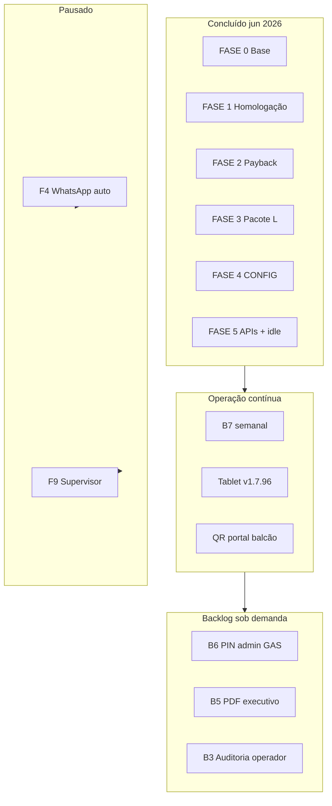

# MOVI KIDS — Plano de continuidade (pós-FASE 5)

> ⚠️ **Snapshot histórico (09/06/2026)** — FE v1.7.96 / GAS v1.5.72.  
> **Estado atual:** `HANDOFF_NOVO_CHAT.md` · **`DEPLOY_ATUAL.md`** · **`MAPA_FASES.md`**

**Data:** 09/06/2026 (revisão — **FASE 0–5 fechadas**)  
**Produção:** FE **v1.7.96** · GAS **v1.5.72**  
**Planejamento mestre:** **`PLANEJAMENTO_ATUAL_2026-06.md`**  
**Handoff:** **`HANDOFF_NOVO_CHAT.md`**  
**Ordem de execução:** **`PLANO_PRIORIDADES_2026-06.md`**

---

## 1. Onde paramos

### Ciclo FASE 0–5 — **ENCERRADO** (09/06/2026)

| Marco | Status | Versão / evidência |
|-------|--------|-------------------|
| Homologação balcão | ✅ | Milena · `CHECKLIST_FASE5_TABLET.md` |
| Pacote K CRM | ✅ | 240 RESPONSAVEIS · K.3–K.4 tablet |
| Pacote L UX + QR | ✅ | v1.7.91 |
| Payback FASE 2 | ✅ | GAS v1.5.69 |
| CONFIG planilha | ✅ | FASE 4 |
| APIs B1/B2/B7/B8 | ✅ | resumoDia, kpiMes, write regressão, idle I21 |
| Fix splash idle | ✅ | **v1.7.96** · commit `91cc08f` |

**Gargalo atual:** nenhum P0 de feature. Foco = **operação estável** + backlog P2/P3 sob demanda.

**Pausado:** F4 WhatsApp/SMS auto · F9 Supervisor (decisão pendente se ainda necessário).

---

## 2. Princípios (mantidos)

1. Uma métrica → um lugar canônico (Pacote I).
2. Operador na Home = 0 KPI financeiro.
3. Tablet obrigatório em mudança de balcão/auth/write.
4. GET no browser para escritas; `pre-push-check` antes de push.
5. Planilha = fonte histórica; GAS = regras; FE = visualização + balcão.

---

## 3. Roadmap — próximos 90 dias (atualizado)

---

## 4. Sprints históricos (referência)

| Sprint | Período | Status |
|--------|---------|--------|
| **1** Estabilizar | 07–08/06 | ✅ fechada |
| **2** Pacote K | 08/06 | ✅ fechada |
| **2b** Payback | 08/06 | ✅ fechada |
| **3** Pacote L | 08/06 | ✅ fechada |
| **4** CONFIG | 08/06 | ✅ fechada |
| **5** Confiabilidade | 08–09/06 | ✅ fechada |

Detalhe por sprint: seções 4–6 abaixo (histórico) + `PLANEJAMENTO_ATUAL_2026-06.md`.

---

## 5. Sprint 1 — Estabilizar (histórico) ✅

| # | Entrega | Status |
|---|---------|--------|
| S1.1 | Checklist I.5 | ✅ 08/06 |
| S1.2 | GAS v1.5.66+ ping | ✅ |
| S1.3 | Tablet v1.7.87 → **v1.7.96** | ✅ 09/06 |
| S1.4 | pre-push + regressão | ✅ |
| S1.5 | I19 anti-fantasma | ✅ |

---

## 6. Sprint 2 — Pacote K ✅ · Sprint 3 — Pacote L ✅

Ver `CHECKLIST_PACOTE_K.md` · `CHECKLIST_PACOTE_L.md` · `PACOTE_L_UX_POLISH.md`.

---

## 7. FASE 5 — Confiabilidade ✅ (09/06/2026)

| ID | Item | Status |
|----|------|--------|
| B7 | Regressão write | ✅ 3× + tablet Milena |
| B1 | `resumoDia` | ✅ GAS v1.5.71 |
| B2 | `kpiMes` | ✅ GAS v1.5.71 |
| B8 | Idle I21 | ✅ v1.7.94/96 + v1.5.72 + tablet |

---

## 8. Backlog pós-FASE 5

Ver **`PLANEJAMENTO_ATUAL_2026-06.md` § 3–4** (prioridades P0–P4).

| ID | Item | Prioridade |
|----|------|------------|
| B6 | PIN admin só via GAS | P2 |
| B3 | Auditoria UI por operador | P3 |
| B5 | PDF resumo executivo | P3 |
| B4 | Export fechamento WA/e-mail | P3 |
| Q1 | GitHub Actions CI | P2 |
| F4 | WhatsApp auto | **P4 pausado** |
| F9 | Supervisor | **P4 pausado** |

---

## 9. Decisão imediata — pós 09/06/2026

| Prioridade | Ação | Quem |
|------------|------|------|
| **P0** | Manter tablet **v1.7.96** | Ops |
| **P1** | B7 write 1×/semana | Agente/Dev |
| **P2** | Escolher próximo item (B6 ou B5) | Sócio |
| **—** | Não iniciar F4/F9 sem decisão explícita | — |

---

## 10. Visão trimestre (jul–set 2026)

| Mês | Foco sugerido |
|-----|---------------|
| **Jul** | Operação + QR portal + rotina B7 |
| **Ago** | B6 segurança ou B5 PDF executivo |
| **Set** | Reavaliar F4; auditoria planilha Q3 |

---

## 11. Documentos a manter atualizados

| Evento | Atualizar |
|--------|-----------|
| Deploy FE/GAS | `ESTADO_ATUAL.md`, `HANDOFF_NOVO_CHAT.md` |
| Nova fase | `PLANO_PRIORIDADES`, `PLANEJAMENTO_ATUAL` |
| Bug P0/P1 | `MAPA_ERROS_FALHAS_BUGS.md` + incidente |
| Pacote fechado | Checklist + este arquivo |

---

*Próxima revisão: **13/06/2026**.*
