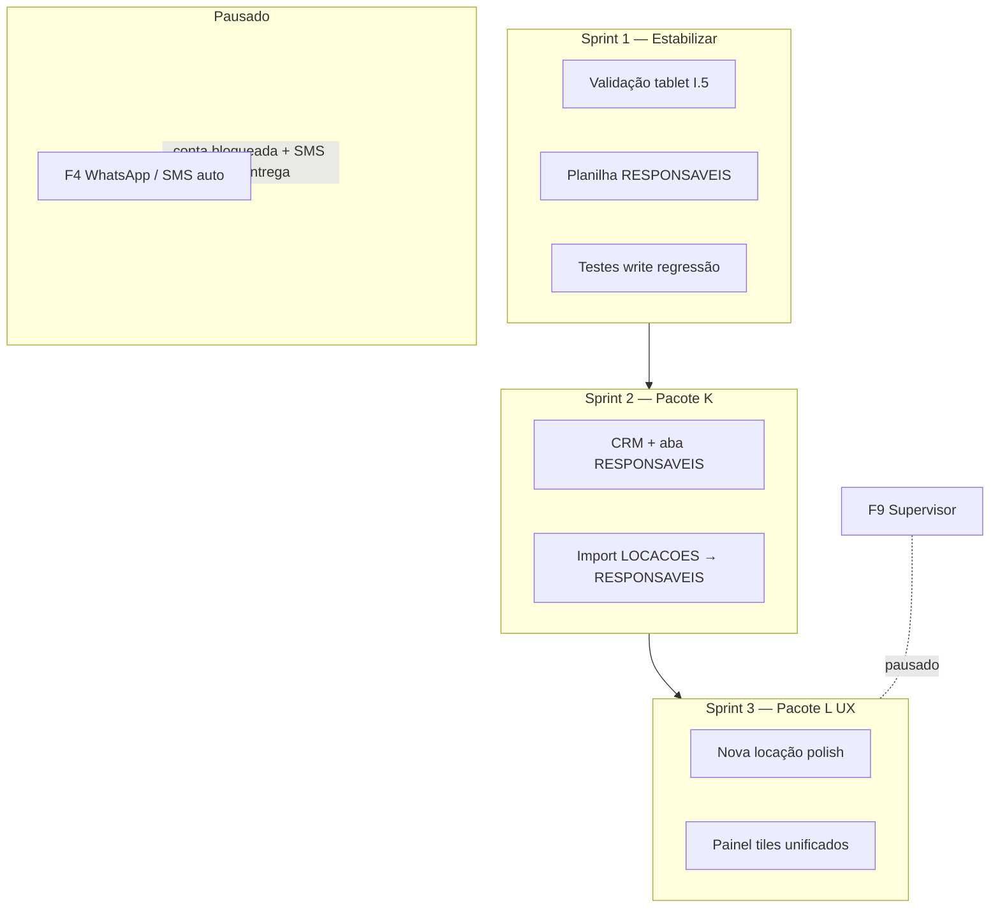

# MOVI KIDS — Plano de continuidade (pós-pausa maturidade)

**Data:** 07/06/2026 (revisão — payback M + prioridades)  
**Produção:** FE **v1.7.64** · GAS **v1.5.63** (ping confirmado 07/06)  
**Ordem de execução:** **`PLANO_PRIORIDADES_2026-06.md`** (prioridades por fase)  
**Substitui como “próximo passo”:** seção 9 de `PLANO_PAUSA_MATURIDADE_2026-06.md` e seção 14 de `PLANO_MESTRE_REORGANIZADO_2026-06.md`  
**Referências:** `ESTADO_ATUAL.md`, `MAPA_ERROS_FALHAS_BUGS.md`, `MEMORIAL_PAYBACK_INVESTIMENTO.md`

---

## 1. Onde paramos

### Ciclo “Pausa maturidade” — **ENCERRADO**

| Pacote | Status | Versão |
|--------|--------|--------|
| I — Sanitização gestão | ✅ | v1.7.40 |
| G — Portal responsável | ✅ | v1.7.41 + GAS v1.5.54–55 |
| H — Config amigável | ✅ | v1.7.43 + GAS v1.5.56 |
| J — Travas CI | ✅ | pre-push-check + guards I15–I18 |
| Fixes pós-incidente | ✅ | I16 cronômetro, I17 sessão UI, I18 idle v1.7.46 |
| Planilha base | ✅ | Auditoria + organização 06/06 |
| Portal carrossel + DNA visual | ✅ | v1.7.47 `acompanhar.html` + `DESIGN_DNA_MOVIKIDS.md` |
| Anti sessão fantasma PWA | ✅ | I19 v1.7.48 — chip Turno + reconcile tablet×GAS |

O gargalo **deixou de ser confiabilidade básica**. O sistema opera; o foco passa a **homologação tablet, payback estratégico e UX (Pacote L)**. WhatsApp automático permanece **pausado** (QR portal).

---

## 2. Princípios do novo ciclo (mantidos)

1. Uma métrica → um lugar canônico (mapa Pacote I).
2. Operador na Home = 0 KPI financeiro.
3. Tablet obrigatório em balcão e WhatsApp.
4. GET no browser para escritas; `pre-push-check` antes de push.
5. Planilha = fonte histórica; app não duplica lógica em 3 abas.

---

## 3. Roadmap — próximos 90 dias

---

## 4. Sprint 1 — Estabilizar operação (1 semana)

**Objetivo:** fechar pendências da pausa e garantir produção alinhada antes de features novas.

| # | Entrega | Tipo | Status | Critério de pronto |
|---|---------|------|--------|-------------------|
| S1.1 | Checklist tablet **I.5** | QA manual | 🟡 parcial | Operador sem R$; Caixa vs Dashboard; portal ±2s; **chip Turno** (I19) |
| S1.2 | Confirmar GAS **v1.5.56** no ping | Ops | ✅ | `?action=ping` ≥ v1.5.55 |
| S1.3 | Tablet **v1.7.48** no ícone PWA | Ops | 🟡 | `?force=1.7.48`; reinstalar ícone se cache 1.7.41 |
| S1.4 | `pre-push-check` + regressão readonly | CI | ✅ | Guards I15–I19 |
| S1.5 | Documentar checklist I.5 | Docs | 🟡 | `HOMOLOGACAO_PRODUCAO_ASSISTIDA.md` + I19 no mapa |
| S1.6 | Auth turno visível + anti-fantasma | FE | ✅ | v1.7.48; Milena login 13:05 validado |

**Incidente fechado na sprint:** I19 (`../arquivo/incidentes/INCIDENTE_AUTH_SESSAO_FANTASMA_PWA_2026-06-06.md`).

**Fora desta sprint:** código novo de feature (exceto hotfix P0/P1).

---

## 5. Sprint 2 — Pacote K: Relacionamento + RESPONSAVEIS (2 semanas)

**Objetivo:** segunda entrega da Fase 5 — cadastro canônico opcional, sem travar locação.

| # | Entrega | Camada | Detalhe |
|---|---------|--------|---------|
| K.1 | Import inicial LOCACOES → **RESPONSAVEIS** | GAS + script | ✅ **240 cadastros** (06/06/2026) |
| K.2 | `listarResponsaveis` lê aba quando existir | GAS | ✅ merge canônico v1.5.57 |
| K.3 | Card relacionamento + badge **Cadastro** | FE | ✅ v1.7.49 — validar tablet |
| K.4 | Botões Nova locação / Nova criança | FE | código ok — checklist K.4 |
| K.5 | `TESTE_RELACIONAMENTO` + import | Teste | ✅ readonly + `cadastroCanonico` |

**Regras (não negociáveis):**

- Telefone = identificador principal (9º dígito BR).
- Locação **nunca** bloqueia se RESPONSAVEIS falhar.
- Auditoria em alterações de cadastro (opcional K.6).

**Versão alvo:** FE **v1.7.49+** · GAS **v1.5.57** (v1.7.48 já consumida por portal + I19)

---

## 6. Sprint 3 — Pacote L: UX polish (2 semanas) ← **próximo após K**

**Objetivo:** reduzir ruído visual sem mudar regras de negócio.

> **F4 WhatsApp / SMS automático — PAUSADO** (06/06/2026): conta bloqueada 4 dias; SMS sem entrega no número novo. **Canal oficial:** QR Code → `acompanhar.html`. Ver `DECISAO_COMUNICACAO_QR_CODE_2026-06.md`.

| # | Entrega | Origem plano mestre |
|---|---------|---------------------|
| L.1 | Tiles veículo unificados (Home / Painel / Nova) | §3.2 |
| L.2 | Barra resumo fixa na Nova locação (menos review duplicado) | §4.1 |
| L.3 | Indicador “Última sync · há Xs” no header | Backlog §8 |
| L.4 | Dashboard: link “ver caixa hoje” sem duplicar número | §5 |
| L.5 | Página Sistema: diagnóstico + liberar sessão | §9 recursos |
| L.6 | QR portal no balcão — `assets/qr-balcao-imprimir.html` (A6) | `DECISAO_COMUNICACAO_QR_CODE_2026-06.md` |

**Versão alvo:** FE **v1.7.50+** · GAS mínimo

---

## 7. F4 WhatsApp — **PAUSADO** (não executar)

Escopo original W.1–W.6 (inventário mensagens, aviso extra não pulável, checklist WA Business) **fora do roadmap** até nova decisão. Manter botões atuais como fallback **manual** apenas; **não** expandir automação.

---

## 8. Backlog (depois de L)

| ID | Item | Prioridade | Notas |
|----|------|------------|-------|
| B1 | API `resumoDia(data)` única para Caixa + chip admin | Média | Reduz divergência planilha/app |
| B2 | API `kpiMes` — Dashboard só visualiza | Média | |
| B3 | Auditoria UI (filtrar AUDITORIA por operador) | Baixa | |
| B4 | Export fechamento WhatsApp/e-mail | Opcional | |
| B5 | PDF resumo executivo (Pacote I-b) | Baixa | |
| B6 | PIN admin só via GAS (T4) | Média | Segurança |
| B7 | Regressão write: iniciar/estender/encerrar em janela controlada | Alta | `TESTE_DRAWER_E` ampliado |

---

## 9. Permanece pausado

| Item | Motivo | Reavaliar quando |
|------|--------|------------------|
| **F4 WhatsApp / SMS auto** | Conta bloqueada 4d; SMS sem entrega; usar **QR Code** | Reavaliar só com entrega manual comprovada |
| **F9 Supervisor** | Operadores precisam autonomia total no balcão | Após K + L estáveis 30 dias |
| Modularização `index.html` | Risco alto, pouco ganho imediato | Q3 se equipe crescer |

---

## 10. Decisão imediata — junho 2026

**Sprint 1** quase fechada. Ordem **agora**:

| Prioridade | Ação | Quem | Tempo |
|------------|------|------|-------|
| **P0** | Tablet balcão em **v1.7.64** (ícone PWA atualizado) | Ops balcão | 10 min |
| **P0** | Fechar checklist **I.5** + **K.3–K.4** tablet | Ops + dev | 30–60 min |
| **P1** | Fechar regras payback (memorial §10) + validar painel Dashboard | Sócio + dev | 1 sessão |
| **P1** | Iniciar **Pacote L** (UX polish + QR balcão) | Dev | sprint 3 |
| **P2** | `TESTE_REGRESSAO` write controlado (B7) | Dev | paralelo |

**Não iniciar F4** — pausado; comunicação = **QR portal** (`DECISAO_COMUNICACAO_QR_CODE_2026-06.md`).

### Critério para encerrar Sprint 1 e abrir Sprint 2

- [ ] Todos tablets **1.7.48** + chip Turno verde com operador logado  
- [ ] Checklist I.5 marcado em `HOMOLOGACAO_PRODUCAO_ASSISTIDA.md`  
- [ ] `pre-push-check` verde  
- [ ] Nenhum incidente P1 auth aberto  

→ Então: **merge mental Sprint 1 → início Pacote K**.

---

## 11. Visão por trimestre (resumo)

| Mês | Entrega principal | Valor para a loja |
|-----|-------------------|-------------------|
| **Jun** | K — CRM / RESPONSAVEIS | Reconhecer cliente, repetir visita |
| **Jul** | **L — UX polish** + QR no balcão | Balcão rápido; pais pelo portal |
| **Ago** | Backlog B7/B1 | Regressão write + KPIs |
| ~~F4 WhatsApp~~ | **Pausado** | QR + manual apenas |

---

## 12. Documentos a manter atualizados

| Ao fechar sprint | Atualizar |
|------------------|-----------|
| Deploy FE/GAS | `ESTADO_ATUAL.md` |
| Bug novo | `MAPA_ERROS_FALHAS_BUGS.md` + incidente se P0/P1 |
| Planilha | `AUDITORIA_PLANILHA_BASE_*.md` |
| Pacote fechado | Este arquivo + `PLANO_PAUSA_MATURIDADE` (histórico) |

---

*Próxima revisão: ao iniciar Pacote K.1 (import RESPONSAVEIS) ou 13/06/2026.*
