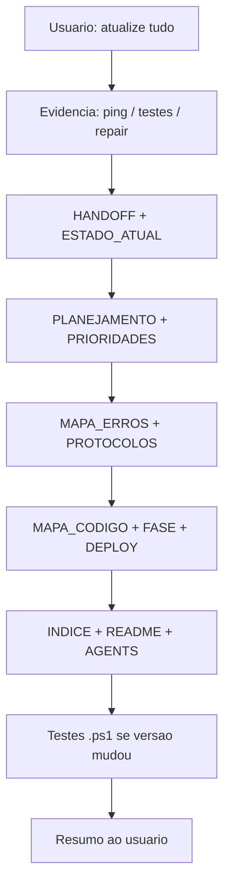

# MOVI KIDS — Protocolo "Atualize tudo"

**Criado:** 14/06/2026  
**Função:** quando o usuário pedir **"atualize tudo"**, o agente segue **esta lista** — não só handoff parcial.  
**Regra Cursor:** `.cursor/rules/atualize-tudo-movikids.mdc`

---

## O que significa "atualize tudo"

Sincronizar **documentação + estado operacional** do projeto com a realidade atual (produção, testes, incidentes), incluindo:

| Área | Onde |
|------|------|
| Handoff | `HANDOFF_NOVO_CHAT.md` |
| Estado / versões | `ESTADO_ATUAL.md`, `README.md`, `AGENTS.md` |
| Planejamento | `PLANEJAMENTO_ATUAL_2026-06.md`, `PLANO_PRIORIDADES_2026-06.md` |
| Mapa de erros | `MAPA_ERROS_FALHAS_BUGS.md` (I29/I30) |
| **Design System** | **`docs/referencia/DESIGN_SYSTEM_MOVIKIDS.md`** |
| Protocolos | `PROTOCOLO_DIAGNOSTICO_E_TESTES.md`, **este arquivo** |
| Arquitetura / fluxos / diagramas | `MAPA_CODIGO_ARQUITETURA.md`, `FASE_*.md` ativas |
| Deploy / processos | `DEPLOY_*.md`, `DEPLOY_GAS_v1.5.32_AUTH.md`, `REGRAS_DE_PUBLICACAO_SEGURA.md` |
| Histórico | `docs/arquivo/incidentes/`, `docs/arquivo/deploy/` |
| Planilhas | Memorials `docs/referencia/`, IDs e métricas abas (FOLHA, CONFIG, etc.) |
| Pasta no C | Caminhos PC em HANDOFF, AGENTS, regras `.cursor/rules/` |
| Testes | `scripts/testes/README.md`, versões nos `.ps1` |

---

## Repo e planilha (referência fixa)

| Recurso | Valor |
|---------|--------|
| **Repo PC** | `C:\Users\riboc\Documents\Codex\2026-05-30\files-mentioned-by-the-user-movikids\movikids-github` |
| **GitHub** | `ribocg-a11y/movikids` · branch `main` |
| **Planilha** | `1ULMUx8AqZkZ75Ed0iRK_lQWc3I7YV9Itfoe-1JY5618` |
| **Aba FOLHA** | [gid=179040058](https://docs.google.com/spreadsheets/d/1ULMUx8AqZkZ75Ed0iRK_lQWc3I7YV9Itfoe-1JY5618/edit#gid=179040058) |
| **GAS Deploy ID** | `AKfycbwakQ-_aWsF5lFGLsiwB5UvJ4AlpW88krSv8daPeMvULwX5FOIdMhGVgdGd0G35270Y` |
| **GAS .gs canônico** | `MOVIKIDS_Code_v1.5.32_AUTH_OPERADORES_SOBRE_v1.5.31.gs` (raiz do repo) |

---

## Produção atual (20/06/2026)

| Camada | Versão | Evidência |
|--------|--------|-----------|
| GAS ping | **v1.5.107** | ping público `/exec?action=ping` |
| GAS repo | **v1.5.111** | header do `.gs` canônico |
| FE | **v1.8.68** | Pages live |
| Aba FOLHA | **OK** (I25) | B25=15,38 · B68=5269,96 · D36=24 · `fonte=FOLHA` |
| FASE 9 CLT | **verde 6/6** | `TESTE_FASE9_FOLHA_READONLY` · `CONTRATACAO_VIAVEL` |

---

## Comandos de validação (PowerShell)

**Repair FOLHA (se necessário):**

```powershell
Invoke-RestMethod -Uri "https://script.google.com/macros/s/AKfycbwakQ-_aWsF5lFGLsiwB5UvJ4AlpW88krSv8daPeMvULwX5FOIdMhGVgdGd0G35270Y/exec?action=repairFolhaAdmin&adminPin=1416"
```

**Testes (caminho absoluto ou `cd` no repo):**

```powershell
cd C:\Users\riboc\Documents\Codex\2026-05-30\files-mentioned-by-the-user-movikids\movikids-github
.\protocolo-mestre.ps1
.\verify-gas-deploy.ps1
powershell -ExecutionPolicy Bypass -File ".\scripts\testes\TESTE_FOLHA_FORMULAS_READONLY.ps1"
powershell -ExecutionPolicy Bypass -File ".\scripts\testes\TESTE_FASE9_FOLHA_READONLY.ps1"
```

---

## Ordem de execução do agente

1. Ler output recente do usuário (repair, testes, ping) — extrair métricas e data.
2. Atualizar docs **ativos** (handoff, estado, mapa erros, fases, deploy atual).
3. Se incidente ou re-validação — append em `INCIDENTE_*.md` ou criar novo I*.
4. Atualizar **versões de referência** em `MAPA_ERROS` (não deixar prod. defasada).
5. Atualizar `INDICE.md` + `README.md` + `AGENTS.md`.
6. Ajustar scripts de teste se versão mínima GAS/FE mudou.
7. Resumir ao usuário o que foi atualizado (lista de arquivos).

---

## Diagrama — fluxo "atualize tudo"



---

*Revisar quando mudar versão FE/GAS ou fechar incidente.*
