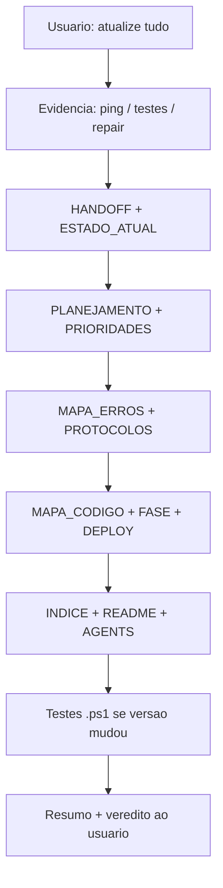

# MOVI KIDS — Protocolo "Atualize tudo"

**Criado:** 14/06/2026 · **Última execução:** 02/09/2026 (FE **v1.9.111** · GAS ping **v1.5.213** · repo **v1.5.215** · **I151b** travas definitivas encerrar fantasma)  
**Função:** quando o usuário pedir **"atualize tudo"**, o agente segue **esta lista** — não só handoff parcial.  
**Regra Cursor:** `.cursor/rules/atualize-tudo-movikids.mdc`

---

## O que significa "atualize tudo"

Sincronizar **documentação + estado operacional** do projeto com a realidade atual (produção, testes, incidentes), incluindo:

| Área | Onde |
|------|------|
| Handoff | `HANDOFF_NOVO_CHAT.md` |
| Estado / versões | `ESTADO_ATUAL.md`, `README.md`, `AGENTS.md` |
| Planejamento | `PLANEJAMENTO_ATUAL_2026-06.md`, `PLANO_PRIORIDADES_2026-06.md`, **`MAPA_FASES.md`**, **`PLANEJAMENTO_CICLO_POS_ONEUI_2026-06.md`** |
| Deploy atual | **`DEPLOY_ATUAL.md`** |
| Estrutura repo | **`ESTRUTURA_REPO.md`** |
| Mapa de erros | `MAPA_ERROS_FALHAS_BUGS.md` (I* até **I151b** + família encerrar fantasma) |
| **Design System** | **`docs/referencia/DESIGN_SYSTEM_MOVIKIDS.md`** |
| Protocolos | `PROTOCOLO_DIAGNOSTICO_E_TESTES.md`, **este arquivo** |
| Arquitetura / fluxos / diagramas | `MAPA_CODIGO_ARQUITETURA.md`, `FASE_*.md` ativas |
| Deploy / processos | **`DEPLOY_ATUAL.md`**, `DEPLOY_GAS_v1.5.32_AUTH.md`, histórico `arquivo/deploy/` |
| Histórico | `docs/arquivo/incidentes/`, `docs/ativos/INCIDENTE_*.md` |
| Planilhas | Memorials `docs/referencia/`, IDs e métricas abas (FOLHA, CONFIG, etc.) |
| Pasta no C | `scripts/sync-pasta-c-pc.ps1` · caminhos PC em HANDOFF, AGENTS, regras `.cursor/rules/` |
| Testes | `scripts/testes/README.md`, versões nos `.ps1` |
| Entregas PDF | `entregas/holerite-mes-2026-07/` |

---

## Repo e planilha (referência fixa)

| Recurso | Valor |
|---------|--------|
| **Repo PC** | `C:\Users\riboc\Documents\Codex\2026-05-30\files-mentioned-by-the-user-movikids\movikids-github` |
| **GitHub** | `ribocg-a11y/movikids` · branch `main` |
| **Planilha** | `1ULMUx8AqZkZ75Ed0iRK_lQWc3I7YV9Itfoe-1JY5618` |
| **Aba FOLHA** | [gid=179040058](https://docs.google.com/spreadsheets/d/1ULMUx8AqZkZ75Ed0iRK_lQWc3I7YV9Itfoe-1JY5618/edit#gid=179040058) |
| **GAS Deploy ID** | `AKfycbwakQ-_aWsF5lFGLsiwB5UvJ4AlpW88krSv8daPeMvULwX5FOIdMhGVgdGd0G35270Y` |
| **GAS .gs canônico** | `MOVIKIDS_Code_v1.5.32_AUTH_OPERADORES_SOBRE_v1.5.31.gs` (raiz do repo) |

---

## Produção atual (02/09/2026)

| Camada | Versão | Evidência |
|--------|--------|-----------|
| GAS | ping **v1.5.213** · repo **v1.5.215** | `listarAtivas` OK · encerrar 409 OK · Nova versão Web ping ⏳ |
| FE | **v1.9.111** | Pages live · `?force=1.9.111` · **I151b** travas encerrar fantasma |
| Planilha | **OK** | **0** abertas 02/09 · encerradas reais |
| Homolog tablet | **⏳** | paridade `listarAtivas`=cards · smoke encerrar fantasma |
| Perf | I146–I151b | local-first · offline · purge 409 · reconcile listarAtivas |

```powershell
.\scripts\testes\TESTE_I151_ENCERRAR_FANTASMA_READONLY.ps1
node scripts\testes\teste-i150-cenarios-financeiros.cjs
.\scripts\encerramento-sessao.ps1
```

---

## Comandos de validação (PowerShell)

```powershell
cd C:\Users\riboc\Documents\Codex\2026-05-30\files-mentioned-by-the-user-movikids\movikids-github
.\scripts\sync-pasta-c-pc.ps1
.\scripts\relatorio-versoes.ps1 -Markdown
node scripts\testes\teste-i141-bonus-resto.cjs
Invoke-RestMethod ".../exec?action=ping"
Invoke-RestMethod ".../exec?action=validarSchema"
.\scripts\encerramento-sessao.ps1
```

---

## Ordem de execução do agente

1. Ler output recente do usuário (repair, testes, ping) — extrair métricas e data.
2. Atualizar docs **ativos** (handoff, estado, mapa erros, fases, deploy atual).
3. Se incidente ou re-validação — append em `INCIDENTE_*.md` ou criar novo I*.
4. Atualizar **versões de referência** em `MAPA_ERROS` (não deixar prod. defasada).
5. Atualizar `INDICE.md` + `README.md` + `AGENTS.md`.
6. Ajustar scripts de teste se versão mínima GAS/FE mudou.
7. Resumir ao usuário o que foi atualizado (lista de arquivos) + **veredito em ordem?**.

---

## Diagrama — fluxo "atualize tudo"


```mermaid
flowchart TD
  U[Usuario: atualize tudo] --> E[Evidencia: ping / testes / repair]
  E --> H[HANDOFF + ESTADO_ATUAL]
  H --> P[PLANEJAMENTO + PRIORIDADES]
  P --> M[MAPA_ERROS + PROTOCOLOS]
  M --> A[MAPA_CODIGO + FASE + DEPLOY]
  A --> I[INDICE + README + AGENTS]
  I --> T[Testes .ps1 se versao mudou]
  T --> R[Resumo + veredito ao usuario]
```

---

*Revisar quando mudar versão FE/GAS ou fechar incidente.*

- Estudo negócio: `ESTUDO_NEGOCIO_BREAK_EVEN_TICKET_2026-07.md` · memorial CSV · aba VIABILIDADE_NEGOCIO (OAuth script).
- Holerite PDF: `INCIDENTE_I142_HOLERITE_PDF_CONFERENCIA_2026-07-31.md`
- P0 local-first: `INCIDENTE_I146_BOOT_MK_SESSIONS_FANTASMA_2026-08-29.md`
