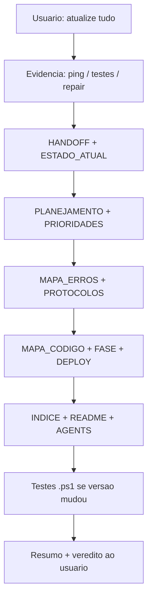

# MOVI KIDS — Protocolo "Atualize tudo"

**Criado:** 14/06/2026 · **Última execução:** 03/10/2026 (FE **v1.9.161** · GAS ping **v1.5.231** · **I166–I168** folha/PDF/cache · La Ville · Golden · sync pasta C)  
**Função:** quando o usuário pedir **"atualize tudo"**, o agente segue **esta lista** — não só handoff parcial.  
**Regra Cursor:** `.cursor/rules/atualize-tudo-movikids.mdc`

---

## O que significa "atualize tudo"

Sincronizar **documentação + estado operacional** do projeto com a realidade atual (produção, testes, incidentes), incluindo:

| Área | Onde |
|------|------|
| Handoff | `HANDOFF_NOVO_CHAT.md` |
| Estado / versões | `ESTADO_ATUAL.md`, `README.md`, `AGENTS.md` |
| Planejamento | `PLANEJAMENTO_ATUAL_2026-06.md`, `PLANO_PRIORIDADES_2026-06.md`, **`MAPA_FASES.md`**, **`PLANEJAMENTO_CICLO_POS_ONEUI_2026-06.md`** |
| Deploy atual | **`DEPLOY_ATUAL.md`** |
| Estrutura repo | **`ESTRUTURA_REPO.md`** |
| Mapa de erros | `MAPA_ERROS_FALHAS_BUGS.md` (I* até **I168** folha/PDF + I165 caixa + I158 Golden) |
| La Ville | `PLANO_MULTI_UNIDADE_GOLDEN_LAVILLE_2026-09.md` · checklist inauguração no HANDOFF |
| **Design System** | **`docs/referencia/DESIGN_SYSTEM_MOVIKIDS.md`** |
| Protocolos | `PROTOCOLO_DIAGNOSTICO_E_TESTES.md`, **este arquivo** |
| Arquitetura / fluxos / diagramas | `MAPA_CODIGO_ARQUITETURA.md`, `FASE_*.md` ativas |
| Deploy / processos | **`DEPLOY_ATUAL.md`**, `DEPLOY_GAS_v1.5.32_AUTH.md`, histórico `arquivo/deploy/` |
| Histórico | `docs/arquivo/incidentes/`, `docs/ativos/INCIDENTE_*.md` · `EVIDENCIA_*` |
| Planilhas | Memorials `docs/referencia/`, IDs e métricas abas (FOLHA, CONFIG, etc.) |
| Pasta no C | `scripts/sync-pasta-c-pc.ps1` · caminhos PC em HANDOFF, AGENTS, regras `.cursor/rules/` |
| Testes | `scripts/testes/README.md`, versões nos `.ps1` · `teste-estabilidade-pos-i155.cjs` |
| Entregas PDF | `entregas/holerite-mes-2026-07/` · Golden set `entregas/MOVI-KIDS-Relatorio-Setembro-2026-*` |

---

## Repo e planilha (referência fixa)

| Recurso | Valor |
|---------|--------|
| **Repo PC** | `C:\Users\riboc\Documents\Codex\2026-05-30\files-mentioned-by-the-user-movikids\movikids-github` |
| **GitHub** | `ribocg-a11y/movikids` · branch `main` |
| **Planilha** | `1ULMUx8AqZkZ75Ed0iRK_lQWc3I7YV9Itfoe-1JY5618` |
| **Aba FOLHA** | [gid=179040058](https://docs.google.com/spreadsheets/d/1ULMUx8AqZkZ75Ed0iRK_lQWc3I7YV9Itfoe-1JY5618/edit#gid=179040058) |
| **GAS Deploy ID** | `AKfycbwakQ-_aWsF5lFGLsiwB5UvJ4AlpW88krSv8daPeMvULwX5FOIdMhGVgdGd0G35270Y` |
| **GAS .gs canônico** | `MOVIKIDS_Code_v1.5.32_AUTH_OPERADORES_SOBRE_v1.5.31.gs` (raiz do repo) |

---

## Produção atual (03/10/2026)

| Camada | Versão | Evidência |
|--------|--------|-----------|
| GAS | ping **v1.5.231** = repo | multi-unidade · I160 · lookback 600 |
| FE | **v1.9.161** | Pages live · `?force=1.9.161` · I168 cache-first |
| Golden set (fechamento) | R$ **14.577** · CTO **R$ 1.500** | PDF 01/10 · n **684** |
| Folha / holerite PDF | I166–I168 ✅ | Blob print · cache FE/LS 24h |
| La Ville | código ✅ | Ops: QR · tablet D4 · equipe · CTO |
| Homolog tablet | **⏳** | D4 Golden + LV · `?force=1.9.161` |
| Confiabilidade | I153–I168 ✅ | I168 folha · I167 PDF · I165 caixa · I158 Golden |

```powershell
node scripts\testes\teste-estabilidade-pos-i155.cjs
.\scripts\testes\TESTE_I158_GOLDEN_SEM_CANCELADAS_READONLY.ps1
.\scripts\testes\TESTE_HOLDING_SMOKE_C_READONLY.ps1
.\scripts\encerramento-sessao.ps1
```

---

## Comandos de validação (PowerShell)

```powershell
cd C:\Users\riboc\Documents\Codex\2026-05-30\files-mentioned-by-the-user-movikids\movikids-github
.\scripts\sync-pasta-c-pc.ps1
.\scripts\relatorio-versoes.ps1 -Markdown
Invoke-RestMethod "${GAS}?action=ping"
node scripts\testes\teste-estabilidade-pos-i155.cjs
.\scripts\encerramento-sessao.ps1
```

---

## Ordem de execução do agente

1. Ler output recente do usuário (repair, testes, ping) — extrair métricas e data.
2. Atualizar docs **ativos** (handoff, estado, mapa erros, fases, deploy atual).
3. Se incidente ou re-validação — append em `INCIDENTE_*.md` ou criar novo I*.
4. Atualizar **versões de referência** em `MAPA_ERROS` (não deixar prod. defasada).
5. Atualizar `INDICE.md` + `README.md` + `AGENTS.md`.
6. Ajustar scripts de teste se versão mínima GAS/FE mudou.
7. Resumir ao usuário o que foi atualizado (lista de arquivos) + **veredito em ordem?**.

---

## Diagrama — fluxo "atualize tudo"


```mermaid
flowchart TD
  U[Usuario: atualize tudo] --> E[Evidencia: ping / testes / repair]
  E --> H[HANDOFF + ESTADO_ATUAL]
  H --> P[PLANEJAMENTO + PRIORIDADES]
  P --> M[MAPA_ERROS + PROTOCOLOS]
  M --> A[MAPA_CODIGO + FASE + DEPLOY]
  A --> I[INDICE + README + AGENTS]
  I --> T[Testes .ps1 se versao mudou]
  T --> R[Resumo + veredito ao usuario]
```

---

*Revisar quando mudar versão FE/GAS ou fechar incidente.*

### Registro desta execução (03/10/2026)

| I* / item | Evento | Doc |
|-----------|--------|-----|
| **I166** | Folha set + relatório na tela (parcial; retries/`force` regressaram) | FE **1.9.159** · família I168 |
| **I167** | Holerite Salvar/Imprimir → about:blank → Blob URL | `INCIDENTE_I167_*` · FE **1.9.160** |
| **I168** | Folha cache-first: sem apagar cache / force / auto-kpiMes | `INCIDENTE_I168_*` · FE **1.9.161** |
| Medição | full frio ~62s · warm ~2s · force=1 ~49s | `INCIDENTE_I168_*` |
| Golden set | R$ 14.577 / CTO R$ 1.500 / n 684 | PDF `entregas/...fechamento-2026-10-01.*` |
| Sync C | `sync-pasta-c-pc.ps1` nesta execução | pasta C = este repo |

**Erros do agente (não repetir):** I166 hardening com `force=1`+apagar cache+3 retries+auto-kpiMes = regressão I120/I136 · I167 `noopener`+`document.write` · §7.2/I24 publicar FE sem pedir · I165 não misturar lojas no chip Caixa.

### Registro anterior (02/10/2026)

| I* / item | Evento | Doc |
|-----------|--------|-----|
| **La Ville** | Continuidade: plano §8 fechado no código · checklist inauguração Ops | `PLANO_MULTI_UNIDADE_*` · HANDOFF |
| **Receita dia a dia** | Página consulta + pills loja + cache local | FE **1.9.157–158** · `#page-receita-diaria` |
| **I165** | Chip Caixa não mistura Golden→LV | `MAPA_ERROS` I165 · FE **1.9.152+** |
| **I158** | Golden fechamento set **14577** / CTO **1500** | PDF `entregas/...fechamento-2026-10-01.*` |

### Registro anterior (29/09/2026)

| I* | Evento | Doc |
|----|--------|-----|
| **I158** | Golden PDF/e-mail contava Cancelada → FE kpiMes | `INCIDENTE_I158_*` |
| I156 | Ritmo Dashboard fatMap chaves "01" | `INCIDENTE_I156_*` |
