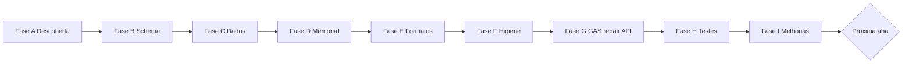

# MOVI KIDS — Protocolo de auditoria, padronização e testes por aba da planilha

**Criado:** 24/06/2026 · **Piloto:** aba **LOCACOES** (incidente **I52**)  
**Função:** roteiro repetível para auditar, formatar, melhorar e validar **cada aba** do workbook até a última.  
**Complementa:** `MAPA_PLANILHA_ABAS_MOVIKIDS.md` · `PROTOCOLO_DIAGNOSTICO_E_TESTES.md` · `MAPA_ERROS_FALHAS_BUGS.md`

**Orquestrador:** `scripts/testes/TESTE_PROTOCOLO_ABA_PLANILHA.ps1`  
**Template por aba:** `docs/referencia/CHECKLIST_ABA_PLANILHA_TEMPLATE.md`

---

## 1. Por que este protocolo existe

A planilha é o **banco de dados operacional** do MOVI KIDS. Cada aba tem:

- papel na hierarquia (camadas 0–5),
- consumidores (tablet, portal, dashboard, RH),
- regras de escrita (GAS vs manual),
- formatos de célula (data, R$, enum),
- riscos de regressão (I42, I43, I44, I45…).

Auditar só “se abre” não basta. O piloto **LOCACOES (I52)** definiu o ciclo completo: **descobrir → validar → formatar → proteger → testar → documentar → melhorar**.

---

## 2. Roteiro executado — aba LOCACOES (piloto I52)

Use como **referência** ao replicar nas demais abas.

### Fase A — Descoberta (o que é / para que serve)

| # | Ação | Resultado LOCACOES |
|---|------|-------------------|
| A1 | Confirmar posição no workbook (1ª aba, camada 1) | Coração operacional P0 |
| A2 | Ler `MAPA_PLANILHA_ABAS_MOVIKIDS.md` §3 e §6 | 28 cols A–AB documentadas |
| A3 | Mapear **quem grava** | `salvarLocacao_`, `iniciarTimer_`, `encerrarLocacao_`, etc. |
| A4 | Mapear **quem lê** | Tablet, portal, caixa, dashboard, AUDITORIA, metas RH |
| A5 | Identificar cols **críticas** | S=`conta_id` (I42) · Y=`startTimestamp` (I43) · Z/AA=extensão |
| A6 | `diagnosticoPlanilhaCompletoAdmin` | 803+ linhas · 28 cols · `mapeadaGAS=true` |

### Fase B — Inventário e schema

| # | Ação | Resultado LOCACOES |
|---|------|-------------------|
| B1 | `validarSchema` (antes: só 18 cols no GAS) | **Gap:** cols S–AB invisíveis |
| B2 | Constante `COL_LOC_READ_=28` no `.gs` | Paridade leitura timer/sync |
| B3 | `LOC_HEADERS_` — 28 cabeçalhos canônicos | Linha 9, uma célula por coluna |
| B4 | `listarAtivas_` lia 26 cols | **Gap:** `extendedValor` fora da listagem |
| B5 | Corrigir GAS + guards `pre-push-check` | `guard.gas.listarAtivas.colY` · `guard.gas.validarSchema.loc28` |

### Fase C — Auditoria de dados (amostra)

| # | Ação | Resultado LOCACOES |
|---|------|-------------------|
| C1 | `auditLocacoesSampleCore_(30)` — últimas 30 linhas | Status, col Y se Ativa, R$ numérico |
| C2 | Flag linhas de **teste** | `DRAWER_E_*`, `TESTE_*`, tel `9899999*` |
| C3 | Verificar 0 Ativas/Pendentes antes de deploy crítico | `check-operacao-livre.ps1` |
| C4 | Conferir datas como **número** vs texto | `fmtData_` dd/mm/aaaa |
| C5 | Conferir telefone só dígitos | col N formato `@` |

### Fase D — Memorial, cabeçalho e proteção

| # | Ação | Resultado LOCACOES |
|---|------|-------------------|
| D1 | Linhas **1–3** memorial operacional | “Não editar manualmente” + link mapa §6 |
| D2 | Linhas **4–8** reservadas (vazias) | Espaço para notas futuras |
| D3 | **Linha 9** cabeçalho 28 cols | Bold + fundo `#E8F0FE` |
| D4 | **Linha 10** espaçador (dados desde **11**) | `DATA_ROW=11` |
| D5 | Congelar até linha 9 | `setFrozenRows(9)` |
| D6 | Proteger linhas **1–9** | Descrição `MOVI KIDS memorial LOCACOES` |

### Fase E — Formatação e validação de célula

| Col | Campo | Formato / regra aplicada |
|-----|-------|--------------------------|
| B | Data | `dd/mm/yyyy` |
| C–D | Hora início/fim | `hh:mm` |
| H, J–K | Valores R$ | `"R$" #,##0.00` |
| AA | Extensão R$ | `"R$" #,##0.00` |
| N | Telefone | `@` (texto) |
| O | Status | Dropdown: Pendente / Ativa / Encerrada / Cancelada |

**833 linhas** formatadas em batch via `repairLocacoesFormatosCore_`.

### Fase F — Limpeza e higiene

| # | Ação | Resultado LOCACOES |
|---|------|-------------------|
| F1 | `limparLocacoesTesteAdmin` (motivo ≥10 chars) | Anula testes sem apagar histórico |
| F2 | Tag `[ANULADO TESTE ADM]` na observação | Rastro auditável |
| F3 | `invalidateInicioResumoCache_` pós-repair | Cache caixa/sync atualizado |

### Fase G — Código GAS (API admin)

| # | Entrega | Função |
|---|---------|--------|
| G1 | `repararLocacoesPlanilhaAdmin` | Repair idempotente + `dryRun=1` |
| G2 | `validarSchema` estendido | LOCACOES 28 cols |
| G3 | `diagnosticoPlanilhaCompletoAdmin` | `locacoesAudit` + `dataRows` correto |
| G4 | Versão GAS **v1.5.149** | Deploy Nova versão Web |

### Fase H — Testes automatizados

| Script | Quando | Resultado pós-I52 |
|--------|--------|-------------------|
| `REPARAR_LOCACOES_PLANILHA_ADMIN.ps1` | Após deploy GAS | `schemaOk=True` |
| `TESTE_REAUDITORIA_PLANILHA.ps1` | Pós-repair | OK |
| `TESTE_AUDITORIA_PLANILHA_COMPLETA_READONLY.ps1` | Regressão | OK (1 warn RH) |
| `TESTE_I43_CARREGAR_INICIO_READONLY.ps1` | Cronômetro P0 | OK |
| `pre-push-check.ps1` | Antes de push | 43/43 guards |

### Fase I — Melhorias registradas (backlog da aba)

| ID | Melhoria | Prioridade | Status |
|----|----------|------------|--------|
| M-LOC-1 | `validarSchema` normalizar quebras de linha no header | P2 | Backlog |
| M-LOC-2 | OAuth `auditar-planilha-movikids.js` amostra 50 linhas | P2 | Backlog |
| M-LOC-3 | Arquivar aba `Analise` (legado) | P3 | Backlog |
| M-LOC-4 | Proteger colunas de dados (só GAS edita) | P3 | Avaliar |

---

## 2b. Roteiro executado — aba CONFIG (I53)

**Data:** 24/06/2026 · **GAS repo:** v1.5.150 · **Checklist:** `CHECKLIST_ABA_PLANILHA_CONFIG.md`

### Resumo por fase

| Fase | Entrega |
|------|---------|
| A | Chave-valor JSON · 4 chaves · alimenta nova locação e KPI frota |
| B | `validarConfigSchema_` · `CONFIG_KEYS_REQUIRED_` · `cfgDataStartRow_` |
| C | `auditConfigSampleCore_` · validação frota/preços JSON |
| D | Memorial 1–3 · header 4 · migração legado (insert 3 linhas) |
| E | Col A `@` · col B wrap |
| F | Seed defaults · cache invalidate |
| G | `repararConfigPlanilhaAdmin` · dispatch · v1.5.150 |
| H | `REPARAR_CONFIG_PLANILHA_ADMIN.ps1` · `TESTE_OPERACAO_CONFIG_READONLY` |
| I | M-CFG-1..3 backlog no checklist |

**Pendente produção:** ~~`prepare-gas-push` + Nova versão Web v1.5.150 + repair ao vivo~~ ✅ 24/06

---

## 3. Ciclo genérico — aplicar em **qualquer aba**



### Checklist universal (copiar por aba)

#### A — Descoberta
- [ ] Nome canônico da aba e **camada** (0–5)
- [ ] **Grava runtime?** (sim/não/só admin)
- [ ] APIs GAS que **escrevem** e **leem**
- [ ] Páginas/superfícies **impactadas** (FE, portal, RH)
- [ ] Incidentes históricos (MAPA_ERROS I*)
- [ ] `diagnosticoPlanilhaCompletoAdmin` — `lastRow`, `lastCol`, `dataRows`

#### B — Schema e constantes
- [ ] Header row documentado (linha 1, 9 ou outra)
- [ ] Data row documentado (`DATA_ROW`, `GP_DATA_ROW`, etc.)
- [ ] Array `*_HEADERS_` no `.gs` (se operacional)
- [ ] Constante `COL_*_READ_` se leitura parcial causou regressão
- [ ] `validarSchema` inclui **todas** as cols usadas pelo GAS
- [ ] Guard estático no `pre-push-check.ps1`

#### C — Auditoria de dados
- [ ] Amostra N linhas (últimas + aleatórias se muitas)
- [ ] Enums válidos (status, SIM/NAO, pagamento…)
- [ ] Datas: número `dd/mm` ou texto consistente
- [ ] Moeda: número + formato R$, não texto “R$ 10,00”
- [ ] IDs / FKs (ex.: `operador_id` existe em OPERADORES)
- [ ] Linhas teste / lixo identificadas
- [ ] Campos obrigatórios vazios em linhas ativas

#### D — Memorial e proteção
- [ ] Linhas 1–3: **o que é** + **não editar manual** + link doc
- [ ] Cabeçalho único por coluna (sem quebra de linha na célula)
- [ ] Congelar até header row
- [ ] Proteger memorial + header (GAS owner edita dados abaixo)

#### E — Formatação e validação
- [ ] `setNumberFormat` por tipo de coluna (ver §4)
- [ ] `DataValidation` em enums
- [ ] Telefone/CPF/Pix como texto `@` quando aplicável
- [ ] Largura de coluna legível (opcional, manual ou script)
- [ ] Sem `#NAME?` / `#ERROR!` em fórmulas (abas memorial)

#### F — Higiene
- [ ] Limpar ou anular linhas de teste (com motivo auditado)
- [ ] Duplicatas óbvias documentadas
- [ ] Invalidar caches GAS afetados

#### G — API repair (GAS)
- [ ] `reparar{Aba}PlanilhaAdmin_(p)` com `dryRun=1`
- [ ] `audit{Aba}SampleCore_(n)` somente leitura
- [ ] Registrar no `dispatchMoviAction_`
- [ ] Bump versão header `.gs` + Nova versão Web

#### H — Testes
- [ ] Script `REPARAR_{ABA}_PLANILHA_ADMIN.ps1`
- [ ] Script `TESTE_{ABA}_PLANILHA_READONLY.ps1` (novo ou existente)
- [ ] Teste de fluxo que **consome** a aba (ex.: I43 para LOCACOES)
- [ ] `TESTE_PROTOCOLO_ABA_PLANILHA.ps1 -Aba NOME`
- [ ] Entrada no `pre-push-check` se P0

#### I — Melhorias e documentação
- [ ] Preencher `CHECKLIST_ABA_PLANILHA_{NOME}.md` (a partir do template)
- [ ] Atualizar `MAPA_PLANILHA_ABAS_MOVIKIDS.md` §6 schema
- [ ] Incidente `INCIDENTE_I5x_*` se houve correção
- [ ] HANDOFF + ESTADO_ATUAL se mudou produção

---

## 4. Padrões de formatação (todas as abas)

| Tipo de dado | Formato Sheets | Exemplo | Nunca |
|--------------|----------------|---------|-------|
| Data operação | `dd/mm/yyyy` ou `dd/mm` | 24/06/2026 | Texto “24 de junho” |
| Hora | `hh:mm` | 14:30 | Decimal de dia |
| Moeda BRL | `"R$" #,##0.00` | R$ 130,00 | Texto com vírgula |
| Telefone / CPF / PIX | `@` | 98999999999 | Número que perde zero |
| Competência mês | `@` ou `mm/yyyy` | 06/2026 | Date ambígua |
| Enum status | Data validation lista | Pendente | Texto livre |
| ID sequencial | Número geral | 815 | Vazio em linha ativa |
| Percentual | `0%` ou número | 25% | Texto “25%” |

**Visual header (operacional):** fundo `#E8F0FE`, bold, Fredoka/Nunito na UI — na planilha usar padrão Google azul claro.

---

## 5. Roadmap — ordem de auditoria das 24 abas

Ordem sugerida: **camada 1 → 2 → 3 → 4 → 5**, maior impacto primeiro.

| # | Aba | Camada | Repair GAS | Protocolo | Status |
|---|-----|--------|------------|-----------|--------|
| 1 | **LOCACOES** | 1 | `repararLocacoesPlanilhaAdmin` | I52 ✅ | **Concluído 24/06** |
| 2 | **CONFIG** | 1 | `repararConfigPlanilhaAdmin` | I53 ✅ | **Concluído 24/06** |
| 3 | **OPERADORES_SISTEMA** | 1 | `repararOperadoresSistemaPlanilhaAdmin` | I54 ✅ | **Concluído 24/06** |
| 4 | **CUSTOS** | 2 | `repararCustosPlanilhaAdmin` | I55 ✅ | **Concluído 24/06** |
| 5 | **DASHBOARD** | 2 | `repararDashboardPlanilhaAdmin` | I56 ✅ | **Concluído 24/06** |
| 6 | **FOLHA** | 2 | `repararFolhaPlanilhaAdmin` | I57 ✅ | **Concluído 24/06** |
| 7 | **INVESTIMENTO** | 2 | `repararInvestimentoPlanilhaAdmin` | I58 ✅ | **Concluído 24/06** |
| 8 | **RESPONSAVEIS** | 3 | `repararResponsaveisPlanilhaAdmin` | I59 ✅ | **Concluído 24/06** |
| 9 | **RELATORIOS** | 2 | `repararRelatoriosPlanilhaAdmin` | I60 ✅ | **v1.5.158** prod · schemaOk |
| 10 | **AUDITORIA** | 4 | `repararAuditoriaPlanilhaAdmin` | I61 ✅ | **v1.5.159** · 2657 reg |
| 11 | **AUD_TURNO** | 4 | `repararAudTurnoPlanilhaAdmin` | I61 ✅ | 235 reg |
| 12 | **AUD_SMS** | 4 | `repararAudSmsPlanilhaAdmin` | I61 ✅ | 630 reg · pausado |
| 13 | **AUD_WHATSAPP** | 4 | `repararAudWhatsappPlanilhaAdmin` | I61 ✅ | 36 reg · pausado |
| 14 | **AUD_RESPONSAVEIS** | 4 | `repararAudResponsaveisPlanilhaAdmin` | I61 ✅ | 240 reg |
| 15 | **COLABORADORES_RH** | 5 | `repararColaboradoresRhPlanilhaAdmin` | I62 ✅ | **v1.5.160** · 2 colab |
| 16 | **FOLHA_PONTO** | 5 | `repararFolhaPontoPlanilhaAdmin` | I62 ✅ | 9 registros |
| 21 | **BANCO_HORAS** | 5 | `repararBancoHorasPlanilhaAdmin` | I62 ✅ | 4 registros |
| 17 | **ESCALA_COLABORADORES** | 5 | `repararEscalaPlanilhaAdmin` | I63 ✅ | **v1.5.161** · 2 reg |
| 18 | **FALTAS_AUSENCIAS** | 5 | `repararFaltasPlanilhaAdmin` | I63 ✅ | 1 reg |
| 19 | **HOLERITES** | 5 | `repararHoleritesPlanilhaAdmin` | I63 ✅ | 2 reg |
| 20 | **METAS_COLABORADORES** | 5 | `repararMetasPlanilhaAdmin` | I63 ✅ | 1 reg demo |
| 22 | **COMUNICADOS_RH** | 5 | `repararComunicadosRhPlanilhaAdmin` | I63 ✅ | 1 reg |
| 23 | **AVALIACOES_RH** | 5 | `repararAvaliacoesRhPlanilhaAdmin` | I63 ✅ | 0 reg |
| 24 | Analise | — | arquivar | — | 🚫 legado |

**Camada 4 I61 ✅ · Camada 5 P0 I62 ✅ · Camada 5 resto I63 ✅ 25/06 — protocolo abas mapeadas fechado.**

**Pendente I55:** ~~Nova versao Web v1.5.152 + repair~~ ✅ 24/06

---

## 6. Comandos rápidos

```powershell
cd C:\Users\riboc\Documents\Codex\2026-05-30\files-mentioned-by-the-user-movikids\movikids-github

# Piloto LOCACOES — dry-run (só leitura)
.\scripts\testes\TESTE_PROTOCOLO_ABA_PLANILHA.ps1 -Aba LOCACOES -DryRun

# Piloto LOCACOES — repair + validação
.\scripts\testes\TESTE_PROTOCOLO_ABA_PLANILHA.ps1 -Aba LOCACOES

# CONFIG I53 — após deploy Web v1.5.150
.\scripts\testes\TESTE_PROTOCOLO_ABA_PLANILHA.ps1 -Aba CONFIG -DryRun
.\scripts\testes\REPARAR_CONFIG_PLANILHA_ADMIN.ps1
.\scripts\testes\TESTE_OPERACAO_CONFIG_READONLY.ps1

# Qualquer aba — inventário readonly
.\scripts\testes\TESTE_PROTOCOLO_ABA_PLANILHA.ps1 -Aba CONFIG -SomenteLeitura

# I63 RH resto — após deploy Web v1.5.161
.\scripts\testes\TESTE_RH_CAMADA5_RESTO_READONLY.ps1
.\scripts\testes\REPARAR_RH_CAMADA5_RESTO_PLANILHA_ADMIN.ps1
.\scripts\testes\TESTE_PROTOCOLO_ABA_PLANILHA.ps1 -Aba ESCALA_COLABORADORES -DryRun

# Suite geral planilha
.\scripts\testes\TESTE_AUDITORIA_PLANILHA_COMPLETA_READONLY.ps1
.\scripts\testes\TESTE_REAUDITORIA_PLANILHA.ps1
```

---

## 7. Critérios de “aba fechada”

Uma aba está **fechada** no protocolo quando:

1. `validarSchema` (ou checklist equivalente) = **ok**
2. Memorial + header + formatos aplicados
3. `audit*Sample` sem problemas P0 na amostra
4. Teste de fluxo consumidor verde (se P0)
5. Checklist preenchido em `docs/referencia/CHECKLIST_ABA_PLANILHA_*.md`
6. MAPA_PLANILHA §6 atualizado
7. Melhorias P1–P2 resolvidas ou registradas em §I do checklist

---

## 8. Referências

| Doc | Uso |
|-----|-----|
| `MAPA_PLANILHA_ABAS_MOVIKIDS.md` | Hierarquia, schemas, dependências |
| `PROTOCOLO_DIAGNOSTICO_E_TESTES.md` | Fluxos F0–F14 do app |
| `INCIDENTE_I43_*` / `INCIDENTE_I42_*` | Lições LOCACOES |
| `REGRAS_DE_PUBLICACAO_SEGURA.md` | Antes de deploy GAS |
| `ACESSOS_E_AUTORIZACOES.md` | PIN admin 1416 · repair APIs |

---

*Atualizar este doc ao fechar cada aba no roadmap §5.*
