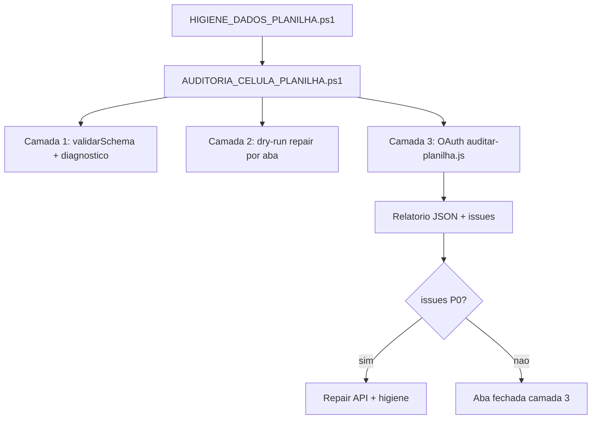

# MOVI KIDS — Protocolo auditoria célula a célula (pós I52–I63)

**Criado:** 25/06/2026 · **GAS:** v1.5.165+ · **Complementa:** `PROTOCOLO_AUDITORIA_ABAS_PLANILHA.md`

---

## Por que três camadas?

| Camada | O que valida | Cobertura | Quem roda |
|--------|--------------|-----------|-----------|
| **1 — Schema** | Headers, memorial, formatos, `validarSchema` | Estrutura 100% | GAS API (sempre) |
| **2 — Amostra GAS** | Últimas N linhas por aba (`audit*SampleCore_`) | Dados recentes | GAS API dry-run |
| **3 — OAuth full** | **Todas** as células de dados (A11:AB LOCACOES, etc.) | 100% linhas | Node + `npm run auth` |

**Fase I52–I63 fechou a camada 1** nas 23 abas operacionais.  
**Célula a célula** = camada 3 + amostra ampliada onde couber.

---

## Fluxo recomendado



---

## Comandos

```powershell
cd C:\Users\riboc\Documents\Codex\2026-05-30\files-mentioned-by-the-user-movikids\movikids-github

# Rotina mensal (GAS only — sem OAuth)
.\scripts\testes\AUDITORIA_CELULA_PLANILHA.ps1

# Uma aba
.\scripts\testes\AUDITORIA_CELULA_PLANILHA.ps1 -Aba LOCACOES

# Varredura completa incluindo OAuth (requer auth)
.\scripts\testes\AUDITORIA_CELULA_PLANILHA.ps1 -OAuthFull

# OAuth manual (PC com npm run auth em google-drive-sheets-auth)
cd C:\Users\riboc\Projects\google-drive-sheets-auth
npm run auth
node scripts\auditar-planilha-movikids.js > audit.json
```

---

## Camada 3 — regras por aba (OAuth)

### LOCACOES (todas linhas A11:AB)

| Col | Regra célula |
|-----|--------------|
| A | id único, numérico |
| B | data `dd/mm/aaaa` parseável |
| O | enum Pendente/Ativa/Encerrada/Cancelada |
| P | veículo ∈ CONFIG `veiculos_validos_json` |
| H–K, AA | R$ numérico ou zero |
| N | telefone dígitos; obrigatório se Ativa/Pendente |
| Y | ms > 0 se status Ativa |
| R | teste: tag `[ANULADO TESTE ADM]` ou Cancelada R$0 |

### RH (COLABORADORES_RH, FOLHA_PONTO, …)

- FK `operador_id` existe em OPERADORES_SISTEMA
- CPF 11 dígitos; PIX/email formatos
- Ponto: entrada/saída coerentes; sem sobreposição no mesmo dia

### Camada 2 — amostra GAS (dry-run)

Cada `reparar{Aba}PlanilhaAdmin&dryRun=1` retorna `audit` com problemas nas **últimas 20–30 linhas**.

---

## Critério “célula a célula fechada”

1. Camada 1: `schemaOk=true`
2. Camada 2: `problemas=0` na amostra (ou só P2 documentados)
3. Camada 3: `issues` vazio ou só `teste_nao_anulado` já tratados
4. Checklist `CHECKLIST_ABA_PLANILHA_*.md` §C preenchido com amostra ≥50 linhas (abas >100 rows)

---

## Ordem das abas (camada 3 completa)

Mesma ordem §5 de `PROTOCOLO_AUDITORIA_ABAS_PLANILHA.md` — LOCACOES primeiro (maior volume), depois CONFIG, … RH por último.

**Estimativa tempo (camada 2 GAS):** ~2 min/aba · 23 abas ≈ 45–50 min (pausa anti rate-limit).

**Rate limit GAS:** se várias abas falharem em &lt;5 s seguidas, aguardar 2 min e rodar só as que falharam:  
`.\scripts\testes\AUDITORIA_CELULA_PLANILHA.ps1 -Aba COLABORADORES_RH`

---

## Referências

- `scripts/testes/AUDITORIA_CELULA_PLANILHA.ps1`
- `scripts/testes/HIGIENE_DADOS_PLANILHA.ps1`
- OAuth: `C:\Users\riboc\Projects\google-drive-sheets-auth\scripts\auditar-planilha-movikids.js`
- Mapa: `docs/referencia/MAPA_PLANILHA_ABAS_MOVIKIDS.md` §9
