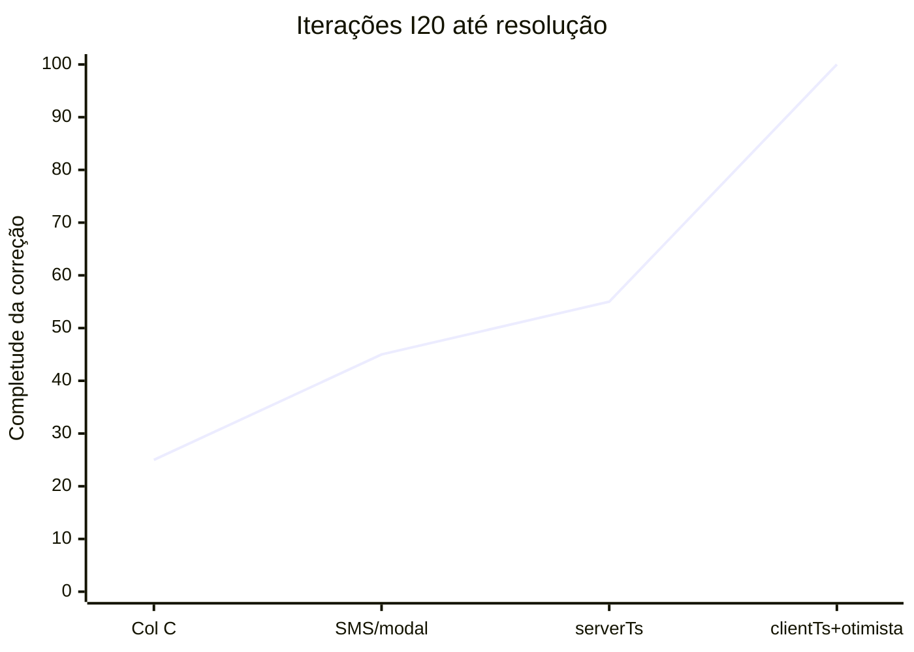
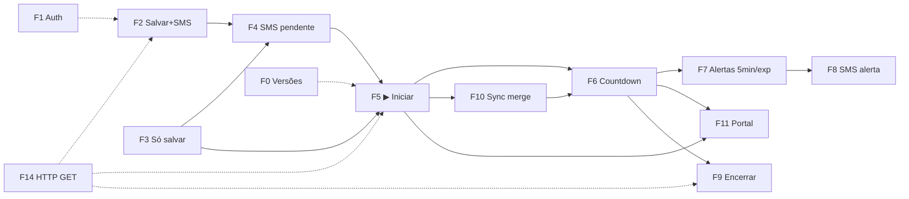

# MOVI KIDS — Protocolo de diagnóstico, testes e maturidade de aprendizado

**Criado:** 07/06/2026 · **Atualizado:** 09/06/2026 (FASE 5 fechada · v1.7.96)  
**Função:** quando o usuário pedir *“rodar teste”*, *“diagnosticar”* ou *“validar deploy”*, o agente **segue este documento** — não improvisa escopo.  
**Complementa:** `MAPA_ERROS_FALHAS_BUGS.md`, `INCIDENTE_I20_CRONOMETRO_RESOLUCAO_2026-06-07.md`, `MAPA_CODIGO_ARQUITETURA.md`, `HOMOLOGACAO_PRODUCAO_ASSISTIDA.md`

**Orquestrador:** `scripts/testes/TESTE_PROTOCOLO_DIAGNOSTICO.ps1`

---

## 1. Diagnóstico meta — como estamos aprendendo?

### 1.1 Maturidade atual (honesta)

| Nível | Nome | O que temos | O que falta |
|-------|------|-------------|-------------|
| 1 | **Reativo** | Fix no sintoma que o operador viu | — |
| 2 | **Documentado** | Incidentes I1–I20, MAPA, memorial I20 | Cobertura por fluxo |
| 3 | **Travas pontuais** | `pre-push-check.ps1`, guards estáticos | Testes E2E por fluxo |
| **→ 4** | **Protocolo por fluxo** | **Este documento** + orquestrador + `TESTE_TABLET_F5_F7_F10_F11` | F10 2 abas físico |
| 5 | **Contínuo** | CI bloqueia merge; homologação diária | Não alcançado |

**Posição hoje:** entre **3 e 4** (subindo para 4 com este protocolo).

### 1.2 Curva de evolução — caso I20 (lição deste chat)



| Iteração | Foco | Completude | O que ainda faltava |
|----------|------|------------|---------------------|
| v1.5.64 / v1.7.74 | Col C vazia, sem fallback | ~25% | Latência API, UX botão, sync |
| v1.7.76 | SMS separado do ▶ | ~45% | `serverTs`, início otimista, alertas |
| Diagnóstico 07/06 | Causa `serverTs` | ~55% | FE Pages desatualizado, merge |
| **v1.5.66 / v1.7.78** | `clientTs` + otimista + merge | **100%** | Tablet validado |

**Padrão de erro:** corrigir **uma camada** (planilha OU FE OU GAS) sem percorrer **todos os fluxos** que tocam o cronômetro.

### 1.3 Falha sistêmica identificada (este chat)

| Anti-padrão | O que aconteceu no I20 | Regra nova |
|-------------|------------------------|------------|
| **Patch no sintoma** | “09:33” → mexeu em col C; depois em SMS; depois em latência | Sempre mapear **fluxo F5** inteiro antes de codar |
| **Escopo estreito** | Esqueceu alertas SMS, paridade portal, sync stomp, versão Pages | Usar **matriz de impacto** (§4) |
| **Só API / só repo** | Teste PowerShell passou; tablet em v1.7.76 | **F0 versões** antes de qualquer F1–F14 |
| **Declarar “resolvido” cedo** | Operador ainda via 09:33 com GAS novo + FE velho | Resolvido = **F0 + fluxo afetado + tablet** |
| **Teste polui produção** | Cards `T1_SO_SALVAR_` na tela do operador | **F0 cleanup** sempre no `finally` |

---

## 2. Mapa de fluxos do sistema (F0–F14)

Cada fluxo tem: **arquivos**, **incidentes**, **teste automático**, **tablet obrigatório?**

| ID | Fluxo | Caminho feliz | Arquivos principais | Incidentes | Teste auto | Tablet |
|----|-------|---------------|---------------------|------------|------------|--------|
| **F0** | Infra / versões / cleanup | ping OK, FE=GAS esperado, sem lixo teste | `mk-version.js`, `sw.js`, `.gs` ping | I3, I10, I12, I14 | `pre-push-check`, ping | `?force=` |
| **F1** | Auth operador + admin + idle 1h | PIN → chip Turno → sessão GAS; idle B8 | `mk-auth.js`, `mk-admin.js`, GAS | I4, I6, I17, I19, **I21** | `TESTE_SESSAO_IDLE_READONLY` | ✅ PWA + mock idle |
| **F2** | Nova locação — **Salvar + SMS** | Salva Pendente + SMS, **sem** timer | `mk-nova.js` `confirmarLocacaoEEnviarSms_` | I20 | `TESTE_4_FLUXOS` T2 | ✅ |
| **F3** | Nova locação — **Só salvar** | Pendente 10:00 parado | `mk-nova.js` `confirmarLocacao` | I20 | `TESTE_4_FLUXOS` T1 | ✅ |
| **F4** | Pendente — **Enviar SMS** | SMS portal; continua Pendente | `mk-operacao.js` `enviarSmsPendente_` | I20 | `TESTE_I20` B1 | opcional |
| **F5** | Pendente — **▶ Iniciar** | Clique imediato; 10:00; col Y=clientTs | `mk-operacao.js`, GAS `iniciarTimer_`, `mk-sync.js`, `mk-sessao.js` | **I16, I20** | `TESTE_I20` B2 | **✅ obrigatório** |
| **F6** | Timer ativo — countdown | `calcRemaining`, anel, stats | `mk-sessao.js`, `mk-home.js` | I16, I20 | paridade cronômetro | ✅ |
| **F7** | Alertas timer — 5 min / expirado | `checkTimer` → `triggerAlert5` / `triggerAlertExpired` | `mk-sessao.js`, `mk-operacao.js` | — | `TESTE_TABLET_F5_F7_F10_F11` | ✅ |
| **F8** | SMS operacional | portal, alerta, esgotado, extensão | `mk-operacao.js`, GAS SMS | SMS P0 | regressão readonly | opcional |
| **F9** | Encerrar / cancelar | drawer → GAS → some do ativo | `mk-drawer.js`, GAS encerrar | I2, I11, I13 | `TESTE_DRAWER_E` | ✅ |
| **F10** | Sync multi-canal | poll + Firebase + merge + BC | `mk-sync.js`, `mk-firebase.js` | I17, I20 | `TESTE_TABLET_F5_F7_F10_F11` (reload OK; 2 abas físico pendente) | ✅ 2 abas |
| **F11** | Portal responsável | `acompanhar.html` ±2s do balcão | portal + GAS `buscarPortalResponsavel_` | **I16** | `TESTE_PARIDADE_CRONOMETRO` | ✅ celular |
| **F12** | Admin — KPIs / payback / caixa / cockpit | Dashboard (`kpiMes`), Caixa (`resumoDia`), payback | `mk-admin.js`, GAS `buildKpiMesPayload_`, `calcLeadingDiaPatch_` | I23, payback M | `TESTE_KPI_MES_READONLY`, `TESTE_RESUMO_DIA_READONLY` | PC admin |
| **F13** | CRM relacionamento | busca responsável, badge cadastro | `index.html` rel, GAS | K.3 | `TESTE_RELACIONAMENTO` | opcional |
| **F14** | HTTP / escrita browser | GET nas 5 actions críticas | `mk-api.js` | **I15** | `TESTE_PARIDADE_HTTP` | ✅ |

### 2.1 Grafo — o que conecta com o quê (zona sensível)



**Regra:** mudança em um nó → percorrer **nó + vizinhos** na matriz de impacto (§4).

---

## 3. O que esquecemos no I20 — checklist de abrangência

Use esta tabela **antes de fechar qualquer bug** no fluxo F5 (e analogamente para outros fluxos):

| # | Dimensão | Esquecido na 1ª abordagem? | Onde verificar agora |
|---|----------|----------------------------|----------------------|
| 1 | Semântica planilha (col C/Y) | Sim | F3, F5 + guards GAS |
| 2 | Latência API (`clientTs`) | Sim | F5 + `TESTE_I20` B2.clientTs |
| 3 | Início otimista FE | Sim | F5 + guard `fe.iniciar.otimista` |
| 4 | Sync stomp (`mergeSessaoCanonica`) | Sim | F10 + guard `sync.localTimer` |
| 5 | Paridade portal (I16) | Parcial | F11 |
| 6 | SMS **não** inicia timer | Parcial | F2, F4, `TESTE_4_FLUXOS` |
| 7 | Alertas 5 min / expirado (F7) | **Sim** | Tablet — timer curto teste |
| 8 | SMS status / reconsulta (F8) | **Sim** | Card badge SMS |
| 9 | UX botões pendente | Sim | Tablet visual |
| 10 | Versão FE Pages vs repo | **Sim** | F0 `mk-version.js` produção |
| 11 | Versão GAS ping vs repo | Parcial | F0 ping |
| 12 | Poluição testes na UI | Sim | F0 cleanup + `limparLocacoesTesteAdmin` |
| 13 | Firebase / segunda aba | Parcial | F10 `TESTE_TABLET_*` + 2 abas PWA físico |
| 14 | Auth / operador na escrita | Assumido | F1 + params `operador` |
| 15 | Mutex KPI hub vs Dashboard (I23) | **Sim** | F12 — abrir Dashboard com Caixa em background |
| 16 | Peso GAS `resumoDia` vs `kpiMes` | **Sim** | F12 — `TESTE_RESUMO_DIA_READONLY` rapido vs kpiMes ~6s |

---

## 4. Matriz de impacto — antes de mudar código

**O agente preenche esta matriz** (mentalmente ou no chat) **antes** de editar:

| Arquivo / função tocada | Fluxos impactados | Testes obrigatórios | Tablet? |
|-------------------------|-------------------|---------------------|---------|
| `salvarLocacao_` | F2, F3, F5, F10, F11 | F0, F2, F3, `TESTE_4_FLUXOS` | ✅ |
| `iniciarTimer_` | F5, F6, F7, F10, F11 | F0, F5, F6, F11, `TESTE_I20`, paridade cronômetro | ✅ |
| `iniciarContagem` / `mk-operacao.js` | F5, F6, F7, F10 | idem + guards otimista | ✅ |
| `mergeSessaoCanonica` | F5, F6, F10, F11 | F5, F10, `TESTE_I20` | ✅ |
| `calcRemaining` / `effectiveStartTs_` | F6, F7, F11 | paridade cronômetro | ✅ |
| `enviarSmsResponsavel_` / GAS SMS | F2, F4, F7, F8 | `TESTE_I20` B1, F4 manual | opcional |
| `checkTimer` / `triggerAlert*` | F7, F8 | timer teste 10min plano | ✅ |
| `mk-auth.js` | F1, F14, todas escritas | guards auth, F1 tablet | ✅ |
| `api()` / `mk-api.js` | F14, **todas** escritas | `TESTE_PARIDADE_HTTP` | ✅ |
| `acompanhar.html` | F11 | paridade cronômetro | celular |
| `mk-version.js` / `sw.js` | F0, **todos** | pre-push versões | `?force=` |
| `mk-admin.js` `carregarKPIs*` | F12 | `TESTE_KPI_MES_READONLY`, Dashboard PC | PC admin |
| `buildKpiMesPayload_` / `calcLeadingDiaPatch_` | F12 | kpiMes + resumoDia readonly | PC admin |
| `index.html` `#page-dashboard` | F0, F12, **I22** | `guard.html.page-balance`, tablet Home | ✅ |

**Se não souber o impacto:** ler `MAPA_CODIGO_ARQUITETURA.md` §3 e §5–6 antes de codar.

---

## 5. Protocolo de execução — quando o usuário pede “rodar teste”

### 5.1 Classificar o pedido

| Tipo | Quando | Escopo |
|------|--------|--------|
| **P0 — Completo** | Após deploy, bug P0, “testa o sistema” | F0 → F14 (fases abaixo) |
| **P1 — Pós-mudança** | Commit em arquivo X | F0 + fluxos da matriz §4 |
| **P2 — Fluxo único** | “Testa só o cronômetro” | F0 + F5 + F6 + F11 |
| **P3 — Regressão rápida** | Pre-push | `pre-push-check.ps1` apenas |

### 5.2 Ordem obrigatória (nunca pular F0)

```
F0  Infraestrutura
 ├─ pre-push-check.ps1 (-SkipNetworkTests se offline)
 ├─ ping GAS → versao >= esperada (ESTADO_ATUAL.md)
 ├─ mk-version.js GitHub Pages == repo
 └─ cleanup testes se rodou escrita

F1  Auth (se mexeu mk-auth ou sessão)

F14 HTTP GET (sempre em P0 ou mexeu api/escritas)

F2–F4  Cadastro + SMS sem timer
F5–F7  Iniciar + countdown + alertas
F11    Portal paridade
F9     Encerrar + cleanup

F10    Sync (2 abas / recarregar)
F12–F13 Admin/CRM (se escopo incluir)
```

### 5.3 Comando orquestrador

```powershell
# Completo (recomendado pós-deploy ou "testa o sistema")
.\scripts\testes\TESTE_PROTOCOLO_DIAGNOSTICO.ps1

# Só cronômetro / I20
.\scripts\testes\TESTE_PROTOCOLO_DIAGNOSTICO.ps1 -Foco cronometro

# Só infra + HTTP (rápido)
.\scripts\testes\TESTE_PROTOCOLO_DIAGNOSTICO.ps1 -Foco infra

# Pós-mudança em arquivo
.\scripts\testes\TESTE_PROTOCOLO_DIAGNOSTICO.ps1 -Foco iniciarTimer
```

### 5.3.1 Modo read-only (loja aberta / sem poluir planilha)

O orquestrador **completo** inclui scripts que **gravam** locações de teste. Quando o usuário pedir diagnóstico **sem criar dados reais**, rodar apenas:

| Fase | Script |
|------|--------|
| F0 | `pre-push-check.ps1` + ping GAS + FE Pages vs `mk-version.js` |
| F14 | `TESTE_PARIDADE_HTTP_BROWSER_GAS.ps1` |
| F11 | `TESTE_PORTAL_READONLY.ps1` |
| F6/F11 | `TESTE_PARIDADE_CRONOMETRO_PORTAL_BALCAO.ps1` |
| F13 | `TESTE_RELACIONAMENTO_MOVIKIDS_READONLY.ps1` |
| CONFIG | `TESTE_OPERACAO_CONFIG_READONLY.ps1` |
| B7 write | `TESTE_B7_REGRESSAO_WRITE.ps1` (grava + cleanup) |
| B1 resumoDia | `TESTE_RESUMO_DIA_READONLY.ps1` |
| B2 kpiMes | `TESTE_KPI_MES_READONLY.ps1` |
| B8 idle I21 | `TESTE_SESSAO_IDLE_READONLY.ps1` · `assets/mock-idle-homolog.html` |
| F0 | `TESTE_REGRESSAO_MOVIKIDS_PROD_SAFE.ps1` (sem `-RunWriteTests`) |

**Pular:** `TESTE_I20_*`, `TESTE_4_FLUXOS_*`, `TESTE_DRAWER_E_*`, `TESTE_PACOTE_F_KPI_READONLY.ps1` (este último grava apesar do nome).

**Estático:** `node --check` em cada `mk-*.js`; `grep "^function"` em `index.html` → 0; funções duplicadas entre `mk-*.js`.

**Scripts `.ps1`:** não usar em-dash `—` em strings perto de `-f` (ver `scripts/testes/README.md`).

### 5.4 Template de relatório (agente devolve ao usuário)

```markdown
## Diagnóstico MOVI KIDS — [data]

**Escopo:** P0 / P1 / P2 — [motivo]
**Versões:** FE [Pages/repo] · GAS ping [x]

### F0 Infra
- [ ] pre-push: ok/fail
- [ ] ping: vX
- [ ] Pages alinhado: sim/não

### Fluxos percorridos
| Fluxo | Teste | Resultado | Observação |
|-------|-------|-----------|------------|
| F5 ▶ | TESTE_I20 B2 | ok | rem inicial ~600s |

### Tablet pendente (se não executado)
- [ ] F5 clique imediato
- [ ] F7 alerta 5min

### Lacunas / próximo passo
- ...
```

---

## 6. Roteiro manual por fluxo (tablet + celular)

Detalhe em `HOMOLOGACAO_PRODUCAO_ASSISTIDA.md` seções A–H. Resumo mínimo:

| Fluxo | Passos | Critério de aceite |
|-------|--------|-------------------|
| F3 | Nova → só salvar | Pendente 10:00, 30s parado |
| F5 | ▶ | “⏳ Iniciando…” imediato; 10:00 ±1s |
| F7 | Plano 10min perto do fim | Alerta 5min dispara; SMS alerta opcional |
| F11 | Celular `acompanhar.html` | ±2s do balcão |
| F10 | 2 abas tablet | Mesmo timer após reload |

---

## 7. Scripts — mapa teste → fluxo → incidente

| Script | Fluxos | Incidentes |
|--------|--------|------------|
| `pre-push-check.ps1` | F0, F14 guards, I16/I20 estático | I3, I15–I20 |
| `TESTE_PROTOCOLO_DIAGNOSTICO.ps1` | **Orquestra todos** | — |
| `TESTE_PARIDADE_HTTP_BROWSER_GAS.ps1` | F14 | I15 |
| `TESTE_PORTAL_READONLY.ps1` | F11 leitura | — |
| `TESTE_PARIDADE_CRONOMETRO_PORTAL_BALCAO.ps1` | F6, F11 | I16 |
| `TESTE_I20_COMPLETO_PROD.ps1` | F2–F5 | I20 |
| `TESTE_4_FLUXOS_CADASTRO_I20.ps1` | F2, F3 | I20 |
| `TESTE_DRAWER_E_PACOTE_E.ps1` | F9 | I13, Pacote E |
| `TESTE_REGRESSAO_MOVIKIDS_PROD_SAFE.ps1` | F0, leituras | geral |
| `TESTE_RELACIONAMENTO_*` | F13 | K.3 |
| `TESTE_OPERACAO_CONFIG_READONLY.ps1` | CONFIG frota/preços | FASE 4 |
| `TESTE_B7_REGRESSAO_WRITE.ps1` | F5 iniciar/estender/encerrar | B7 |
| `TESTE_SESSAO_IDLE_READONLY.ps1` | F1 idle B8 | **I21** |
| `TESTE_RESUMO_DIA_READONLY.ps1` | F12/B1 | FASE 5 |
| `TESTE_KPI_MES_READONLY.ps1` | F12/B2 | FASE 5 |
| `TESTE_PACOTE_F_KPI_*` | F12 | Pacote F (⚠️ grava locação teste) |
| `TESTE_TABLET_F5_F7_F10_F11.ps1` | F5, F7, F10, F11 | I20, I16 |
| `TESTE_TABLET_F5_F7_F10_F11_BROWSER.js` | F5, F7, F10, F11 | via `RUN_TABLET_BROWSER_TEST.ps1` |
| `RUN_TABLET_BROWSER_TEST.ps1` | Orquestra browser CDP | — |

---

## 8. Lacunas conhecidas (honestidade)

| Lacuna | Risco | Mitigação atual |
|--------|-------|-----------------|
| F10 **2 abas PWA** no tablet físico | Dessync multi-aba | `TESTE_TABLET_*` cobre reload; checklist §D manual |
| F7 alertas — drift GAS >2min via API | Teste API falha por design I20 | Browser ajusta timestamp FE; validar modal no tablet |
| F8 SMS entrega real | Gateway externo | `TESTE_PORTAL_READONLY` + monitor |
| Tablet não roda em CI | Bugs só em produção | Usuário valida; protocolo exige reportar “tablet pendente” |
| Matriz impacto manual | Agente pode esquecer fluxo | Regra `.cursor/rules` + este doc |

---

## 9. Regras permanentes para agentes

1. **Nunca** declarar bug resolvido sem **F0 + fluxos da matriz §4 + tablet** quando marcado ✅.
2. **Sempre** rodar `TESTE_PROTOCOLO_DIAGNOSTICO.ps1` (ou `-Foco` adequado) quando usuário pedir teste.
3. **Sempre** listar fluxos impactados **antes** de editar código (§4).
4. **Nunca** testar só PowerShell e omitir versão Pages (lição I20).
5. **Sempre** `finally` cleanup após testes de escrita em produção.
6. Ao fechar incidente: atualizar MAPA + memorial + **esta matriz** se novo fluxo ou lacuna.

---

## 10. Histórico

| Data | Ação |
|------|------|
| 07/06/2026 | Criado após retrospectiva chat I20 — maturidade, fluxos F0–F14, protocolo e orquestrador |
| 07/06/2026 | §5.3.1 modo read-only; fix `TESTE_RELACIONAMENTO` (em-dash quebrava ParserError) |
| 08/06/2026 | Scripts tablet `TESTE_TABLET_F5_F7_F10_F11` + browser; F7/F10 na matriz F0–F14; §8 lacunas atualizadas |
| 08/06/2026 | Fix T1 em-dash `TESTE_I20_COMPLETO_PROD.ps1`; protocolo completo WARN transitório Pages |
| 09/06/2026 | F12 atualizado FASE 6–7; I23 mutex + `calcLeadingDiaPatch_`; abrangência §3 linhas 15–16 |
