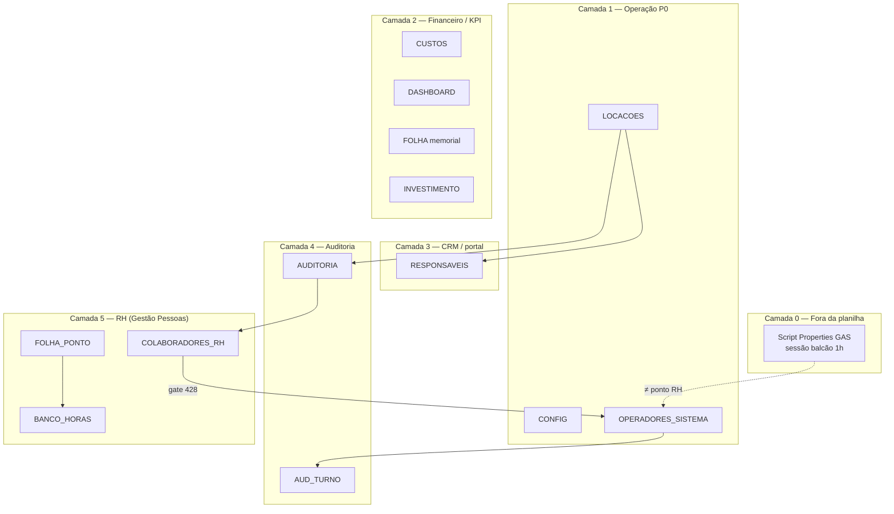

# Mapa canônico — Planilha MOVI KIDS (hierarquia + controle)

**Atualizado:** 23/06/2026 · GAS Web **v1.5.139** · FE **v1.8.116**  
**Workbook único:** [MOVIKIDS_Planilha_Base](https://docs.google.com/spreadsheets/d/1ULMUx8AqZkZ75Ed0iRK_lQWc3I7YV9Itfoe-1JY5618/edit) · ID `1ULMUx8AqZkZ75Ed0iRK_lQWc3I7YV9Itfoe-1JY5618`  
**Inventário ao vivo:** `?action=diagnosticoPlanilhaCompletoAdmin&adminPin=1416`  
**Teste:** `scripts/testes/TESTE_AUDITORIA_PLANILHA_COMPLETA_READONLY.ps1`

---

## 1. Hierarquia — uma planilha, seis camadas

Não há várias planilhas Google separadas em produção: **tudo vive num único workbook**. O GAS (`ss_()`) abre sempre este arquivo.



| Camada | Abas | Papel |
|--------|------|--------|
| **0** | *(Script Properties)* | Sessão “quem está no balcão” — **não** é ponto RH |
| **1** | LOCACOES, CONFIG, OPERADORES_SISTEMA | Coração do negócio: locação, timer, login |
| **2** | CUSTOS, DASHBOARD, FOLHA, INVESTIMENTO | Caixa, KPIs, memorial CLT, payback |
| **3** | RESPONSAVEIS + logs AUD_RESP/SMS/WA | CRM e portal do responsável |
| **4** | AUDITORIA, AUD_TURNO | Trilha de auditoria + metas RH vivas |
| **5** | 9 abas `*_RH` / FOLHA_PONTO / etc. | Pessoas: cadastro, ponto, holerite |

**Aba no código mas ausente no workbook hoje:** `PLANO_CONTAS` (mini-DRE F14) — constante GAS existe; criar se ativar F14 na planilha.

---

## 2. Inventário ao vivo (23/06/2026)

| Aba | Linhas dados | Cols | Mapeada GAS |
|-----|-------------|------|-------------|
| LOCACOES | 798 | 28 | Sim |
| AUDITORIA | 2485 | 8 | Sim |
| AUD_SMS | 627 | 13 | Sim |
| RESPONSAVEIS | 241 | 9 | Sim |
| AUD_RESPONSAVEIS | 240 | 7 | Sim |
| AUD_TURNO | 222 | 7 | Sim |
| FOLHA | 99 | 9 | Sim |
| CONFIG | 60 | 4 | Sim |
| INVESTIMENTO | 51 | 6 | Sim |
| DASHBOARD | 43 | 6 | Sim |
| AUD_WHATSAPP | 36 | 12 | Sim |
| CUSTOS | 19 | 6 | Sim |
| FALTAS_AUSENCIAS | 17 | 8 | Sim |
| Analise | 4 | 5 | Sim |
| BANCO_HORAS | 4 | 3 | Sim |
| OPERADORES_SISTEMA | 3 | 8 | Sim |
| COLABORADORES_RH | 2 | 19 | Sim |
| ESCALA_COLABORADORES | 2 | 10 | Sim |
| COMUNICADOS_RH | 1 | 9 | Sim |
| CUSTOS | 19 | 6 | Sim |
| FOLHA_PONTO | 1 | 9 | Sim |
| HOLERITES | 1 | 15 | Sim |
| METAS_COLABORADORES | 1 | 7 | Sim |
| RELATORIOS | 1 | 6 | Sim |
| AVALIACOES_RH | 0 | 7 | Sim |

**Total: 24 abas** · todas mapeadas no GAS v1.5.139.

---

## 3. Tabela mestre — o que cada aba alimenta e o que a afeta

Legenda: **Alimenta** = quem lê/consome · **Gravado por** = quem escreve em runtime · **Afeta** = telas/comportamentos downstream

| Aba | Camada | Grava runtime? | Gravado por (quem/API) | Alimenta (o quê) | Páginas / superfícies | Afeta diretamente |
|-----|--------|----------------|------------------------|------------------|----------------------|-------------------|
| **LOCACOES** | 1 | **Sim** | Operador/admin — `salvarLocacao_`, `encerrarLocacao_`, `iniciarTimer_`, etc. (GET browser) | Portal timer, caixa, dashboard fat/dia, AUDITORIA, metas RH, conta do dia | `index.html`, `acompanhar.html`, caixa, dashboard | Timer, receita, CRM encerramento, bônus colaborador |
| **CONFIG** | 1 | **Sim** (admin) | `salvarOperacaoConfigAdmin` | Preços, frota, veículos válidos, JSON operação | Nova locação, sistema admin | Rejeição de veículo (ex. I31 pelúcias) |
| **OPERADORES_SISTEMA** | 1 | **Sim** | Seed + `resetarPinOperadorAdmin`; último login em col 7 | `loginOperador_`, listagem operadores, perfil | Login balcão, hub tablet | Quem pode logar; **≠ cadastro RH** |
| **CUSTOS** | 2 | **Sim** | `salvarCusto_` (admin) | Caixa, dashboard custos, mini-DRE | Caixa, dashboard | Despesa do dia |
| **DASHBOARD** | 2 | Fórmulas | Planilha (fórmulas) | KPIs mensais admin | Dashboard | Metas visuais (leitura) |
| **FOLHA** | 2 | Memorial | Admin repair fórmulas; manual | `lerFolhaPlanejamento_`, holerite VA, viabilidade CLT | Dashboard FASE 9 | Parâmetros VA/salário **planejamento** — não holerite individual |
| **INVESTIMENTO** | 2 | Manual/repair | Admin / scripts | Payback dashboard | Dashboard payback | — |
| **PLANO_CONTAS** | 2 | Opcional | Admin F14 | Categorias mini-DRE | Dashboard custos | *(aba ausente no workbook)* |
| **RESPONSAVEIS** | 3 | **Sim** | `salvarLocacao_` (CRM), `importarResponsaveisAdmin` | Portal `acompanhar.html` (telefone) | Portal, relacionamento admin | Quem vê qual locação no celular |
| **RELATORIOS** | 2 | **Sim** | `salvarRelatorioDrive_` | Lista PDFs admin | Relatórios | — |
| **Analise** | — | Legado | — | — | — | Não usar |
| **AUDITORIA** | 4 | **Sim** | `registrarAuditoriaLocacao_` em encerramentos/edições | `gpMetasPainel_`, bônus RH, histórico desempenho | Gestão Pessoas metas, admin operadores | Bônus holerite, “meta OK” |
| **AUD_TURNO** | 4 | **Sim** | Login/logout balcão | Trilha operador no turno | *(log)* | Diagnóstico sessão — **≠ FOLHA_PONTO** |
| **AUD_SMS** | 4 | Log | SMS pausado | — | — | Histórico apenas |
| **AUD_WHATSAPP** | 4 | Log | WA pausado | — | — | Histórico apenas |
| **AUD_RESPONSAVEIS** | 4 | Log | Import CRM | — | Relacionamento | Histórico import |
| **COLABORADORES_RH** | 5 | **Sim** | `salvarCadastroColaborador_` (PIN colab) · `salvarCadastroRhAdmin` (admin) | Gate balcão 428, holerite CPF, painel admin | `gestao-pessoas.html`, gate login | **Bloqueio balcão** se incompleto |
| **FOLHA_PONTO** | 5 | **Sim** | `registrarPontoColaborador_` (PIN colab) | Jornada, alertas ponto, widget “Ponto RH hoje” | `gestao-pessoas.html` → Meu ponto | **Único** destino de ponto RH |
| **ESCALA_COLABORADORES** | 5 | Parcial | Installer + `gpEnsureEscalaRow_` | Alertas escala, jornada | Gestão Pessoas | “Folga hoje” |
| **FALTAS_AUSENCIAS** | 5 | Sync | `gpSyncFaltasFromJornada_` | Jornada (faltas) | Gestão Pessoas jornada | Desconto holerite (futuro) |
| **HOLERITES** | 5 | Snapshot | `gpPersistHoleriteSnapshot_` | Arquivo mensal (parcial) | Holerite PDF | Não guarda CPF |
| **METAS_COLABORADORES** | 5 | Seed | Installer | *(demo)* | — | Metas **vivas** = AUDITORIA |
| **BANCO_HORAS** | 5 | Saída ponto + repair | `gpPersistBancoHoras_`, `repairBancoHorasAdmin` | Alertas RH, painel admin | Gestão Pessoas banco | Saldo exibido |
| **COMUNICADOS_RH** | 5 | **Sim** | `salvarComunicadoRhAdmin_` | Hub colaborador | `gestao-pessoas.html` | Avisos equipe |
| **AVALIACOES_RH** | 5 | **Sim** | `salvarAvaliacaoRhAdmin_` | Hub colaborador | Gestão Pessoas | Avaliações gestão |

### Fora da planilha (Camada 0)

| Armazenamento | O quê | Gravado por | Confundir com |
|---------------|-------|-------------|---------------|
| **Script Properties GAS** | `sessaoOperadorAtiva` (1 operador, TTL) | `loginOperador_` / logout | FOLHA_PONTO, AUD_TURNO |

---

## 4. Matriz de dependências (quem afeta quem)

| Origem | → Destino | Regra |
|--------|-----------|--------|
| LOCACOES encerrar | AUDITORIA | Log + usuário operador |
| AUDITORIA | Metas RH / bônus | `gpMetasPainel_` por mês |
| AUDITORIA | Holerite (bônus) | `gpCalcHollerite_` |
| COLABORADORES_RH | loginOperador | HTTP **428** se cadastro incompleto |
| COLABORADORES_RH | Holerite | CPF, admissão, salário base |
| FOLHA memorial | Holerite VA | `lerFolhaPlanejamento_` |
| FOLHA_PONTO | Jornada API | `gpAnaliseJornadaColab_` |
| FOLHA_PONTO saída | BANCO_HORAS | `gpPersistBancoHoras_` (não na leitura — I44) |
| OPERADORES_SISTEMA | Login balcão | PIN hash |
| RESPONSAVEIS | Portal | Telefone → locações |
| CONFIG | salvarLocacao | Valida veículo/preço |

---

## 5. Camadas de controle e gerenciamento de dados

### 5.1 Quem pode gravar

| Papel | PIN | Pode gravar |
|-------|-----|-------------|
| **Operador** | Próprio | LOCACOES (escritas GET), logout |
| **Admin** | 1416 | CONFIG, custos, CRM import, comunicados, avaliações, repair, cleanup testes |
| **Colaborador RH** | Próprio (≠ admin) | COLABORADORES_RH cadastro, FOLHA_PONTO |
| **Responsável portal** | Telefone | *(somente leitura via GAS)* |
| **Installer** | 1416 + `instalarAbasGestaoPessoasAdmin` | Cria abas RH — **não** `forceReset` com dados (I45) |

### 5.2 APIs de governança (readonly vs mutação)

| API | Função |
|-----|--------|
| `diagnosticoPlanilhaCompletoAdmin` | Inventário 24 abas + RH + ponto + banco |
| `exportarCadastroRhAdmin` | Export cadastro (admin) |
| `buscarTextoPlanilhaAdmin` | Busca texto em todas abas (recuperação) |
| `repararRhPlanilhaAdmin` | Datas, cadastro_pct, repair banco |
| `salvarCadastroRhAdmin` | Restaurar cadastro sem PIN colaborador |
| `repairBancoHorasAdmin` | Zerar banco corrompido (I44) |
| `gestaoPessoasStatus` | 9 abas RH existem? |
| `validarSchema` | LOC/CUS/REL mínimo |

### 5.3 Regras de ouro (nunca violar)

| Dado | Aba canônica | Nunca confundir com |
|------|--------------|---------------------|
| Locação / timer | LOCACOES col Y | — |
| Login balcão | OPERADORES_SISTEMA | Ponto RH |
| Sessão sidebar | Script Properties | FOLHA_PONTO |
| Cadastro CPF/PIX | COLABORADORES_RH | OPERADORES |
| Ponto entrada/saída | FOLHA_PONTO | AUD_TURNO |
| Meta/bônus vivo | AUDITORIA | METAS_COLABORADORES |
| Holerite cálculo | API memória | HOLERITES (snapshot) |

### 5.4 Checklist operacional pós-mudança

1. `TESTE_AUDITORIA_PLANILHA_COMPLETA_READONLY.ps1`
2. `diagnosticoPlanilhaCompletoAdmin` — comparar `dataRows` com esperado
3. Se mexeu RH: conferir Milena/Raykelly `cadastroOk`
4. Se mexeu timer: `TESTE_I43` + tablet F5
5. **Nunca** `instalarAbasGestaoPessoasAdmin&forceReset=sim` com dados reais

---

## 6. Schemas críticos

### LOCACOES (header linha 9, dados desde 11)

| Col | Campo | Notas |
|-----|-------|--------|
| A–R | ids, status, veículo, valores… | Operação |
| S (19) | conta_id | Conta do dia (I42) |
| Y (25) | startTimestamp | **Cronômetro** — `COL_LOC_READ_=28` (I43) |
| Z (26) | extendedMins | Extensão |

### COLABORADORES_RH (header linha 1, dados linha 2+)

Ver tabela cols A–T na versão anterior — gate 8 campos obrigatórios via `gpCadastroOk_`.

### FOLHA_PONTO

Cols: id, operador_id, data, dia_semana, entrada, saida, horas, situacao, registrado_em.

---

## 7. Incidentes ligados à planilha

| ID | Aba | Lição |
|----|-----|--------|
| I31 | CONFIG | Encoding JSON frota |
| I42 | LOCACOES col S | conta_id — não estreitar `getRange` |
| I43 | LOCACOES col Y | timestamp cronômetro |
| I44 | BANCO_HORAS | Não persistir em leitura painel |
| I45 | COLABORADORES_RH | Installer `clear()` + FE falso save |

Doc: `docs/ativos/INCIDENTE_I45_CADASTRO_RH_NAO_PERSISTIDO_2026-06-23.md`

---

## 8. Como auditar de novo

```powershell
.\scripts\testes\TESTE_AUDITORIA_PLANILHA_COMPLETA_READONLY.ps1
.\scripts\testes\TESTE_GESTAO_PESSOAS_READONLY.ps1
.\scripts\testes\TESTE_CADASTRO_RH_READONLY.ps1
```

OAuth célula a célula: `google-drive-sheets-auth\scripts\auditar-planilha-movikids.js` (requer `npm run auth`).
